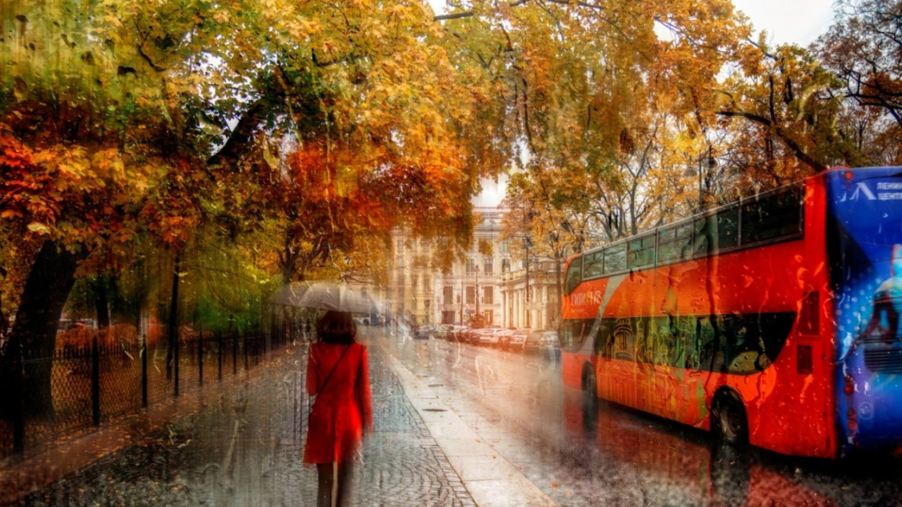

### ĐÔI DÒNG VÀO MÙA KHÔ

> **Nguồn**: [Internet](https://www.peakpx.com/en/hd-wallpaper-desktop-pxcxm)

_Có một dạo tinh thần của mình không ổn định cho lắm, mình đã đánh đàn lại và duy trì việc học ngoại ngữ. Những con chữ cứ thế chảy trôi trong đầu mình, có đôi lúc chúng bị rớt lại ở quán cà phê nào đó, hoặc rơi xuống đường khi mình đang chạy xe, và có lúc chúng bị kẹt lại ở những trang sách cũ._

_Việc học ngày càng nặng, vô số lần mình bị kẹt lại bởi deadline trên trường và những mối quan hệ trên giảng đường, mình thường nghĩ về những cơn mưa trên làng đại học, những lần ăn trưa vội vã và những ly trà sữa đầu giờ chiều của mình và thằng bạn thân._

> **_Mình tìm được những người bạn đủ tốt và ổn định._**
>
> **_Và thời gian vẫn cứ trôi, nắng chiếu rọi trên đường, một ngày mới._**
>
> — **_Cà phê cùng Tony_**

**_À mà Croissant này, hồi bữa mình đã gặp cậu trên xe buýt đấy..._**
