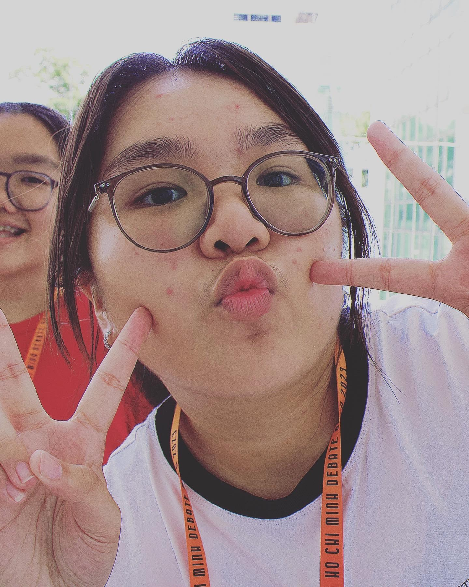
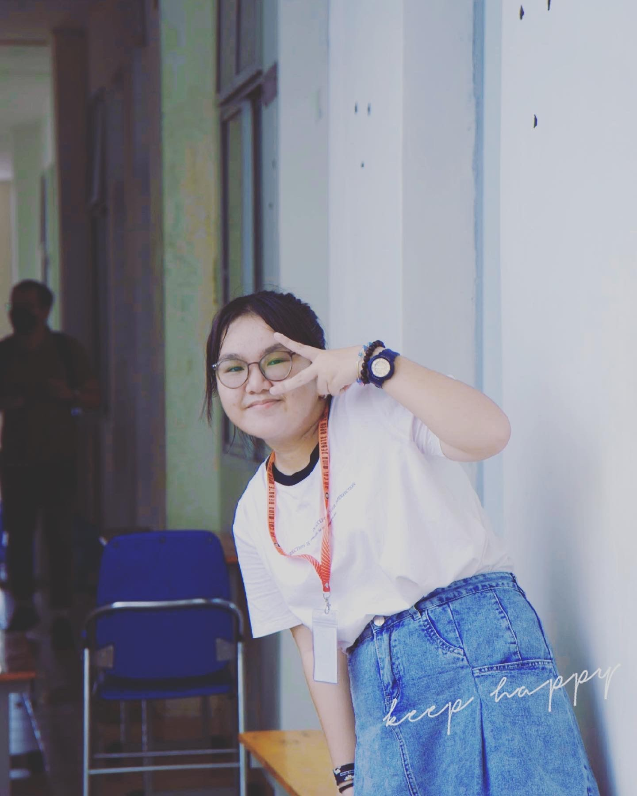
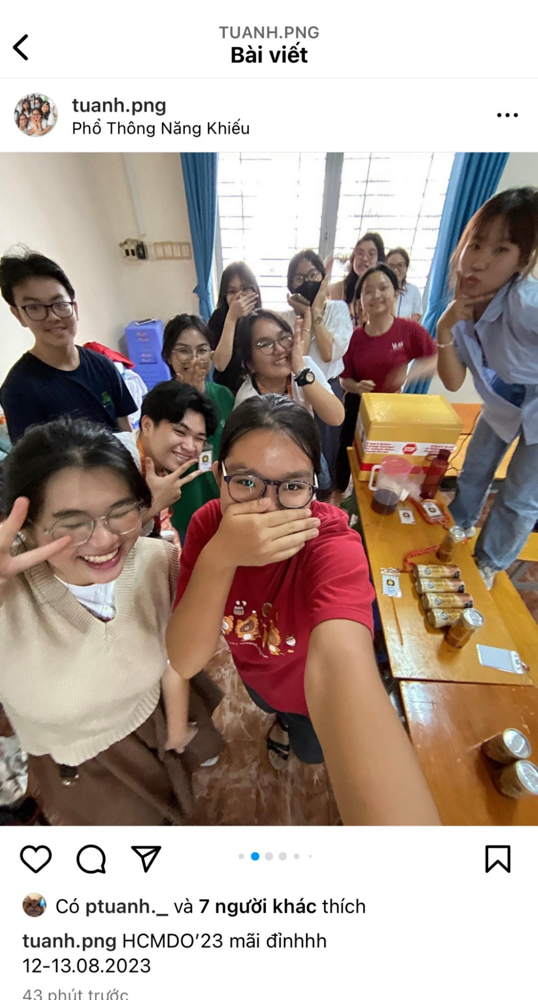
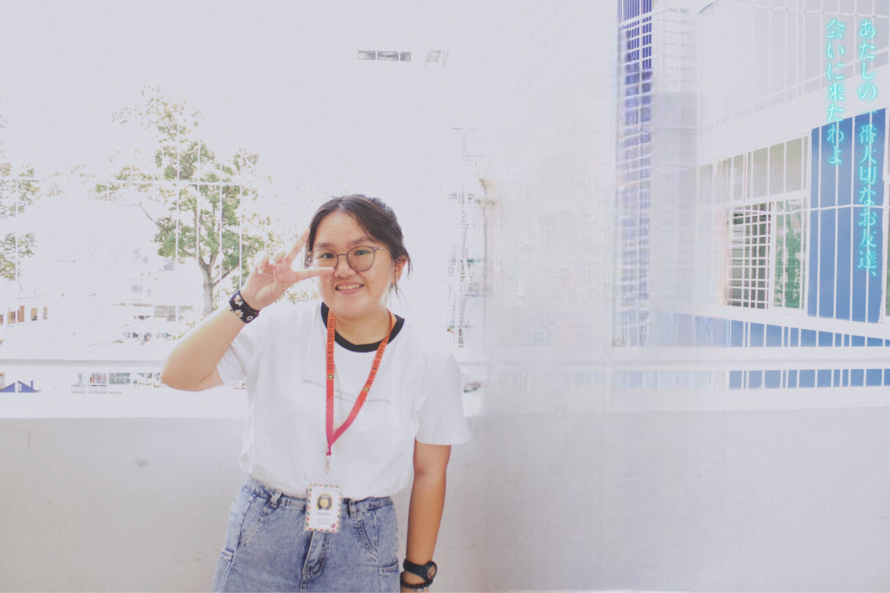

## Kỳ 1: MÙA HÈ CỦA TỚ CHỈ GÓI GỌN TRONG 2 NGÀY 🍁

> - **_Ê bồ, hè này bồ có đi đâu không?_**
> - **_Có_**
> - **_Bồ đi đâu á?_**
> - **_Tui đi đấu đó..._**

:::note LƯU Ý
Bài này sẽ có rất nhiều ảnh của admin nên là... **Mọi người nhớ xem hết nha!!!**
:::

**_Cậu tin không,_**

_Tớ từng là một cô bé hay cãi bướng, cãi đến độ mà cọc mất kiểm soát hay thậm chí là khóc luôn đó. Lí do khóc là vì tớ tức quá đi thôi. Nhưng rồi, khi lớn lên, tớ hiểu ra cảm xúc và nước mắt của con người không thể rơi một cách vô lý như thế. Nên tớ bắt đầu tập kìm nén cảm xúc... **Cho đến khi... tớ gặp debate**._

_Debate dắt tớ đi trên đấu trường của những con người giống tớ, debate cho tớ biết đấu võ mồm và tranh biện là khác nhau, debate dắt tớ đi gặp nhiều người, có cả người mình đang thầm thích... và debate giúp mình biết **kết nối, biết lắng nghe và thấu hiểu mọi vấn đề! Tớ biết ơn debate lắm!**_

_Và rồi, để thay cho lời cảm ơn ấy thì tớ chọn đi tham gia debate thử một lần, nhưng không phải tư cách debaters mà chỉ là administrator thôi. **Vì sao tớ không dám á?** Vì tiếng anh tớ kém, suy nghĩ về vấn đề và tư duy phản biện lại rất chậm nên làm sao mà dám (**nhưng tương lai sẽ dám nha**). Nhưng làm admin như thế thì tớ lại được tiếp xúc với nhiều người nè như debaters, OC và nhất là các adjudicators dày dặn kinh nghiệm (**để tớ gặp được người tớ thích**)._

_Thế cậu có thắc mắc, admin sẽ làm gì? Chạy đi xếp bàn, hỗ trợ hết mình, dùng tiếng anh liên tục, canh thời gian, đi ra đi vào,... **Đúng, nhưng chỉ một phần thôi vì... tớ còn có những thứ này**:_

**_Với tớ đi là để lưu giữ những kỉ niệm mà nên ngại gì mà không chụp chứ nhỉ!_**

_Chưa dừng lại ở đó thôi đâu, tớ gặp nhiều người bạn mà tớ hằng ao ước được làm bạn, đó là những PTNK-ers vừa giỏi lại vừa dễ thương nữa. **Ôi, nhắc đến đây tớ lại nhớ họ rồi**._

_À mà nè, **cậu có tin không?** Trong suốt quá trình tớ làm admin chỉ 2 ngày, mà tớ gặp đến tận 4 anh bác sĩ tương lai, họ là những người giám khảo với rất nhiều kinh nghiệm debate trên các cuộc tranh biện lớn nhỏ, và tất cả họ đều đến từ các trường Y nổi tiếng, thậm chí có anh còn là điều dưỡng viên tại bệnh viện ở trường ĐH Harvard nữa (**và anh ấy cũng đang là người mình thầm thích đó**). Cơ mà, để cho mọi người tò mò đoán xem anh ấy là ai thì mình đã chủ động xóa nó đi rồi (**vì mình cũng hơi ngại xíu**), hihi._

_Thế tóm lại, **tớ muốn nói gì qua bài này vậy nhỉ?** Tớ cũng hong biết, nhưng mà... cậu có chắc rằng hai chữ "**từ từ**" của cậu **sẽ đi với cậu mãi không?** Rồi có phải cậu lại **bỏ lỡ điều gì đó không?** Tớ cũng vậy, tớ cũng nghĩ "**từ từ**" rồi đi có sao đâu, nhưng cậu sẽ chẳng biết được rằng nếu không và nếu có khác nhau ra sao đâu. **Vậy nên là...**_

> **_Dù cho mùa hè chỉ còn một ngày, hãy cứ bước đi và gặp gỡ mọi người. Vì biết đâu, bạn sẽ gặp được người mình yêu, có khi ngay trong những khoảnh khắc cuối cùng đó._**

**_Chào cậu,_**

**_Khánh Phương - cô gái dùng 48 giờ để suy nghĩ..._**
