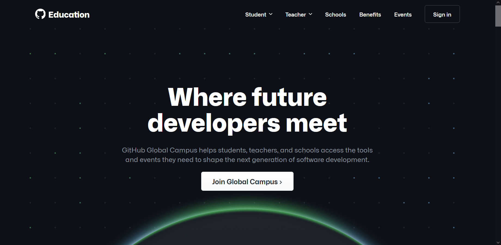
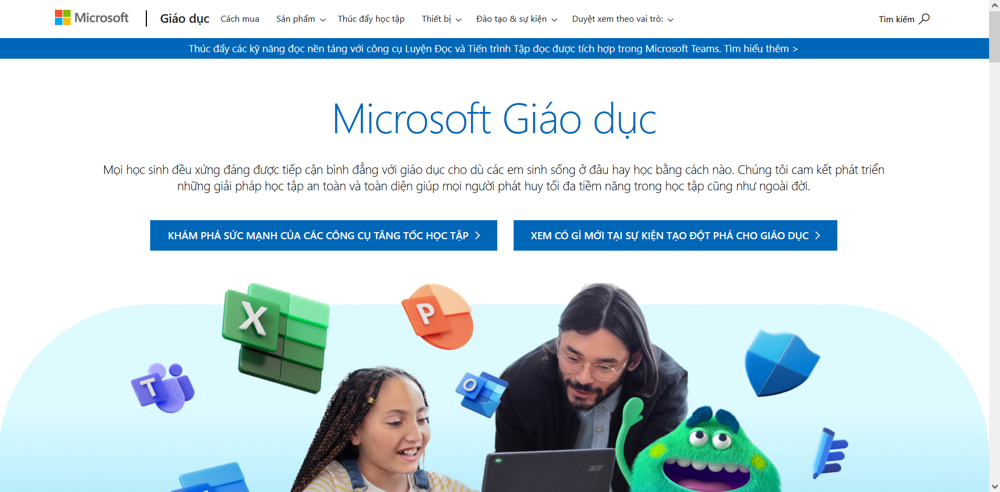
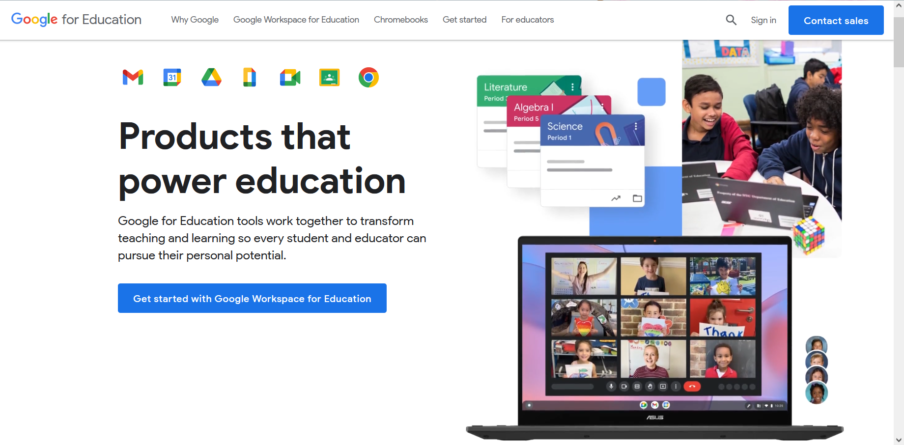

## Phần 1: Tản mạn về Mail sinh viên

_Trước khi đến với câu chuyện về Điện toán đám mây và DevOps, chúc mừng các bạn đã hoàn thành mục tiêu đậu vào trường
Đại học mà mình mong muốn. Nhìn mấy bạn chạy đôn chạy đáo đi nộp hồ sơ nhập học, tôi lại bồi hồi nhớ về hình ảnh của
chính bản thân cách đây bốn năm trước, khi tôi cũng trúng tuyển vào ngành Công nghệ thông tin của **Khoa học Tự nhiên -
ĐHQG TPHCM**. Giờ đây tôi đã chuẩn bị tốt nghiệp, và đang truyền lại những gì đặc biệt nhất cho các bạn tân sinh viên._

_Chắc hẳn các bạn đã nghe qua về cụm từ Mail sinh viên rồi. Ừ, thì nó là một chiếc thư điện tử, được các trường cấp cho
mỗi bạn để liên lạc với các phòng ban cũng như người khác. Tất nhiên, nếu các bạn chỉ đọc tới đây mà cảm thấy chán nản
bỏ đi thì **các bạn đã sai lầm**. Bởi có nhiều thứ mà có thể bạn sẽ chưa biết về công năng của chiếc mail sinh viên quyền lực
này. **Are you ready? Let's check it out!**_

### [GitHub Student Developer Pack](https://education.github.com/pack)

_Với các bạn sinh viên học Công nghệ thông tin, rất nhiều bạn sẽ cần biết đến **GitHub** - một trong những nơi lưu trữ mã nguồn có thể gọi là lớn nhất thế giới do Microsoft vận hành. Chính vì thế, với việc sử dụng email sinh viên, không chỉ các bạn được nâng cấp miễn phí lên **gói Pro** với nhiều tính năng nâng cao, mà với chương trình **Gói hỗ trợ cho Sinh viên**, các bạn có thể sử dụng **miễn phí hàng chục dịch vụ khác nhau** với những công năng khác nhau. Các bạn có thể chọn vào tiêu đề mục này để xem những ưu đãi sẵn có của Gói hỗ trợ._

### [Microsoft](https://www.microsoft.com/vi-vn/education) và [Google](https://edu.google.com/)

