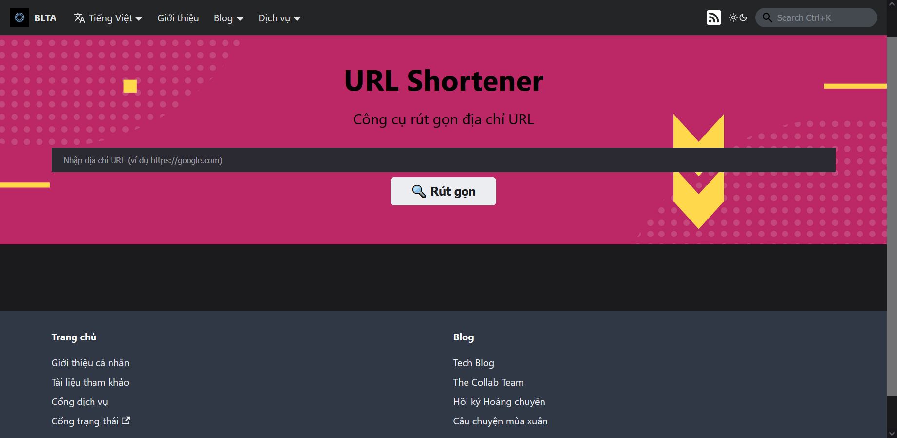

## Giới thiệu

Dịch vụ URL Shortener cho phép người dùng rút gọn đường dẫn của một trang web bất kỳ để có thể dễ dàng chia sẻ và truy cập.

## Hướng dẫn truy cập

Để sử dụng dịch vụ, có các cách sau:

1. Truy cập vào đường dẫn [**này**](../../services)
2. Từ thanh điều hướng, chọn **Dịch vụ** ➡ **Cổng dịch vụ**
3. Từ phần chân trang, mục **Trang chủ** chọn **Cổng dịch vụ**

Chọn dịch vụ **URL Shortener**, nhấn nút **Truy cập**. Hệ thống sẽ tự chuyển hướng đến trang của dịch vụ như hình dưới.

## Hướng dẫn tương tác

Nội dung đang được cập nhật...
