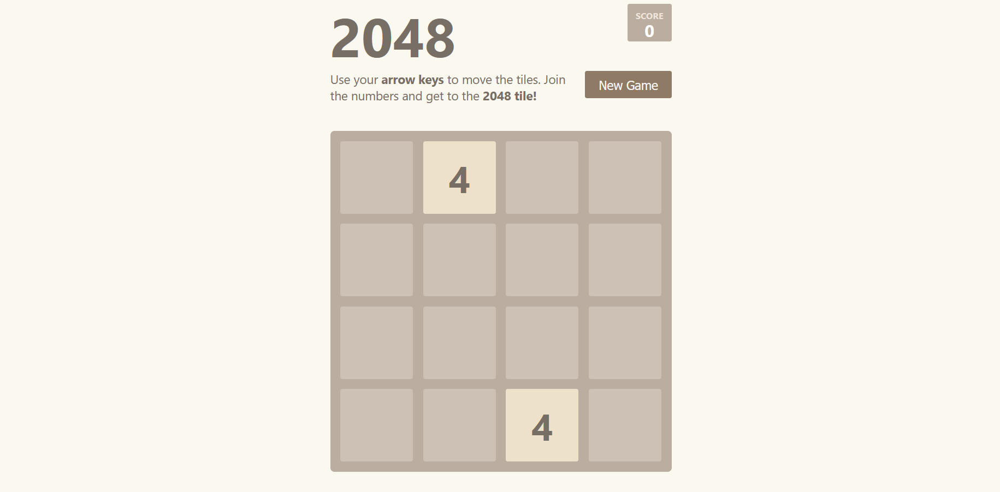

## Introduction

The 2048 Game service allows users to play 2048 game online.

## Guide to access

The service is currently under maintenance and will be updated as soon as possible.

<!-- To use the service, there are the following ways:

1. Access from [**this link**](https://2048.builetuananh.name.vn/)
2. From the **Navigation bar** on the top of this page, select **Services** ➡ **Portal**
3. From the **Footer** at the end of this page, in the **Homepage** section select **Services Portal**

Select the **2048 Game** service, then click on **Access**. The website will automatically be redirected to the service page as shown below.

:::note

The game interface uses **English** and is currently not supported on mobile devices.

::: -->

## How to play

_2048 is a single-player sliding block puzzle game designed by Italian web developer Gabriele Cirulli. The game's objective is to slide numbered tiles on a grid to combine them to create a tile with the number 2048. However, one can continue to play the game after reaching the goal, creating tiles with larger numbers. The game is won when a tile with a value of 2048 appears on the board, hence the name of the game. After reaching the 2048 tile, players can continue to play (beyond the 2048 tile) to reach higher scores. When the player has no legal moves (there are no empty spaces and no adjacent tiles with the same value), the game ends._
