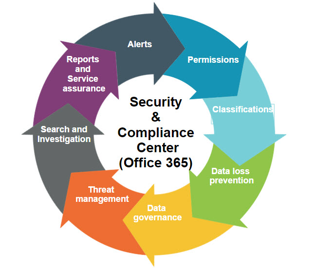

## Chuyện ở Microsoft Support (2024)

_Như vậy là chỉ sau hơn bốn tháng rưỡi công tác, tôi cũng đã kết thúc nhiệm vụ của mình với vai trò **Kỹ sư hỗ trợ tại iTechWX** - một đơn vị hợp tác với **Microsoft**. Trụ sở chính của đơn vị được đặt tại Trung Quốc, và chính vì thế nguồn lực tài chính của đơn vị này là không thiếu. Thứ duy nhất còn thiếu ở đây là **thiếu thời gian** (vâng, tôi không nói đùa đâu)_ 🤣

### Một ngày điển hình của Anthony

_Mỗi ngày, nhiệm vụ của tôi là tiếp nhận và hỗ trợ cho ít nhất **hai khách hàng mới**. Đồng thời, các vấn đề của những khách hàng cũ chưa giải quyết được vẫn phải tiếp tục theo dõi và liên lạc khi cần. Có những ngày, số lượng khách cần hỗ trợ trên hàng đợi của tôi lên đến con số **20** - một con số khiến tôi choáng ngợp. Điều đáng lưu tâm ở đây là yêu cầu theo sát "**hàng ngày**", ngoài ra mỗi yêu cầu có phương thức liên lạc khác nhau, đòi hỏi việc mình luôn duy trì trực điện thoại và email suốt từ **8h sáng đến 5h chiều**._

**_Chuyện tăng ca, gần như là cơm bữa..._**

### Tấn công và Phòng thủ

- **Nguồn**: [C# Corner](https://www.c-sharpcorner.com/article/alert-policies-in-the-office-365-security-compliance-center/)

_Nhóm tôi tham gia là nhóm **SCC (Security and Compliance Centers)**, một trong những nhóm trực tiếp làm việc với những vấn đề liên quan đến tất cả phương thức tấn công và phòng thủ trên các hệ thống của Microsoft. Tại đây, mình được học rất nhiều thứ về công nghệ, đặc biệt là các **hình thức tấn công** phổ biến diễn ra trên không gian mạng cũng như một số giải pháp **bảo vệ dữ liệu mật chống thất thoát** ra bên ngoài. Để nói về lí do mà mình phải lựa chọn ngưng việc, có hai điều mình đã lưu tâm:_

1. **_Do áp lực lớn về số lượng và yêu cầu theo dõi khách mỗi ngày_**
2. **_Do một số vấn đề cá nhân_**

_Tất nhiên, sẽ là vô nghĩa nếu như cứ vịn vào câu "**Muốn thì tìm cách, không muốn sẽ tìm lý do**" để bào chữa cho năng lực của bản thân mình. Nhưng sẽ có ý nghĩa hơn khi vào ngày cuối cùng mình làm việc tại công ty, mọi người gửi cho mình những món quà cảm ơn vì "**không để lại bất kỳ gánh nặng lớn nào**" liên quan đến vé hỗ trợ của khách hàng (tự nhiên thấy nhẹ nhõm vì không bị mọi người gọi là "**báo thủ đời đầu**")_ 🤣 

### Những câu chuyện vui và bài học cho tất cả chúng ta

_Trong quá trình thực hiện nhiệm vụ của mình, tôi bắt gặp một vấn đề khá hóc búa: **Làm sao để bảo vệ dữ liệu thẻ tín dụng của các ngân hàng khi chia sẻ qua các nền tảng khác?**. Từ đây, hành trình khám phá ra bí mật đằng sau các dãy số trên những chiếc thẻ **VISA, MasterCard** được bắt đầu:_

1. _Ngay sau khi nhận được yêu cầu, tôi nhanh chóng bắt tay vào thực hiện phân tích và hỗ trợ, tuy nhiên khách hàng có vẻ khá khó tính, **không đồng ý với bất kỳ giải pháp "chữa cháy" nào**._
2. _Tôi tiếp tục phân tích thông tin của dãy số, và dần dần phát hiện ra vấn đề lớn: Dãy số thẻ tín dụng đều có quy luật chung của nó cả. Và mỗi dãy số thẻ đều tuân thủ nghiêm ngặt theo **thuật toán Luhn** - **thuật toán "đồng dư modulo 10"**. Lúc này khách hàng có vẻ như đã hiểu ra được vấn đề thật sự nằm ở sự "**ngẫu nhiên**" đầy tai hại này._
3. _Khách hàng yêu cầu giải pháp tiếp theo nhằm đảm bảo **không thất thoát số thẻ tín dụng nhưng vẫn cho phép chia sẻ các mã số khác**. Lúc này yêu cầu trở nên khó khăn, và ở thời điểm đó, theo như yêu cầu từ phía Microsoft, tôi tiến hành tham vấn với chuyên viên cấp cao của nhóm và **xin hỗ trợ trên vé của khách**._

_Tới đây, tôi chợt hiểu ra một điều: **Hóa ra tất cả chúng ta đều bị lừa** - mọi chiếc thẻ tín dụng quốc tế, đều có chung 1 bộ khung, đồng nghĩa với việc nếu để lộ ra dù **chỉ có một chút thông tin trên thẻ**, cũng sẽ gây ra rất nhiều hệ lụy cho chính bản thân chủ thẻ. Vấn đề bảo mật dữ liệu nhạy cảm, cũng vì thế, **ngày càng trở nên cấp thiết**, nhất là trong hoàn cảnh công cuộc chuyển đổi số đang diễn ra ngày càng mạnh mẽ hơn bao giờ hết._

_Tại thời điểm tôi kết thúc công tác, việc hỗ trợ vẫn đang tiếp tục diễn ra. Cũng đang hóng xem là chuyên viên đã xử lý tới đâu rồi, và khách đã giải quyết được vấn đề hay chưa, chứ để mang tiếng đẩy việc khó cho chuyên viên thì **khổ thân tôi lắm**_ 😂

Phần phụ lục phía dưới sẽ cung cấp cho mọi người một cái nhìn tổng quan về **thuật toán Luhn** - thuật toán được sử dụng để kiểm tra tính hợp lệ của các dãy số thẻ tín dụng. Thuật toán này được phát minh bởi **Hans Peter Luhn**, một kỹ sư của IBM, và đã được cấp bằng sáng chế vào năm 1960. 

_Và đây là tất cả những gì mà bài viết này mang đến cho tất cả mọi người. Hy vọng mọi người từ đây sẽ hiểu rõ và ý thức hơn trong quá trình bảo vệ dữ liệu cá nhân của mình. Xin hẹn gặp lại quý vị ở phần 2 - nơi mà một câu chuyện mới về **Giám sát hệ thống** sẽ được trình bày. Tạm biệt._

**_Tuấn Anh_**