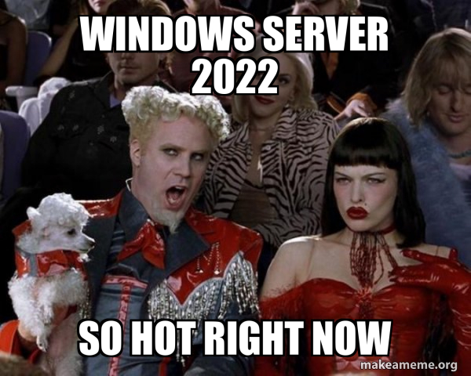
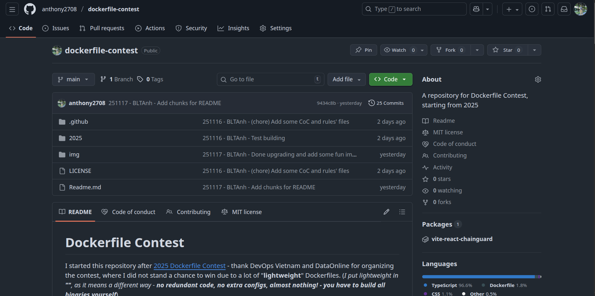

## Niềm đam mê trở lại, với diện mạo khác...

_Chào mọi người. Quá nhiều biến động đã diễn ra từ bài viết gần nhất của CS102 cho đến bài này, từ chuyện **công việc phải ngừng lại**, đến những vấn đề khác phát sinh. Giờ đây, một Tuấn Anh tự do, phóng khoáng **đã quay trở lại**._

_Hôm nay, xin kể cho mọi người một câu chuyện thú vị về những gì đã diễn ra dạo này._

### Từ chiếc máy chủ Windows Server đầy quyết đoán...

_Trước khi mình dừng công việc hiện tại, mình được giao một nhiệm vụ: **Nâng cấp hoặc thay thế máy chủ cũ của công ty**._ 

#### Tiền sử bệnh tật

_Máy chủ đó chạy **Windows Server 2012**, rất cũ. Mà muốn nâng cấp nó, mình phải chuẩn bị sẵn những giải pháp như nghiên cứu các ứng dụng đang chạy, tính thông dụng cũng như nhu cầu sử dụng của người dùng công ty. Đã thễ, mỗi lần muốn tắt nó để phục vụ việc kiểm tra, bạn phải cho hệ điều hành biết lý do - rất là phiền phức._

_Đó là một con máy ảo, và dựa trên quy trình nâng cấp [chuẩn](https://learn.microsoft.com/en-us/windows-server/get-started/upgrade-overview), mình đi kiếm hai con ISO (là tệp cài đặt chuẩn từ Microsoft) để thực hiện việc này._

**_Cụ thể, ít nhất mình sẽ đẩy lên 2016 trước, rồi sau đó mới nhảy cóc lên 2022 được._**

| **Upgrade from / to**      | **Windows Server 2012 R2** | **Windows Server 2016** | **Windows Server 2019** | **Windows Server 2022** | **Windows Server 2025** |
|----------------------------|----------------------------|-------------------------|-------------------------|-------------------------|-------------------------|
| **Windows Server 2012**    | Yes                        | Yes                     | -                       | -                       | -                       |
| **Windows Server 2012 R2** | -                          | Yes                     | Yes                     | -                       | Yes                     |
| **Windows Server 2016**    | -                          | -                       | Yes                     | Yes                     | Yes                     |
| **Windows Server 2019**    | -                          | -                       | -                       | Yes                     | Yes                     |
| **Windows Server 2022**    | -                          | -                       | -                       | -                       | Yes                     |
| **Windows Server 2025**    | -                          | -                       | -                       | -                       | Yes                     |

_Quá trình nâng cấp bắt đầu. Việc nâng cấp lên bản 2016 diễn ra khá trơn tru, không có gì bất thường._

_Nếu dừng ở đây thì mọi người sẽ thắc mắc: **Ủa vậy mà cũng kể?**_

**_Cuộc vui bắt đầu ở đây._**

#### Thử thách cực đại

_Nối tiếp thành công của lần trước, lần này mình đi thẳng lên 2022 luôn. Nhưng rồi mọi chuyện bắt đầu diễn tiến xấu đi._

_Mình nâng cấp ba lần, cả ba đều **thất bại** vì nhiều lỗi khác nhau. Mình đưa sang cho ông anh đồng nghiệp thử lại, và vẫn bị **lỗi nâng cấp**._

_Mình thử nâng cấp lên 2019 (tức là bản thấp hơn của 2022) và vâng, **nó cũng bị lỗi luôn!**_

_Mình đứng trước hai lựa chọn: Hoặc tiếp tục **cố chấp nâng cấp** (dù mình lờ mờ đoán được vấn đề là do xung đột phần cứng rồi) hoặc **phá dỡ máy ảo cũ** để dựng mới._

_Sau năm lần thử nâng cấp bất thành, quyết định đã được đưa ra: **PHÁ DỠ**._ 

_Nhiều người sẽ hỏi mình: **Sao không cố?** Vấn đề của "**cố gắng**" nó khác hoàn toàn với việc "**cố gắng trong vô vọng**" - bạn càng để máy chủ đó ở phiên bản cũ càng lâu, bạn càng đặt nhân viên công ty bạn vào nguy hiểm bị **lộ lọt, đánh cắp dữ liệu cá nhân**. Do bản 2016 giờ đây cũng không còn nhận hỗ trợ nữa, bạn không thể nào cầm cự mãi ở đó được._

#### Cuộc chạy đua cuối cùng

_Lúc này là khoảng tháng 8. Sau khi quyết định được đưa ra, một cuộc khảo sát đã được thực hiện, và ngay lập tức sau đó, việc triển khai được diễn ra với tốc độ có thể nói là nhanh chưa từng có: **Trong vòng một tuần**, gần như toàn bộ mọi thứ đã được đưa lên hệ thống, chờ giai đoạn chuyển giao._

_Khi thời cơ chín muồi, cuộc chuyển giao bắt đầu. Việc chuyển giao được thực hiện qua hình thức **nối cầu truyền hình trực tiếp** với đối tác phần mềm bên Úc, lý do là vì giấy phép sử dụng của một số phần mềm đều được đối tác quản lý. Và mình, là **trưởng dự án đó, với một cuộc gọi đặc biệt thông sóng sang nước bạn để xin hỗ trợ**._

_Sau khi cầu truyền hình kết thúc, mình chuyển sang giai đoạn cuối cùng, là **cắt kết nối của người dùng đến máy chủ cũ** - vốn đã hoạt động từ khá lâu và không còn duy trì được hiệu năng. Nó trông giống như việc tắt sóng truyền hình tương tự mặt đất ở Việt Nam, tuy có rất nhiều kỷ niệm, nhưng rồi cũng **đành phải chuyển sang cái mới an toàn hơn** vậy._

_Một điều đặc biệt hơn, lời chia tay đó cũng trùng hợp **là lời chia tay của mình với công ty** sau hơn một năm công tác..._

_Mình ra đi, để lại niềm nuối tiếc với tất cả đồng nghiệp, nhưng cũng đồng thời cũng gieo vào đó những hy vọng về một tương lai tưoi sáng hơn không chỉ cho doanh nghiệp mà còn cho chính mình - khi mình đã s**ẵn sàng đi tiếp hành trình đầy chông gai** này._

### ... đến chiếc Dockerfile đầu tiên sau hai năm không viết lại

_Mình biết đến **cuộc thi Dockerfile năm 2025** do cộng đồng **DevOps Vietnam** tổ chức phối hợp cùng nhà tài trợ qua một chiếc quảng cáo của Facebook. Và thế là tự nhiên thứ đam mê ngày xưa của mình trỗi dậy, **trở lại**._

#### Bước chạy đà đầu tiên
_Tất nhiên, chiếc Dockerfile với kích thước **hơn 18MB** của mình làm sao cạnh tranh được với những Dockerfile chỉ hơn **2MB**, thậm chí có cái **dưới 200KB** (tức là nhỏ hơn **90 lần**) chứ? Nhưng với mình, thứ làm nên khác biệt đó chính là **tư duy**._

_Ở cuộc thi đó, mình học được rằng, tối ưu để bản ảnh Docker nhỏ nhất là tốt, nhưng **không được xem thường yếu tố bảo mật**._

_Mà nói về Bảo mật, thì mình lại tự tin nói rằng: **Dockerfile của mình sử dụng những bản ảnh gốc từ đối tác quét CVE (lỗ hổng) hàng ngày** (xem **phụ lục** phía dưới)._

#### Cho đến một dự án lớn hơn

_Mình cố gắng làm cho Dockerfile của mình sau khi dựng trở nên nhỏ bé hơn. Sau đó thì một ý tưởng bật lên trong đầu: **Tại sao không vận hành tự động việc dựng, đăng tải, và quét bảo mật trong cùng một quy trình tự động hoá?**_

Đó là lúc chiếc kho lưu trữ [này](https://github.com/anthony2708/dockerfile-contest) ra đời.

_Nó tích hợp cả việc dựng bản ảnh, đến quét bảo mật hàng ngày, rồi đẩy lên kho lưu trữ bản ảnh (**container registry**) mỗi ngày mà **không cần sự can thiệp của con người**._

_Tất cả được thực hiện một cách hoàn hảo, để giúp bản thân hiểu ra thêm một điều: Đã đến lúc mình theo đuổi một dự án còn lớn hơn, đó là: Xây dựng một **bản ảnh chuẩn (Base image)** vàng - bao gồm những công cụ cần thiết với kích thước **nhỏ nhất** để chuẩn bị "**phục thù**" vào năm sau._

**_Đó sẽ là lựa chọn sống còn, để kiếm chút danh hiệu cũng như sự công nhận cho bản than trong tương lai._**

_Và kho lưu trữ mã nguồn vẫn còn ở đó, để mọi người chiêm ngưỡng._

_Xin hẹn mọi người ở câu chuyện tiếp theo, nơi **KVM** sẽ là điểm nhấn của **những ngày cuối năm**..._