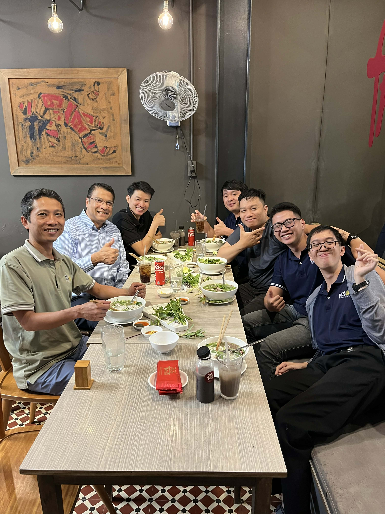
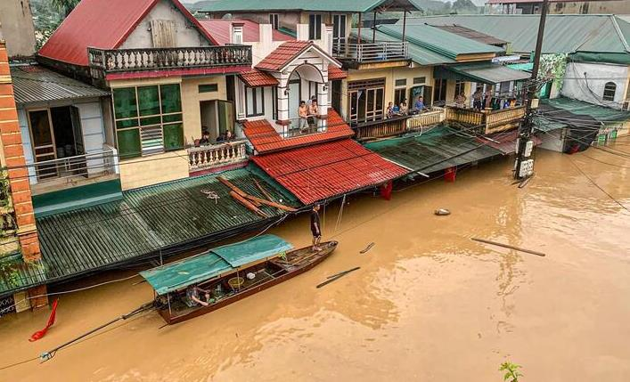
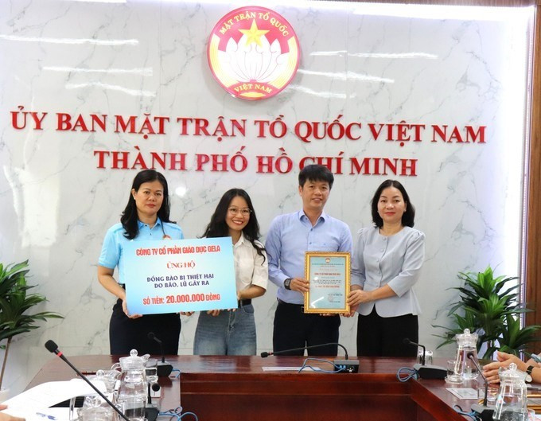
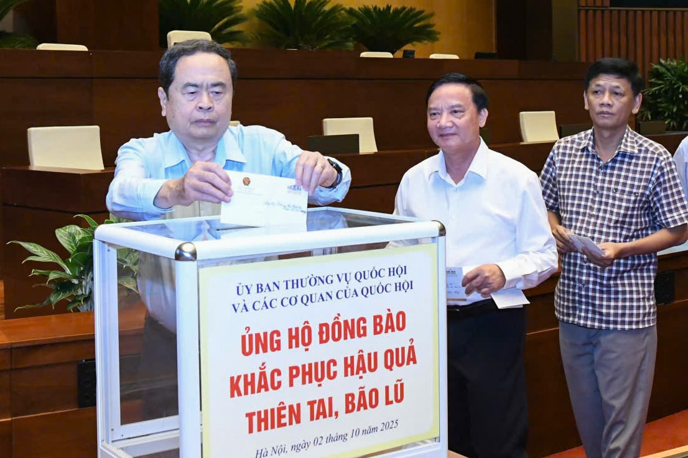
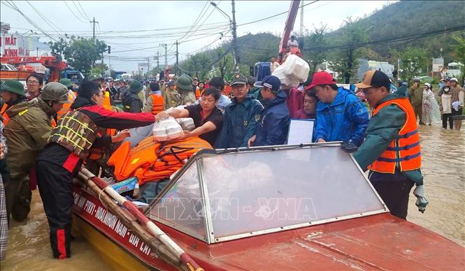
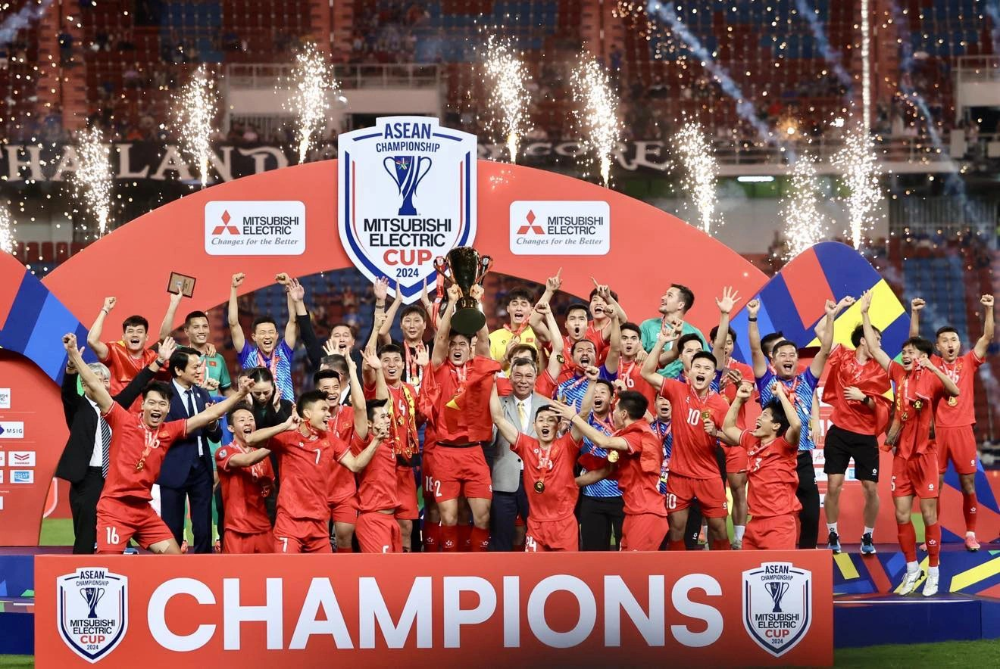
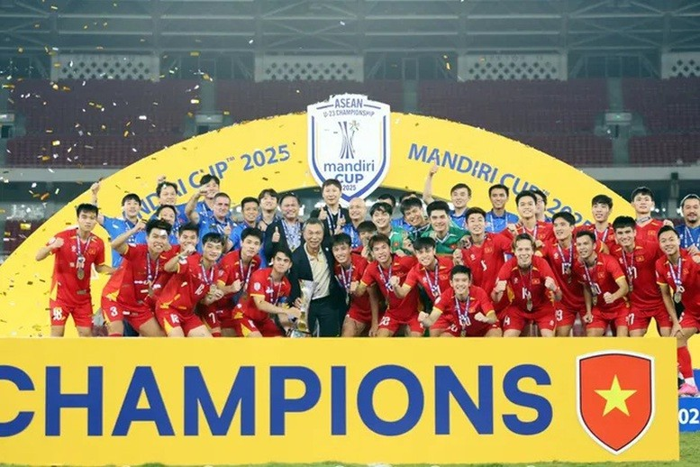
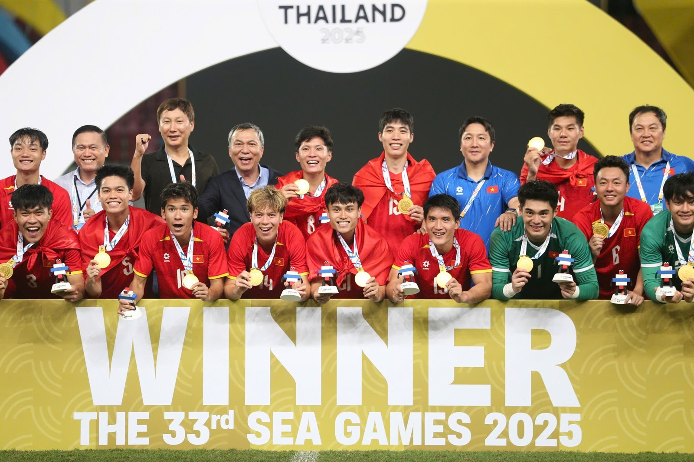
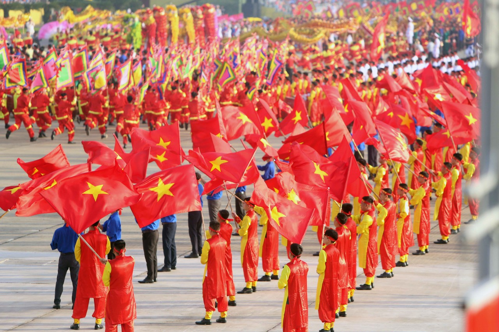
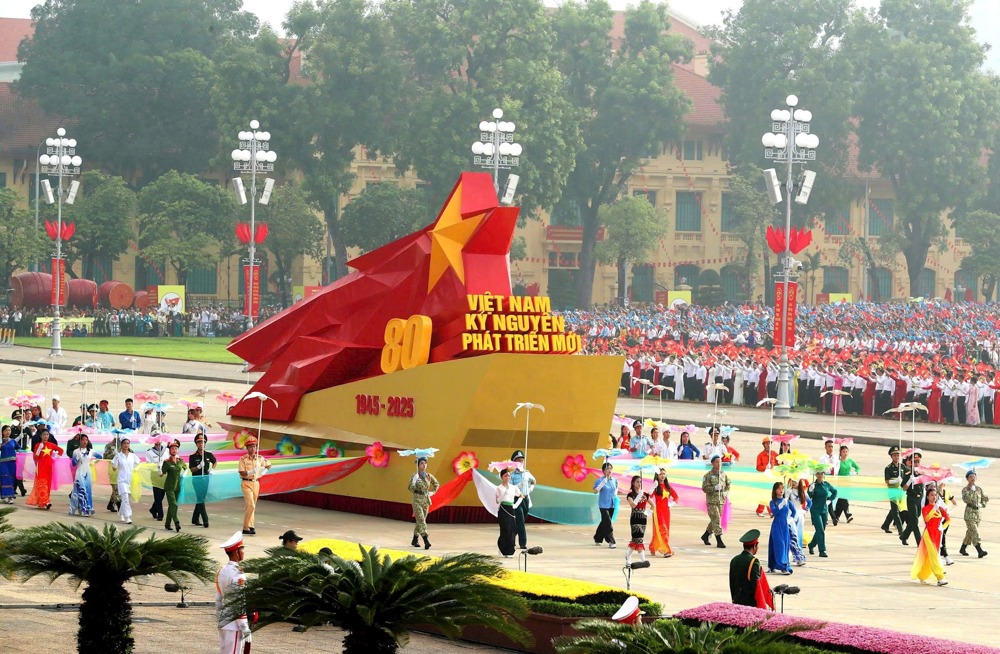

## Kỳ 1: Recap 2025 - Kiếp sau vẫn là người Việt Nam

_Xin chào mọi người, đây là bài viết mà mình hứa hẹn sẽ đăng tải nó ngay trước lúc chuyển giao giữa năm 2025 và năm 2026 đây. Một năm với quá nhiều cảm xúc lẫn lộn - quá nhiều đau thương, quá nhiều nghiệt ngã nhưng cũng quá nhiều tình yêu thương mà mình nhận được từ quý độc giả._

_**Thế năm nay có gì mà Tuấn Anh này phải thốt lên như vậy?** Cùng đi vào nội dung chính nhé._

### Biến động nhân sự cuối năm 😭

_Có lẽ đau đớn nhất chính là khi mình phải **kết thúc** công việc mà đúng một năm trước khi viết bài Recap đang phải **vừa viết vừa làm Change Request**. Một thứ công việc ban đầu trông rất vui vẻ, nhưng rồi lại trở nên áp lực hơn bao giờ hết, từ đồng lương, cho đến khối lượng đổ dồn xuống đôi vai nhỏ bé của mình._

_Cũng may là trước khi nghỉ việc, mình cũng kịp đi ăn với **CIO - Giám đốc bộ phận Công nghệ thông tin** của Tập đoàn sang Việt Nam. Chúng tôi tản bộ trên những cung đường vừa quen vừa lạ của **phường Sài Gòn, Thành phố Hồ Chí Minh**, kể cho nhau nghe về sự phát triển của đất nước và những câu chuyện làm nên "**Bản lĩnh Việt Nam**" - thứ bản lĩnh đã đánh bại bao quân thù và làm nên những con người có chất "**thép**" như hôm nay. Mình cũng học được nhiều điều từ tư duy đổi mới, hoà nhập nhưng không hoà tan của những người ngoại quốc. Được làm việc với họ, đó là một trải nghiệm tuyệt vời._

**_Mình sẽ nhớ lắm tấm hình này ngay khi rủ nhau ăn phở Việt giữa cái nắng gắt của Thành phố..._**

### Bão lũ thì kinh hoàng đấy, nhưng tình người còn vĩ đại hơn...

_21 cơn bão và áp thấp nhiệt đới (**15 bão, sáu áp thấp**) là con số bão và áp thấp kỷ lục được ghi nhận trong nước. Phần nhiều trong số đó đánh thẳng vào miền Trung nước ta, gây ra những trận "**đại hồng thuỷ**" theo đúng nghĩa đen, thiệt hại kinh tế và nhân mạng là không thể đong đếm chỉ bằng **những con số vô hồn**._

- **Nguồn**: [Báo Chính phủ](https://baochinhphu.vn/thien-tai-nam-2025-co-xu-huong-cuc-doan-hon-so-voi-trung-binh-nhieu-nam-102251006151314108.htm)

_Thế nhưng, sau tất cả những khó khăn đó, tinh thần tương thân tương ái của người Việt lại được khắc hoạ rõ nét hơn nữa, tô điểm hơn nữa cho chất "**thép**" đã được hun đúc tự muôn đời_...

- **Nguồn**: [Báo Tiền Phong](https://tienphong.vn/tphcm-tiep-nhan-gan-49-ty-dong-ung-ho-nguoi-dan-vung-bao-lu-post1785287.tpo)

- **Nguồn**: [Báo Đại biểu nhân dân](https://daibieunhandan.vn/uy-ban-thuong-vu-quoc-hoi-ung-ho-dong-bao-khac-phuc-hau-qua-thien-tai-bao-lu-10388875.html)

- **Nguồn**: [Báo Tin tức](https://baotintuc.vn/thoi-su/gan-1390-ty-dong-dang-ky-ung-ho-dong-bao-vung-bao-lu-20251119182514540.htm)

### Đến những giây phút bùng nổ...

_Nguyên năm nay thấy điểm sáng duy nhất là được ăn mừng tận hai, ba lần, vâng là những khoảnh khắc này đây._

- **Nguồn**: [Báo Chính phủ](https://baochinhphu.vn/truc-tiep-chung-ket-aff-cup-2024-viet-nam-dan-truoc-thai-lan-1-0-102250105202943215.htm)

- **Nguồn**: [Báo Vietnamnet](https://vietnamnet.vn/ket-qua-bong-da-u22-viet-nam-vs-u22-thai-lan-chung-ket-sea-games-33-2473365.html)

_Hy vọng sang năm còn được đi ăn mừng nhiều hơn nữa, gì chứ năm sau sẽ có nhiều sự kiện để đón chờ lắm._

### Nhìn lại Wishlist

_Okay, bây giờ là lúc nhìn lại chiếc wishlist thần thánh của năm ngoái coi có gì vui không nhé!_

✅ _**Gia đình bình an, mọi người đều có sức khỏe và cuộc sống đủ đầy**. Cũng có đau nhức, cũng có bệnh đó, nhưng sức khoẻ vẫn không suy kiệt tới mức gục ngã._

❎ _**Bản thân không ngừng học hỏi, sẵn sàng cho thi hai chứng chỉ AWS và IELTS trong năm nay**. Hỏng một phần, học thì có học đó mà không sắp xếp được thời gian để đi thi (vì quá bận)._    

❌ _**Sẵn sàng cho một chuyến đi chơi xa hơn, lần này nhất định phải là ra nước ngoài**. Bể kèo toàn tập, tới giờ chưa đụng được tới tấm hộ chiếu lần thứ hai, sau lần đầu tiên vào 2019._ 

_**Wishlist của năm 2026 này, không gì khác là những điều sau**:_

✅ _Tìm được công việc phù hợp hơn cho chính mình. **Mọi việc xảy ra đều có lý do** - và mình luôn tin vào điều đó, nghề chọn người chứ "**người chọn tiền**" mà, phải không mọi người_ 😂 

✅ _Sắp xếp được thời gian đi thi chứng chỉ - **trời ơi, lần thứ ba rồi đó**_ 😂 

✅ _Tìm được "**chân ái**" - Nghe như tìm "người yêu" nhưng mà đúng hơn là tìm kiếm một mảnh ghép đồng hành cùng mình trên những chặng hành trình tiếp theo đầy gian truân sắp tới._

### Tổng kết

_Hết phần recap. Thật sự, năm 2025 đã có quá nhiều những cung bậc cảm xúc tột cùng rồi. **Năm 2026, hãy cùng nhau làm nên những điều còn tuyệt vời hơn nữa nhé!**_

🏡 _Gửi lời cảm ơn đến tất cả mọi người vì đã cùng đồng hành với mình trong một năm_ 2️⃣0️⃣2️⃣5️⃣ _đầy những điều thú vị. **Xin hẹn gặp mọi người vào năm mới - năm của những chiến binh hùng cường!**_

🌸 **Câu chuyện mùa xuân 2️⃣0️⃣2️⃣6️⃣ 🏵 - Kỳ 2️⃣** sẽ lên sóng trong vài ngày nữa.

**_Tạm biệt mọi người, Tuấn Anh đi đón pháo hoa đây!_** 😂