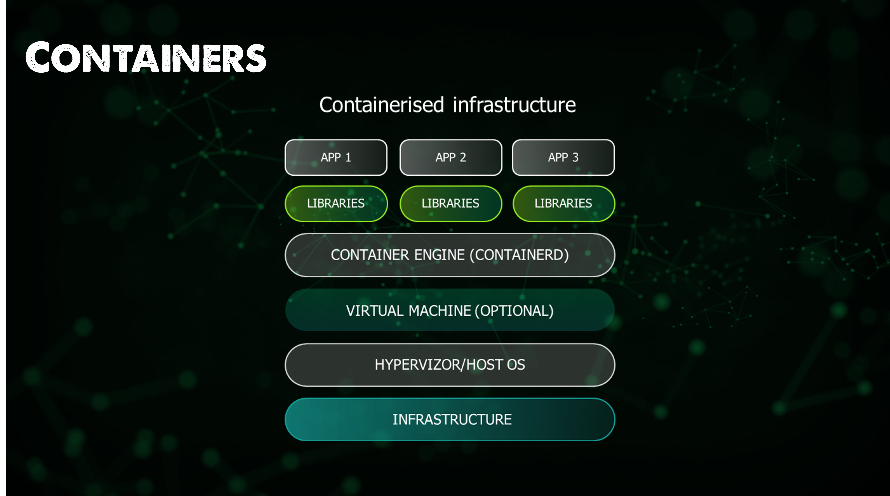

## Ngày 36 - Một bức tranh toàn cảnh về Containers 🚚

### Tại sao phải sử dụng Containers hay Máy ảo?

_Một ngày bình thường như bao ngày. Bạn nhận được yêu cầu phải mang ứng dụng của công ty chuyển sang vận hành trên 
một máy khác có cấu hình khác biệt với cấu hình trên máy hiện thời. **Bạn sẽ phải làm gì?**_

_Bạn âm thầm đi dọn dẹp, chuẩn bị môi trường, cài đặt các thư viện, cấu hình môi trường, và cuối cùng là chạy ứng dụng.
Tất nhiên, nó tiêu hao rất nhiều thời gian của bạn. Và rồi, khi nó báo lỗi "**Không tương thích môi trường**", bạn quay 
lại chỗ của sếp và bảo rằng:_

> - **_Chúng ta cần một chiếc máy khác tương tự máy cũ để chạy ứng dụng._**

_Thật là điên rồ nếu bạn mỗi lần phải di chuyển giữa các máy, vì đó là ngân sách bị tiêu pha không hợp lý chút nào cả. 
Và tất nhiên, bạn muốn đóng gói toàn bộ môi trường vận hành của ứng dụng vào một nơi, và chuyển nó đi đâu cũng được, 
mà không cần phải lo lắng về cấu hình môi trường. Đây là lúc mà máy ảo và containers ra đời._

### Máy ảo

_Máy ảo là máy tính ảo, nó y chang máy tính thật nhưng chạy trên môi trường ảo hóa thôi. Nó cũng được cô lập với máy thật,
và tất nhiên là vẫn có cách để máy ảo kết nối với Internet._

_Bạn có thể có một máy thật, nhưng sẽ có nhiều hơn một máy ảo chạy trên máy thật. Mỗi máy ảo sẽ chứa một hệ điều hành
và môi trường khác nhau._

### Containers

**_Đây là containers._**

**_Dưới đây cũng là containers._**

_**Hãy nhìn xem sự giống nhau của nó là gì?** Đúng rồi, chúng đều đựng hàng hóa bên trong, và chúng ta có thể chuyển chúng
đi đâu cũng được. Containers giống như một chiếc hộp chứa toàn bộ môi trường vận hành của ứng dụng, bao gồm cả mã 
nguồn ứng dụng và các thư viện cần thiết. Khi chúng ta cần chạy ứng dụng, chúng ta chỉ cần chạy container, và mọi thứ 
sẽ hoạt động như chúng ta đã mong muốn._

_Về mặt cấu trúc, chiếc thuyền sẽ đóng vai trò là **máy tính vật lý**, còn container sẽ đóng vai trò là một **máy ảo**.
Điều này giúp cô lập giữa máy thật và máy ảo. Tính mở rộng được nâng cao hơn khi bạn có thể triển khai bao nhiêu 
containers trên máy thật cũng được, không phải mỗi máy một ứng dụng, vấn đề duy nhất là dung lượng máy thật._

_Mỗi ứng dụng sẽ tương ứng với một container, và trên máy tính sẽ có một engine - giúp chúng ta quản lý các container
một cách tiện lợi hơn._

### Ưu diểm của Containers

- **_Container giúp đóng gói tất cả các gói phụ trợ bên trong và cô lập nó._**
- **_Dễ dàng quản lý, mở rộng, di chuyển từ hệ thống này qua hệ thống khác các container._**

_Sử dụng các container, bạn có thể mở rộng các container và sử dụng **bộ cân bằng tải** hoặc một **dịch vụ** 
để phân chia lưu lượng và có thể mở rộng ứng dụng theo chiều ngang. Container cung cấp tính linh hoạt 
và dễ dàng trong việc quản lý các ứng dụng của mình._

_Về nguyên tắc vận hành, containers như một máy ảo độc lập, nghĩa là nó sẽ không thay đổi **bất kể bạn chạy
nó ở máy tính nào**. Tính phân ly mạnh này là điểm mấu chốt giúp containers trở nên khác biệt so với rất nhiều
những phương pháp vận hành ứng dụng khác, **dễ dàng và đơn giản hơn**._

### Image - Bản ảnh của Containers

_**Bản ảnh của Container chứa gì?** Nó chứa tất cả mọi thứ. Từ mã nguồn ứng dụng, các thư viện cần thiết, cấu 
hình môi trường, ... Hãy xem bản ảnh như một gói mầm/bộ khung nào đó. Khi bản ảnh được tải xuống và chạy, một
container sẽ được tạo ra._

_Nhìn cảnh này, chắc hẳn nếu ai mà là dân Công nghệ thông tin sẽ nghe loáng thoáng thuật ngữ tập tin ISO để 
cài hệ điều hành - Docker Image chính là một ISO đặc biệt như vậy đó._

**_Nếu bạn đã tò mò về cách Docker hoạt động - hãy trở lại trong bài viết tiếp theo nhé!_**