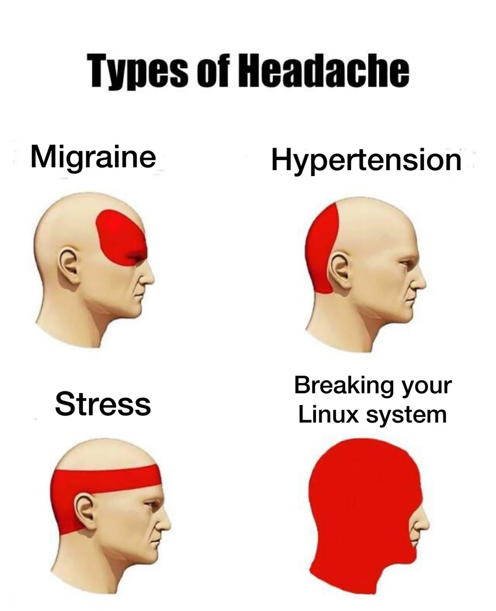

## Ngày 2: Trách nhiệm của một kỹ sư DevOps 👨‍💻

_Ở bài viết này, chúng ta sẽ đi sâu vào hai quá trình cơ bản: **Phát triển (Dev - Development)**, nơi kỹ sư phát triển phần mềm sẽ lập trình và kiểm thử ứng dụng, và **Vận hành (Ops - Operations)**, nơi ứng dụng được triển khai và vận hành trên hệ thống máy chủ._

### Mối quan hệ "không thể tách rời"... 💖

_**DevOps là gì?** Vắt óc suy nghĩ đến đau đầu cho một câu trả lời, để rồi chúng ta nhận ra rằng, cần hiểu rõ về các công cụ, quy trình cũng như cách mà Dev và Ops phối hợp với nhau. Ta bắt đầu với từ khóa chính của ngày hôm nay: **Ứng dụng**._

> **Nguồn**: [MAAS](https://maas.vn/wp-content/uploads/2021/06/mobile-apps-collage-ss-19201-800x450-1.jpg.webp)

_Mỗi ứng dụng được tạo ra bởi các kỹ sư phần mềm, bằng nhiều cách khác nhau, nhiều ngôn ngữ lập trình khác nhau: **Java, Python, Ruby, JavaScript, C#, C++, ...** và được triển khai với nhiều công cụ cho các quy trình khác nhau: **Dựng ứng dụng (Build)**, **Quản lý mã nguồn (Source Control)**, **Kiểm thử (Test)**, ..._

_Là một kỹ sư DevOps, bạn cần hiểu rõ về cách làm việc của một kỹ sư phần mềm cũng như hệ thống, công cụ cần thiết cho quá trình phát triển đó. Tất nhiên, **bạn không phải là một siêu nhân**, và điểm quan trọng là bạn không đi lập trình các ứng dụng này - **nếu ai đó bảo bạn làm DevOps nhưng bắt bạn lập trình mã nguồn ứng dụng, hãy cân nhắc lại công việc của mình**._

> **Nguồn**: [Linkedin](https://www.linkedin.com/posts/automationist_devops-workingfromhome-activity-7177978282733142016-2P0U/)

_Thứ bạn cần quan tâm với DevOps là cách ứng dụng **tương tác với các dịch vụ, dữ liệu và những yêu cầu, phương pháp** khác nhau mà chúng ta có thể kiểm chứng được những điều này._

_Hãy xem **máy chủ** là nơi ứng dụng triển khai. Người dùng đầu cuối truy cập vào ứng dụng qua máy chủ này. Máy chủ này có thể là một **máy chủ vật lý** hoặc **máy chủ ảo**, hoặc một **dịch vụ đám mây như AWS, Azure, GCP**, hay thậm chí là **phi máy chủ (Serverless)** - à ừm, đây là **xu hướng của nhiều doanh nghiệp hiện nay**, mặc dù nó không phải là chủ đề mà chúng ta sẽ nói đến trong ngày hôm nay. Nhiệm vụ của một kỹ sư DevOps thực chất chính là **chuẩn bị, cài đặt và triển khai ứng dụng trên máy chủ** này._

_Mỗi máy chủ có thể sử dụng một **hệ điều hành** khác nhau: **Windows, Linux,...** Ở series này, chúng ta sẽ dành ra1 tuần để nói về **Linux**. Đừng lo lắng nếu bạn chưa từng sử dụng Linux, chúng ta sẽ bắt đầu từ những kiến thức cơ bản nhất, để bạn không phải **đau đầu đi làm khó chủ nhân trang web** đâu._

> **Nguồn**: [Reddit](https://www.reddit.com/r/linuxmasterrace/comments/reoadb/my_doctor_said_no_medicine_can_mitigate_the_pain/?rdt=36476)

_Những kiến thức cơ bản khác về **Mạng máy tính và các dịch vụ mạng** cũng sẽ được đề cập trong series này. Bởi lẽ,trách nhiệm của kỹ sư DevOps là đảm bảo các **máy chủ có thể giao tiếp với nhau hoặc với các thành phần khác**. **DNS,DHCP, Cân bằng tải, ...** là những mục sẽ có trong phần sau của chuyến hành trình 90 ngày **"đau khổ"** này._

### Mr./Mrs./Ms. Biết tuốt ✅

_**Tại sao phải biết tuốt?** Bạn không cần phải là một chuyên gia về mọi thứ, nhưng cần phải biết cách tìm hiểu và giải quyết vấn đề. Đặc biệt, bạn cần phải có **kiến thức nền tảng về cách triển khai và kết nối các thành phần ứng dụng** với nhau. Bạn cũng chả cần đi lập trình ứng dụng, nhưng ít nhất bạn phải nắm những **điều cơ bản về lập trình**, để hiểu được cách mà ứng dụng hoạt động. **Nếu ai bảo rằng học DevOps là không cần phải biết lập trình - coi chừng họ đã quên mất ý nghĩa từ khóa DevOps đã bao gồm chữ Dev ở trong đó rồi**._

> **Nguồn**: [Dzone](https://dzone.com/articles/dev-vs-ops-conflicted-so-are-we)

_Có nhiều khả năng là bạn sẽ **chẳng cần phải quản lý hay tương tác** với máy chủ/ứng dụng mỗi ngày. Mà nhắc tới máy chủ mới nhớ, nói vậy thôi, chứ máy chủ ngoài đời thực nhiều khi chính là **container**. Điều này cũng có nghĩa là, bạn phải biết về **Docker, Kubernetes, OpenShift, ...** để quản lý các container này. Đừng **"Hoang mang" như ca sĩ Hồ Quỳnh Hương**, chúng ta sẽ nói về container ở điểm dừng chân tiếp theo, để bạn không phải hát lên câu hát kinh điển: **"Em quay cuồng trong mơ hồ..."** thuở nào._ 🎶

> **Nguồn**: [Wikipedia](https://en.wikipedia.org/wiki/Dizziness)

### Tóm tắt 📝

1. **_DevOps là một quá trình kết hợp giữa phát triển và vận hành ứng dụng._**
2. **_Kỹ sư DevOps cần phải hiểu rõ về cách ứng dụng tương tác với các dịch vụ, dữ liệu và yêu cầu._**
3. **_Kỹ sư DevOps cần phải biết cách triển khai và kết nối hệ thống với nhau._**

_Có một điều quan trọng quên đề cập: **Làm thế nào đưa tính năng mới/bản vá lỗi/phiên bản mới đến người dùng cuối một cách nhanh chóng, an toàn và hiệu quả?** Ngoài ra cần phải bao gồm cả **quá trình kiểm thử** và đặc biệt là phải **tự động hóa** quá trình này. Đó chính là một trong những nhiệm vụ quan trọng của kỹ sư DevOps._

_Xin được chấm dứt chặng 2 của hành trình này. Với những cố gắng thường xuyên trong những ngày qua, ước mong mọi người đã hiểu hơn phần nào nội dung bài viết này. Hẹn tái ngộ cùng mọi người vào **ngày mai, cũng tại website này**._ 🚀
