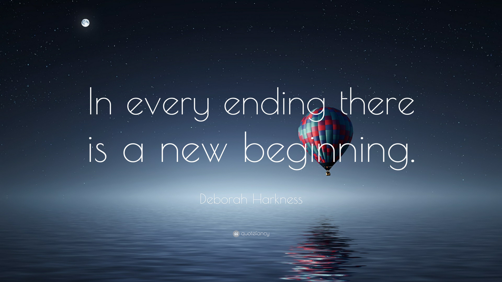

import { Tabs, TabItem, LinkButton } from '@astrojs/starlight/components';
import Day32 from './_day32.mdx';
import Day33 from './_day33.mdx';
import Day34 from './_day34.mdx';
import Day35 from './_day35.mdx';

_Phù, chào mừng mọi người đến với chuyến hành trình mới của 90 ngày cùng DevOps, nơi mà ở đó 
chúng ta sẽ khám phá công cụ quản lý phiên bản mã nguồn được tin dùng số 1 trên thế giới -
**Git**. **Đây là chặng thứ sáu và bây giờ, hãy xuất phát thôi!**_ 🚗

> **Nguồn**: [QuoteFancy](https://quotefancy.com/quote/2516375/Deborah-Harkness-In-every-ending-there-is-a-new-beginning)

:::note

**_Mời mọi người chuyển sang các thẻ khác nhau để theo dõi hành trình này._**

:::

<Tabs>
  <TabItem label="D32">
    <Day32/>
  </TabItem>
  <TabItem label="D33">
    <Day33/>
  </TabItem>
  <TabItem label="D34">
    <Day34/>
  </TabItem>
  <TabItem label="D35">
    <Day35/>
  </TabItem>
</Tabs>

## Tài liệu tham khảo 📚

_Mời mọi người chuyển sang trang này để theo dõi tất cả tài liệu liên quan trong giai đoạn 6, 
để giúp bản thân có được những tài liệu hữu ích về Quản lý phiên bản trong làm việc với DevOps._

<LinkButton 
    href="/90days/reference/git"
    icon="document"
    iconPlacement="end"
><b>Giai đoạn 6 - Tham khảo</b></LinkButton>

_Hẹn gặp mọi người ở những ngày tiếp theo, nơi chúng ta sẽ khám phá những câu chuyện thú vị về bộ chứa
(Containers) và ảo hóa trong xây dựng dự án._ 🚀