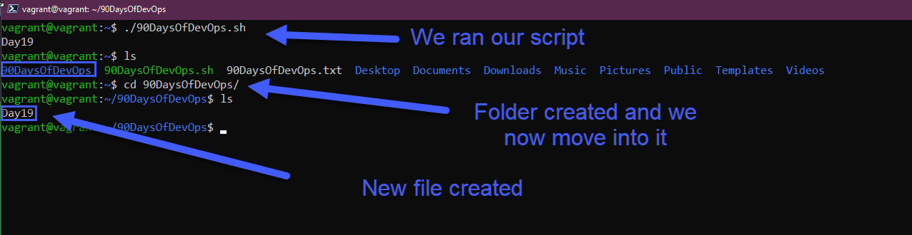
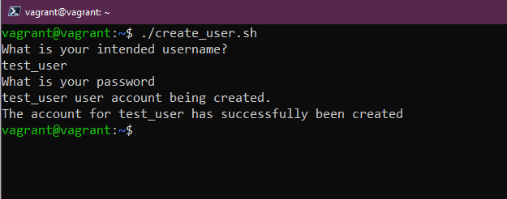

import { Code } from '@astrojs/starlight/components';
import importedCode from '/src/assets/linux/code/90DaysOfDevOps.sh?raw';
import fullCode from '/src/assets/linux/code/90DaysOfDevOps_full.sh?raw';
import userCode from '/src/assets/linux/code/user_full.sh?raw';

## Ngày 19 - Tự động hóa với Bash Shell

_Ngày thứ 19. Chúng ta tiếp tục với hành trình 90 ngày DevOps với câu chuyện mà chúng ta đã từng
nhắc đến ở giai đoạn đầu: **Tự động hóa**. Để tự động hóa được tốt hơn, trong DevOps người ta thường
sử dụng **Bash (Bourne Again Shell)**. Tất nhiên chúng ta cũng có một lựa chọn khác là ZSH sẽ được
nhắc đến trong những phần tiếp theo._

### Khởi đầu

_Chúng ta tạo một tập tin Bash Shell đơn giản bằng ```touch 90DaysOfDevOps.sh```. Sau đó, chỉnh 
sửa bằng ```nano 90DaysOfDevOps.sh```. Dưới đây là nội dung tập tin Bash Shell._

<Code code={importedCode} lang="bash" title="90DaysOfDevOps.sh" />

_Dòng đầu tiên định hình vị trí của Shell mà chúng ta sử dụng, tất nhiên nó có thể có những biến
thể như thế này._

- ```#!/usr/bin/env bash```
- ```#!/usr/bin/bash```

_Để biết chắc chắn Bash đang ở đâu, hãy sử dụng một trong hai câu lệnh: ```which bash``` hoặc
```whereis bash```._

_Lưu tập tin. Kiểm tra quyền hạn của tập tin này bằng lệnh ```ls -la```. Sau đó thay đổi để cấp quyền
thực thi bằng câu lệnh quen thuộc: ```chmod +x 90DaysOfDevOps.sh```. Chạy tập tin này lên, và đây là
kết quả._



### Thay đổi một chút...

_Trên tập tin chúng ta có thể có những trường thông tin sau để chúng ta tìm hiểu._

#### Biến

_Cách dùng có thể là khai báo trực tiếp rồi gọi bằng ```$[name]```. Hoặc có thể sử dụng cách sau để cho
người dùng nhập giá trị vào._

```bash title="Entering variables"
echo "Write your name: "
read name
```

:::note
**_Biến ```$1``` nghĩa là tham số thứ nhất, biến thứ nhất trong một câu lệnh bất kỳ, ví dụ như sau._**

```bash
mkdir hello # Hello sẽ được xem là $1 nếu được khai báo dưới dạng biến
```
:::

#### Điều kiện

<Code code={fullCode} lang="bash" title="90DaysOfDevOps.sh" />

_Đây là cách xét điều kiện trong Bash. Cách so sánh cũng khá khác thường một chút._

- _```eq```: A = B trả ra **ĐÚNG**_
- _```ne```: A != B (khác) trả ra **ĐÚNG**_
- _```gt```: A > B trả ra **ĐÚNG**_
- _```ge```: A >= B trả ra **ĐÚNG**_
- _```lt```: A < B trả ra **ĐÚNG**_
- _```le```: A =< B trả ra **ĐÚNG**_

_Ngoài ra, việc xét điều kiện với một tập tin cũng được tính đến, cụ thể như sau._

- _```-d file```: Tập tin đó là một thư mục_
- _```-e file```: Tập tin tồn tại_
- _```-f file```: Chuỗi cung cấp là một tập tin_
- _```-g file```: Tập tin có cài đặt mã định danh nhóm (Group ID)_
- _```-r file```: Tập tin đọc được_
- _```-s file```: Tập tin có nội dung (Kích thước khác 0)_

```bash

FILE="90DaysOfDevOps.txt"
if [ -f "$FILE" ]
then
  echo "$FILE is a file"
else
  echo "$FILE is not a file"
fi

```

### Nguyên mẫu

_Ta sẽ thử tạo một tập tin mà trong đó, ta sẽ tạo người dùng một cách tự động và cho phép người 
dùng xóa người dùng nếu cần._

<Code code={userCode} lang="bash" title="user_full.sh" />

_Tập tin này cho phép người dùng nhập thông tin tên đăng nhập và mật khẩu trước khi tạo người dùng.
Đồng thời cũng cho phép xóa người dùng khi cần. Dưới đây là kết quả khi chạy chương trình._



**_Kết thúc ngày thứ 19. Nội dung đã được lược giản cho phù hợp với điều kiện thực tế._** 

**_Bạn có thể xem thêm những tài liệu về Bash ở 
[đây](https://github.com/HariSekhon/DevOps-Bash-tools/blob/master/README.md) hoặc phần Tham khảo 
phía dưới._**