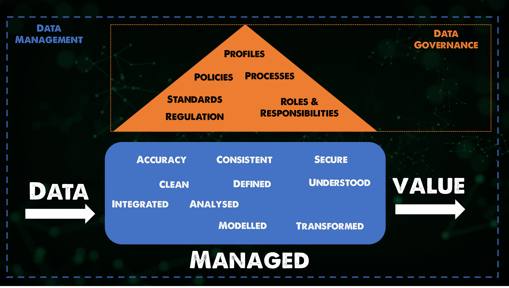

import { Steps } from '@astrojs/starlight/components';

## Giai đoạn 13 - Quản lý dữ liệu

_Dữ liệu - giờ đây nó không còn chỉ là những con số, dòng chữ. Nó đã trở thành thứ **tài sản vô hình** nhưng quý giá 
nhất của doanh nghiệp. Vậy làm sao để **biến thứ tài sản vô hình này trở thành hữu hình?**_

### DevOps và Quản lý dữ liệu

_Nghe không liên quan, nhưng thực tế rất liên quan. Có hai thứ quan trọng nhất trong một quy trình phát triển phần mềm
liên quan đến dữ liệu cần phải lưu ý là: **Tìm ai?** và **Làm thế nào?**_

_**Tìm ai**, tức là tìm người chịu trách nhiệm quản lý dữ liệu trong tổ chức của bạn._

_**Làm thế nào để quản lý dữ liệu hiệu quả?** Phân loại, xử lý, lưu trữ và bảo mật dữ liệu ra sao, để không bị thất 
thoát, và có thể truy xuất khi cần thiết._

#### Khái niệm

:::note[Định nghĩa]

_Quản lý dữ liệu theo [Data Management Body of Knowledge](https://www.dama.org/cpages/body-of-knowledge) là 
"**sự phát triển, thực thi và giám sát các kế hoạch, chính sách, chương trình và thực tiễn để kiểm soát, bảo vệ, 
cung cấp và nâng cao giá trị của tài sản dữ liệu và thông tin.**"_

:::

_Dữ liệu có thể được xem là mạch máu của doanh nghiệp, và quản lý dữ liệu phải là một công cụ hỗ trợ cho DevOps._

#### DataOps vs DevOps

_DataOps là một phương pháp tiếp cận hiện đại để quản lý dữ liệu, tương tự như DevOps trong phát triển phần mềm. 
Cả hai đều nhấn mạnh tầm quan trọng của việc tự động hóa, hợp tác và cải tiến liên tục trong quy trình làm việc.
Tuy vậy, DataOps chú trọng hơn vào đường dẫn dữ liệu vững chắc và những thông tin đáng tin cậy từ phân tích dữ liệu._

_DataOps có thể bao gồm những phần cao hơn như: **Học máy**, **Dữ liệu lớn** và Phân tích Dữ liệu bao gồm 
**Trí tuệ nhân tạo**._

### Quản lý thông tin

_Nếu xem dữ liệu là thông tin, ba yếu tố quan trọng nhất cần được bàn thảo._

<Steps>
1. _**Chính xác** - Đảm bảo dữ liệu chính xác, bên cạnh đó cần đảm bảo rằng dữ liệu sao lưu cũng hoạt động 
và đã được kiểm tra để khôi phục nếu xảy ra sự cố hoặc lý do gì đó, để giúp tổ chức hoạt động trở lại 
một cách nhanh chóng._
2. _**Nhất quán** - Nếu dịch vụ dữ liệu bao gồm nhiều hệ thống thì cần đảm bảo tính nhất quán và bảo mật trên tất cả các 
vị trí dữ liệu để đảm bảo sự toàn vẹn ở các mức khác nhau cũng như giúp tổ chức có ít nhất một bản sao dữ liệu sạch 
cho tất cả dữ liệu được sao lưu._
3. _**Bảo mật** - Kiểm soát truy cập dữ liệu, nói chung, là một chủ đề nóng hiện nay trên toàn cầu. Đảm bảo rằng chỉ 
những người có quyền truy cập vào dữ liệu là rất quan trọng, nhằm giúp tổ chức tránh vi phạm bảo mật, sẵn sàng khôi 
phục sau sự cố._
</Steps>

_Đó là tất cả những gì chúng ta cần phải biết sơ lược về quản lý dữ liệu trong DevOps. Hy vọng mọi người đã có được 
những kiến thức cơ bản về chủ đề này. Phần tài liệu phía dưới sẽ cung cấp thêm nhiều thông tin hữu ích hơn nữa._