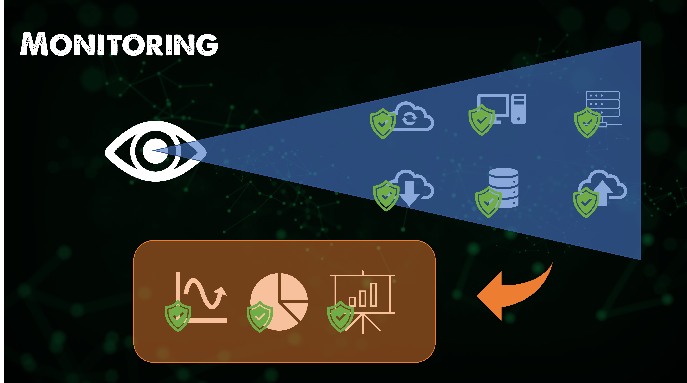
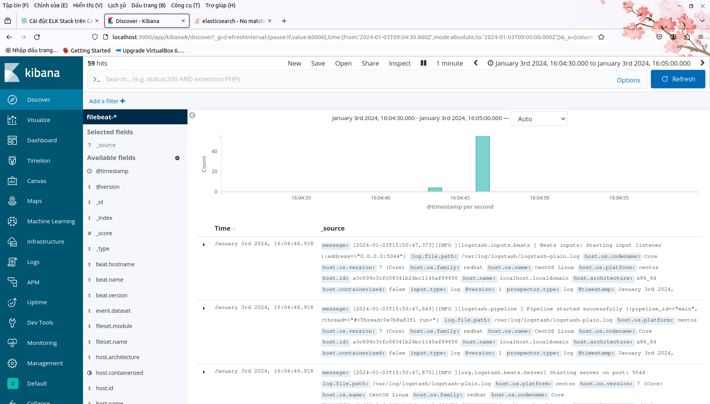
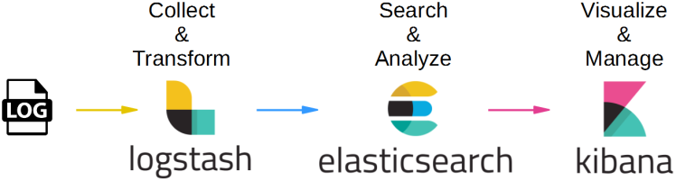

import { Steps } from '@astrojs/starlight/components';

## Giai đoạn 12 - Giám sát và Trực quan hóa dữ liệu (Logs)

_Ở giai đoạn áp chót này, chúng ta sẽ nghiên cứu sơ lược về giám sát và cách giảm đi những 
sai sót không đáng có trong quá trình phát triển phần mềm._

### Tại sao cần giám sát?

:::note[Định nghĩa]
**_Giám sát là thu thập thông tin về hệ thống, thực hiện các biện pháp cần thiết nhằm
đảm bảo tất cả dịch vụ, ứng dụng và tài nguyên trên hệ thống đều vận hành đúng như mong đợi._**
:::

_Có ba cách phổ biến để giám sát hệ thống._

<Steps>
1. **_Tự đăng nhập từng máy chủ để kiểm tra_**
2. **_Viết các đoạn chương trình để đăng nhập và kiểm tra tự động_**
</Steps>

_Cả hai cách này đều tiêu tốn rất nhiều thời gian và công sức, chưa kể đến việc khó có thể phát hiện
được các vấn đề tiềm ẩn trong hệ thống. Do đó, cách thứ ba là **sử dụng các công cụ giám sát** chuyên dụng
được phát triển bởi các công ty khác nhau trên thị trường. **Nagios và Zabbix** là hai trong số đó._

#### Nagios

_Nagios là công cụ giám sát hạ tầng được tạo ra bởi công ty cùng tên. Có hai phiên bản của Nagios: Core
và XI. Phiên bản **Core** là mã nguồn mở và miễn phí, trong khi phiên bản **XI** là phiên bản thương mại 
với nhiều tính năng nâng cao hơn._

_Công cụ này giúp chúng ta giám sát máy chủ và kiểm tra xem các máy có đang tối ưu không, hoặc gửi cảnh báo
khi có sự cố xảy ra. Nagios có thể giám sát các dịch vụ từ xa, từ đó giúp chúng ta đưa ra quyết định nhanh chóng
và chuẩn xác hơn._

#### Giám sát liên tục

_Giám sát không phải là một khái niệm mới và ngay cả **Giám sát liên tục** cũng là một mục tiêu lý tưởng mà rất 
nhiều tổ chức hướng tới suốt nhiều năm qua. Có ba khía cạnh cần phải xem xét khi nhắc đến hai từ Giám sát:_

<Steps>
1. **_Giám sát hạ tầng_**
2. **_Giám sát ứng dụng_**
3. **_Giám sát mạng_**
</Steps>

_Điều quan trọng là có quá nhiều công cụ khả dụng bên ngoài, và câu hỏi dành cho tất cả chúng ta không phải là chọn 
công cụ nào mà là: "**Nên giám sát cái gì? Không nên giám sát cái gì?**"_

_Nếu mở ít quá, chúng ta sẽ bỏ lỡ các vấn đề nghiêm trọng trong hệ thống. Ngược lại, nếu mở quá nhiều, chúng ta sẽ bị
ngập trong một biển thông tin và không thể tập trung vào những gì thực sự quan trọng. Do đó, **việc lựa chọn 
phương pháp giám sát phù hợp là rất cần thiết**._

_Phần tài liệu dưới đây sẽ cung cấp những cái nhìn tổng quan nhất về giám sát và cảnh báo để mọi người tham khảo._

### Quản lý nhật trình và trực quan hóa dữ liệu (Logs)

_Okay, sau khi đã có hệ thống giám sát, chúng ta cần một công cụ để quản lý dữ liệu từ hệ thống này._

:::note[Định nghĩa]

_Khái niệm **Trực quan hoá dữ liệu** xuất phát từ việc cần thu thập và đánh dấu các sự kiện trong hệ thống,
chuyển đổi thành các biểu đồ và bảng điều khiển để dễ dàng theo dõi và phân tích._

:::

_Những dữ liệu đi qua một bộ khung gồm ba công cụ: **Elasticsearch, Logstash và Kibana** (gọi tắt là **ELK Stack**). 
**Elasticsearch** giúp lưu trữ và tìm kiếm dữ liệu, **Logstash** chịu trách nhiệm thu thập và xử lý dữ liệu, còn 
**Kibana** cung cấp giao diện trực quan để người dùng có thể dễ dàng tương tác._

#### Bảo mật và quản lý truy cập dữ liệu

_Dữ liệu nhật trình thường chứa **thông tin nhạy cảm**, do đó việc bảo mật và quản lý truy cập là rất quan trọng. 
Chúng ta cần đảm bảo rằng chỉ những người có quyền mới có thể truy cập vào dữ liệu này._

#### Một số công cụ phổ biến

_Ngoài bộ ba ELK, còn có nhiều công cụ khác hỗ trợ quản lý nhật trình và trực quan hóa dữ liệu như sau._

- **_Fluentd (thay Logstash)_**
- **_DataDog_**
- **_Splunk_**
- **_LogDNA_**
- **_AWS CloudWatch_**
- **_Google Cloud Logging_**
- **_Microsoft Azure Monitor_**

_Những công cụ này, khi được cài đặt đúng cách, sẽ hỗ trợ rất nhiều cho việc giám sát và quản lý hệ thống của chúng ta._