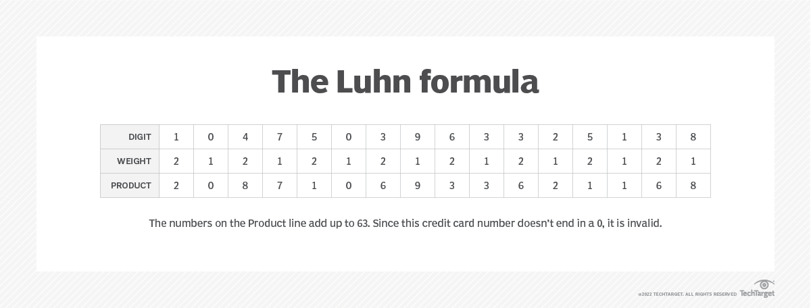

import FirstPost from "../../chunks/2024/06-08-TechBlog-05/_p1.md";
import SecondPost from "../../chunks/2024/06-08-TechBlog-05/_p2.md";
import ThirdPost from "../../chunks/2024/06-08-TechBlog-05/_p3.md";

Kính chào quý độc giả, đây là bài thứ năm của **Tech Blog** xuất hiện trở lại trên website này.
Ngày hôm nay, rất nhiều nội dung thú vị sẽ được chia sẻ tại chiếc Tech Blog này. Với tựa đề
**Chuyện mùa phượng vĩ**, đây sẽ là những câu chuyện được tổng hợp lại dưới góc nhìn hài hước
và dễ hiểu nhất về những vấn đề khác nhau diễn ra từ đầu năm đến nay. Mời quý vị chuyển sang các 
thẻ khác nhau ứng với từng phần của bài viết.

<NewTabs client:load>
  <NewTab name="P1">
    <FirstPost />
  </NewTab>
  <NewTab name="P2">
    <SecondPost />
  </NewTab>
  <NewTab name="P3">
    <ThirdPost />
  </NewTab>
</NewTabs>

<Accordion client:load title="Phụ lục Phần 1: Thuật toán Luhn">

_Thuật toán này được một kỹ sư của IBM tên là **Hans Peter Luhn** tạo ra nhằm mục đích tạo sinh mã định danh cho nhiều loại giấy tờ khác nhau. Thuật toán này đựợc cấp bằng sáng chế số 2.950.048 tại Mỹ vào ngày **23/08/1960**, và được đưa vào chuẩn **ISO/IEC 7812-1** dùng rộng rãi trong thời điểm hiện nay._

_Thuật toán này được sử dụng ở các loại giấy tờ như: **Thẻ tín dụng**, mã IMEI (định danh điện thoại), **số Bảo hiểm xã hội** Canada (Gia Nã Đại) và Hy Lạp, **số căn cước công dân** của Nam Phi, Israel (Do Thái), Thụy Điển, ..._



- **Nguồn**: [TechTarget](https://www.techtarget.com/searchsecurity/definition/LUHN-formula)

_Dưới đây là mã giả của thuật toán này cũng như một số mã nguồn mẫu bằng các ngôn ngữ khác nhau, thu thập từ **[Wikipedia](https://en.wikipedia.org/wiki/Luhn_algorithm)**. Mọi người cũng có thể đọc bài viết này để hiểu thêm cách thuật toán hoạt động._


**Mã giả (để thiết lập cơ chế)**
```bash title="Pseudocode.txt"
function isValid(cardNumber[1..length])
    sum := 0
    parity := length mod 2
    for i from 1 to length do
        if i mod 2 != parity then
            sum := sum + cardNumber[i]
        elseif cardNumber[i] > 4 then
            sum := sum + 2 * cardNumber[i] - 9
        else
            sum := sum + 2 * cardNumber[i]
        end if
    end for
    return cardNumber[length] == (10 - (sum mod 10))
end function
```

**Mã nguồn ứng dụng C#**
```cs title="luhn.cs"
bool IsValidLuhn(in int[] digits)
{
    int check_digit = 0;
    for (int i = digits.Length - 2; i >= 0; --i)
        check_digit += ((i & 1) is 0) switch
        {
            true  => digits[i] > 4 ? digits[i] * 2 - 9 : digits[i] * 2,
            false => digits[i]
        };

    return (10 - (check_digit % 10)) % 10 == digits.Last();
}
```

**Mã nguồn ứng dụng Java**
```java title="luhn.java"
public static boolean isValidLuhn(String number) {
    int n = number.length();
    int total = 0;
    boolean even = true;
    // iterate from right to left, double every 'even' value
    for (int i = n - 2; i >= 0; i--) {
        int digit = number.charAt(i) - '0';
        if (digit < 0 || digit > 9) {
            // value may only contain digits
            return false;
        }
        if (even) {
            digit <<= 1; // double value
        }
        even = !even;
        total += digit > 9 ? digit - 9 : digit;
    }
    int checksum = number.charAt(n - 1) - '0';
    return (total + checksum) % 10 == 0;
}

```

**Mã nguồn ứng dụng TypeScript**
```tsx title="luhn.tsx"
function luhnCheck(input: number): boolean {
  const number = input.toString();
  const digits = number.replace(/\D/g, '').split('').map(Number);
  let sum = 0;
  let isSecond = false;
  for (let i = digits.length - 1; i >= 0; i--) {
    let digit = digits[i];
    if (isSecond) {
      digit *= 2;
      if (digit > 9) {
        digit -= 9;
      }
    }
    sum += digit;
    isSecond = !isSecond;
  }
  return sum % 10 === 0;
}
```
**Mã nguồn ứng dụng Python**

```python title="luhn.py"
class LuhnAlgorithm:
    """Class to validate a number using Luhn algorithm.
    
    Args:
        input_value (str): The input value to validate.

    returns:
        bool: True if the number is valid, False otherwise.        
    """
    def __init__(self, input_value: str) -> None:
        self.input_value = input_value.replace(' ', '')
    
    def last_digit_and_remaining_numbers(self) -> tuple:
        """ Returns the last digit and the remaining numbers """
        return int(self.input_value[-1]), self.input_value[:-1]
    
    def __checksum(self) -> int:
        last_digit, remaining_numbers = self.last_digit_and_remaining_numbers()
        nums = [int(num) if idx % 2 != 0 else int(num) * 2 if int(num) * 2 <= 9 \
                else int(num) * 2 % 10 + int(num) * 2 // 10 \
                    for idx, num in enumerate(remaining_numbers)]

        return (sum(nums) + last_digit) % 10 == 0
    
    def verify(self) -> bool:
        """Verify a number using Luhn algorithm."""            
        return self.__checksum()
```
</Accordion>

<Accordion client:load title="Mã nguồn Phần 3: Dockerfile và CI/CD">

_Dưới đây là các bản ảnh gốc được sử dụng._

```dockerfile title="Dockerfile"
FROM cgr.dev/chainguard/node:latest

FROM cgr.dev/chainguard/wolfi-base:latest

FROM cgr.dev/chainguard/nginx:latest
```
_Còn đây là một phần cấu hình CI/CD - tức **luồng tự động xử lý dựng bản ảnh**
trên Github của mình._ 


```yml title="Docker.yml"

...
      - name: Build and push images to ghcr
        id: push
        uses: docker/build-push-action@v6
        with:
          context: 2025/vite-react-template
          file: 2025/Dockerfile
          tags: ${{ steps.meta.outputs.tags }}
          labels: ${{ steps.meta.outputs.labels }}
          push: true
          pull: true
          sbom: true
          provenance: mode=max
          cache-from: type=gha
          cache-to: type=gha, mode=max
          platforms: linux/amd64, linux/arm64
...

```

_Xem trọn vẹn mọi thứ ở đường dẫn **[này](https://github.com/anthony2708/dockerfile-contest/)**_

</Accordion>


### Tổng kết bài viết

Vừa rồi là toàn bộ bài đăng số 5 của series **Tech Blog**. Mời quý độc giả theo dõi các bài đăng
tiếp theo và đóng góp ý kiến cũng trên website này. Trân trọng cảm ơn và kính chào 👋.
