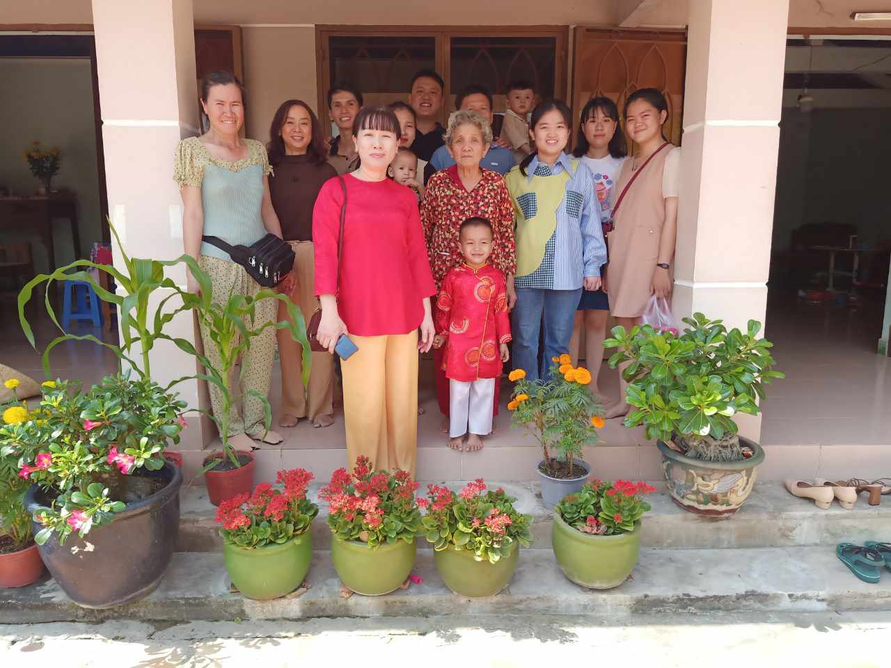

## Kỳ 3: Tết là gia đình...

_Hiện tại, tôi đã trải qua tròn hai mươi mùa Tết. Nhưng Tết trong tôi đã đổi thay. Chẳng còn thơ ngây, hồn nhiên như thuở xanh non, tôi dần hiểu thấu được sự khắc nghiệt của vòng đời. Thời gian quây quần bên những người thương yêu của tôi đang dần rút ngắn lại, tôi không thể bỏ lỡ bất cứ khoảnh khắc nào với họ. Vì vậy, Tết của tôi đa phần đều diễn ra tại nhà nội và nhà ngoại._

_Vào 30 Tết, hai chị em tôi quyết định về nhà ngoại đón giao thừa. Không khí nhà ngoại vào ngày này bao giờ cũng đông vui, nhộn nhịp. Trẻ con tung tăng nô đùa, người lớn tất bật thay diện mạo mới cho căn nhà của mình và cho cả chính mình. Trên gương mặt mỗi người đều nở nụ cười rất tươi, ngỡ như đóa hoa mai rực rỡ chói chang giữa phố thị. **Có lẽ ngày 30 mới đích thực là Tết, nhỉ?**_

_Sáng mồng Một tôi quay ngược từ Tân Biên lên Trảng Bàng nhằm đón Tết tại quê nội. Nhà nội của tôi dù quân số đông đảo nhưng bao giờ cũng thật sum vầy hạnh phúc. Tôi chợt nhận ra bản thân đã già khi có sự hiện diện của mấy đứa cháu, và khi chơi cùng bọn nhỏ, tôi vẫn chưa quen với danh xưng "**cô**”. Đã hai mươi tuổi rồi, nhưng tôi vẫn còn được nhận lì xì và được cưng như một tiểu thư chính hiệu. Buổi trưa cùng ngày, tôi về thăm bà cố - bà ngoại của ba tôi. Bà cố của tôi cũng đã chạm mốc một trăm tuổi, chẳng còn thể ngồi dậy đón Tết cùng con cháu nhưng tinh thần bà vẫn còn minh mẫn lắm. **Dường như bà vẫn còn cảm nhận được Tết đã đến, con cháu đã tụ họp đủ đầy, nên ánh mắt bà lóe lên ánh sáng rực rỡ thế kia mà!**_

_Tôi lại quay trở về Tân Biên đón Tết tại nhà ngoại từ sáng mồng Hai cho đến chiều mồng Ba. Tuy có vài kế hoạch không thể xảy ra như dự tính, nhưng ngẫm lại, nếu Tết này tôi không dành thời gian ở bên ngoại, **liệu cơ hội này còn đến trong những mùa Tết sau không?** Hai ngày ở bên ngoại, tôi chẳng còn khái niệm "**giảm cân**”, bởi ngoại liên tục bồi bổ cho tôi quá nhiều đồ ăn ngon. Tôi chơi đùa cùng các em nhỏ nhà ngoại, tuy mệt mỏi nhưng luôn tràn đầy niềm vui._

**_Tết của tôi gắn liền với bao kỉ niệm ấm áp bên gia đình. Có lẽ, tôi vẫn còn may mắn biết bao, khi tôi vẫn được sống trong tình thương yêu!_**
