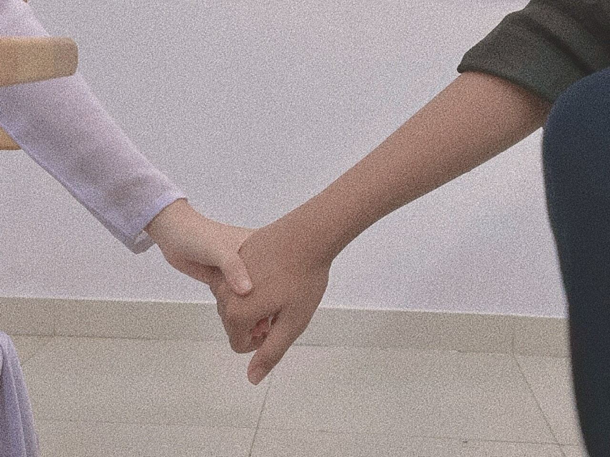

## TỪ NGƯỜI DƯNG BỖNG HÓA NGƯỜI THƯƠNG... ❤

> **_Hi, xin chào cậu của những ngày vào hè nóng ả đến khó chịu..._**
>
> **_Cậu nè, cậu có bao giờ thấy được một thứ tính yêu từ người dưng đến người yêu chưa? Và cậu nghĩ nó không tồn tại? Thật ra là có, và còn rất đẹp nữa..._**
>
> **_Hôm nay không phải là câu chuyện của tớ mà là của cô bạn tớ và cậu bạn cùng lớp đấy!_**

**_Cậu có bao giờ nghĩ đến việc yêu một chàng trai chuyên Văn không?_**

_Trai chuyên Văn có phải như cậu nghĩ là sẽ **ẻo lả như bọn con gái, hay yếu đuối**,... Nhưng đó chắc chắn không phải ở lớp tớ, bởi những chàng trai lớp tớ **mạnh mẽ** lắm kìa, lại còn **giỏi giang, hài hước**! Và cũng chính vì vậy mà các cậu ấy khá khác biệt so với suy nghĩ của nhiều người. **Trong những cậu bạn kia, có một người đã thu hút được sự chú ý của cô bạn thân tớ đó!**_

_Số là hai đứa này nó không biết gì nhau cả, và càng không quan tâm đến sự tồn tại của nhau, như người dưng vậy á. Nhưng bỗng nhiên, hai đứa lại được ghép đôi với nhau trong lớp một cách rất thần kỳ mà đến tớ còn chả biết nữa (**mà hai đứa đẹp đôi lắm hihi**). Ban đầu thì cả hai chẳng ai nói ai câu nào cả, cũng chẳng quan tâm vì vốn dĩ cả hai chẳng ai có tình cảm với đối phương mà._

_Rồi trước ngày Valentine thì rộ tin là cậu bạn kia thích cô bạn thân mình, và đúng cái ngày 14/02 ấy sẽ tặng cô bạn ấy một chú gấu bông xinh xắn. Thì bạn mình vốn không muốn nhận quà tay không, nên nó cũng tặng lại cậu bạn kia một món quà nữa. Tớ cứ mặc định là hai đứa đó là người yêu của nhau nhưng **không, tụi nó vẫn là người dưng**..._

_Ấy vậy mà khi thần tình yêu gõ cửa rồi thì cho dù có chạy đằng trời cũng không trốn được. Cỡ 2 ngày sau, **bọn nó yêu nhau thật**. Cơ mà tình yêu bọn nó dễ thương lắm, gặp nhau là cười à, ngọt ngào kinh khủng luôn á. Vào lớp nắm tay, làm này làm kia... đủ trò mà **trông dễ thương lắm!**_

**_Đó, tình yêu là thứ gì đó dù có thể ập đến một cách rất bất ngờ nhưng lại cho chúng ta cảm nhận được sự hạnh phúc đến tận cùng!_**