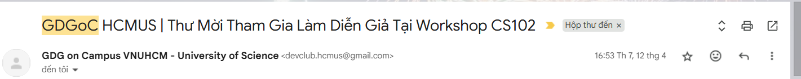
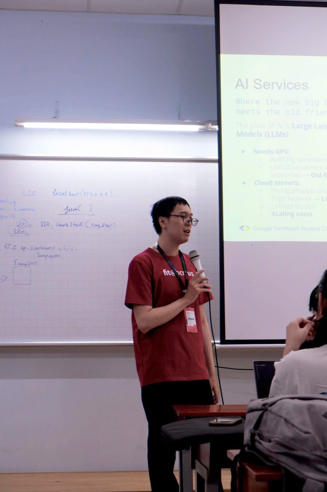
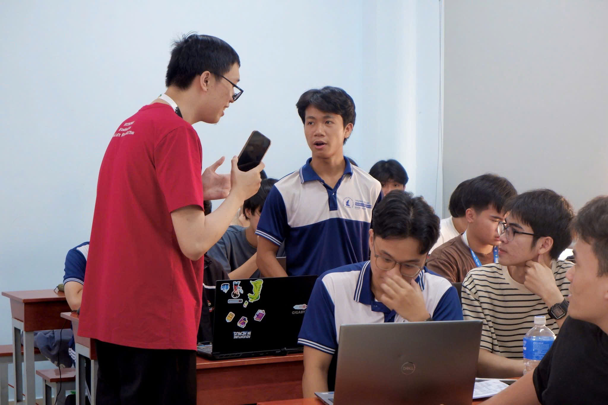
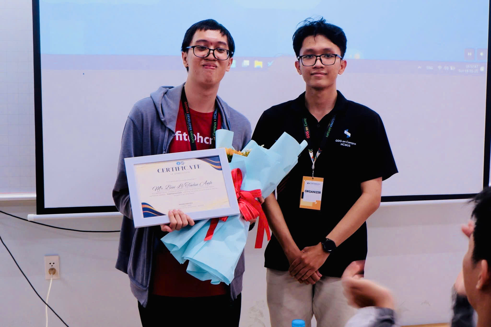
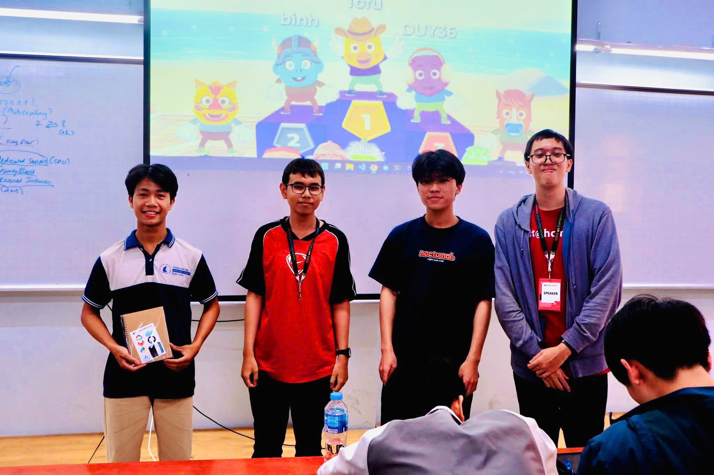
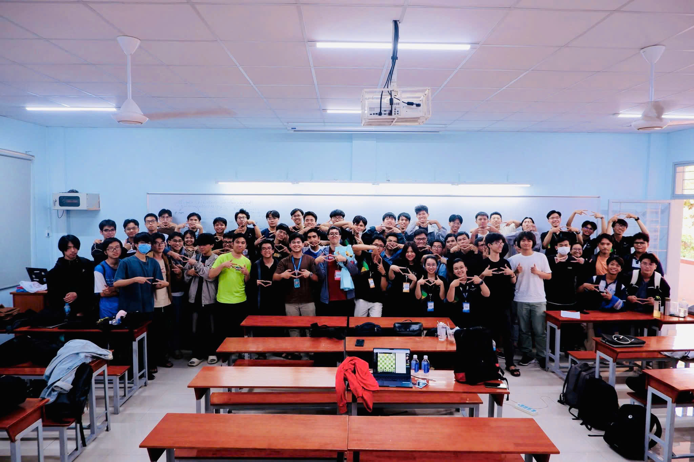

## Kỷ nguyên mới đã bắt đầu...

_Xin chào, đã bao lâu rồi mình mới lại **viết lách nhỉ?** Chắc là nửa năm hơn thì phải..._

_Trải qua biết bao nhiêu thăng trầm, giờ đây mình mới ngồi ở đây, hồi tưởng về những ngày tháng đầy cảm xúc đã qua, và kể mọi người nghe về hành trình của mình._

_Hôm nay, cũng là dịp kỷ niệm **ba năm** những câu chuyện đầu tiên được lên sóng (**05/08/2022 - 05/08/2025**). Từ tên miền cũ, sang tên miền mới, giờ đây hãy sẵn sàng **bắt đầu kỷ nguyên mới ngay từ bây giờ thôi nào!**_

### Mất tích? Tuấn Anh vẫn ở đây mà! 👨‍🏫

_Ngày 26/02/2024, mình đi vận động hành lang để xin một chỗ tham gia "**Học kỳ bị mất tích**". Từ đó, mọi người bắt đầu chú ý đến mình theo một cách không ai ngờ đến. Nếu mọi người thắc mắc câu chuyện của học kỳ ấy ra sao, xin mời xem lại bài viết trước đó tại phần hai của series **Tản mạn đầu năm**, ở **[đây](/2024-01)**._

_Ngỡ rằng chắc là "**mình chỉ may mắn đúng lần đó là thôi, giờ trở về làm một Kỹ sư hỗ trợ (Helpdesk Engineer)**" nhưng không, **mọi người lại bắt mình đi content recovery tiếp cả nhà ạ!**_ 😂

_Năm ngoái, mình làm CS101 - năm nay nâng cấp lên thành **CS102**, đem theo chút quà cáp và trò chơi cho mọi người thưởng thức sự thú vị của chiếc **Speaker - Diễn giả** thân thương, với chiếc áo làm nên thương hiệu này:_

_Một ngày làm việc năng suất khi **DevOps kết hợp Điện toán đám mây**, khi **Trí tuệ nhân tạo kết hợp với khả năng tương tác con người không giới hạn**. Và rất, rất nhiều câu hỏi đã xuất hiện trong ngày hôm đó (**thật là đau lưng khi phải trả lời mọi người, giống như hình dưới chẳng hạn**):_ 🤣

_Ấy vậy mà ở đó, mình nhìn thấy được **tương lai của đất nước**: Một tương lai với rất nhiều những gương mặt **triển vọng, đầy khát khao và tinh thần tận hiến**, sẵn sàng thay thế mình tiếp tục con đường làm chủ công nghệ số - **mạch nguồn làm nên vận mệnh đất nước**. Ở đó, mình nhìn thấy một **không gian sáng tạo không ngừng**, trong từng giây phút được làm việc với các bạn của **bộ phận Sản xuất chương trình** và cả với các bạn **khán giả**._

_Ở đó, mình cũng thấy được sự lạc quan, và đôi khi là cả sự **hài hước** nữa (**anh xin lỗi Bình - tự nhiên anh nhìn mặt em ở tấm hình phía trên xong anh nhớ cái tên này lắm, và anh cũng sẽ không quên cái khoảnh khắc lật kèo mãn nhãn sau câu nói của anh đâu em à**)._ 😅

**_Tất cả những điều ấy, làm nên một thương hiệu, một bản dạng độc nhất mà được mọi người đón chờ hằng năm._** 

_Rất là cảm ơn mấy bạn bên GDGoC của nhà Tự nhiên đã mang cá thể này từ chỗ hiu quạnh quay về với "**môi trường sống thân quen**" sau nhiều năm bôn ba vất vả ngược xuôi (**chắc đi khắp cái thành phố rồi quá**)._ 

> Nhưng mà nè, nói gì thì nói, tiền quảng cáo vẫn là **năm mươi ngàn**, chuyển khoản nhé [GDGoC - HCMUS](https://www.facebook.com/gdgoc.hcmus), **thiếu anh hai năm rồi!** 

### Ba năm, một chặng đường bền bỉ... 📆

_Nhìn lại chuyến hành trình "**tàu lượn**" này, có lẽ mình sẽ chỉ dùng một từ thôi: **Liều**._ 

_Bắt đầu từ những viên gạch đầu tiên là những bài viết được mang từ Facebook về, dùng một cái tên miền miễn phí, cho đến khi **liều mình giật được một tên miền chính thức** để khai phá khoảng không gian trên môi trường mạng với giá **chỉ bằng một ly trà sữa, nhưng trả cho cả năm**. Từ một mình, đến **liều để thêm nhiều "mình"** khác cùng hợp sức, để rồi, khi mỗi người đi trên một lộ trình khác nhau của riêng mình, **họ vẫn ngoái lại và nhìn về những dấu chân đã để lại nơi đây**._

_Từng áng văn chương bất tận, từng bài thơ, câu chữ, khắc ghi những dòng tâm trạng muôn hình vạn vẻ, từ bồi hồi xao xuyến đến lắng đọng xúc cảm, từ phá lên cười khúc khích cho đến những giọt nước mắt không thể kìm nén._

_Sau ba năm, với hơn **80 bài viết nhỏ**, hơn **30 bài viết lớn** được chỉ vài con người chắp bút, The Collab Team dù có thể không tiếp tục sứ mệnh của mình một cách liên tục như trước đây nữa, nhưng những **"Anna, Latte, Jolie, Anthony**" vẫn sẽ là những người bạn đồng hành cùng mọi người trên những hướng đi mới, nơi từng cá nhân vẫn sẽ không ngừng góp nhặt những dòng văn thơ nhỏ bé kia và biến nó trở thành những "**giấc mơ lớn**" của tất cả chúng ta._

> Người ta dạo này hay nói về "**Kỷ nguyên vươn mình**" - ở đây chúng tôi cũng sẽ có "**Kỷ nguyên mới**"! 

_Tất nhiên, Tech Blog vẫn sẽ tiếp tục những dòng chảy của mình và mang đến nhiều hơn những pha tấu hài cũng như cà khịa kinh điển hơn nữa, giúp mọi người hiểu hơn về các xu hướng mới của công nghệ hiện nay. Hãy tiếp tục chờ đón tại đây nhé._

_Còn bây giờ, đã đến lúc nói lời chào đầu tiên: **Xin chào các bạn, mình đã quay trở lại rồi đây!**_

**_Tuấn Anh_**