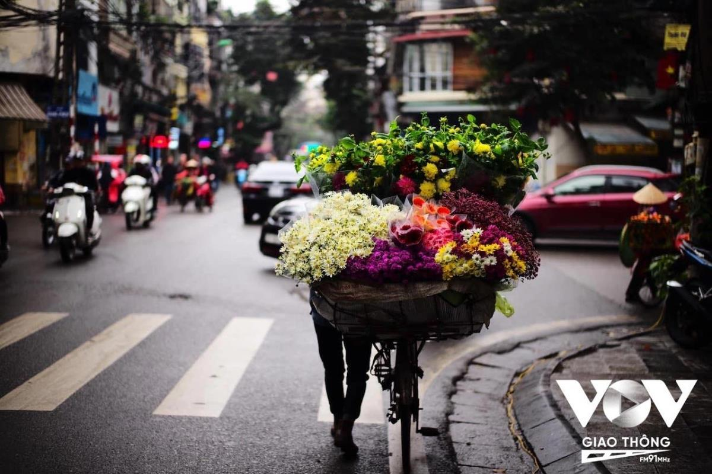
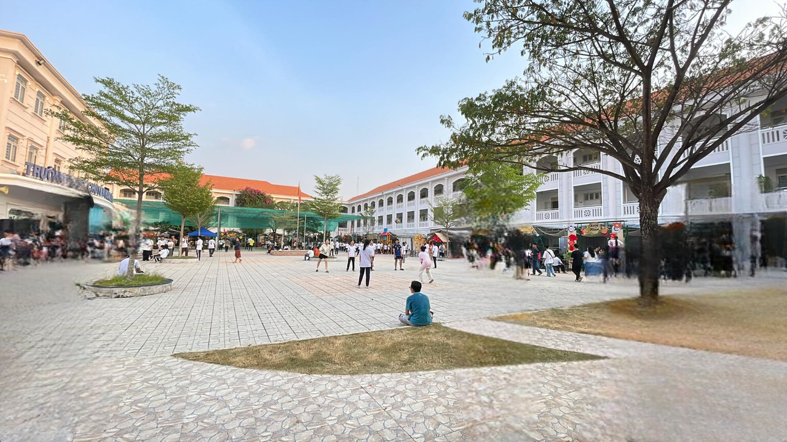
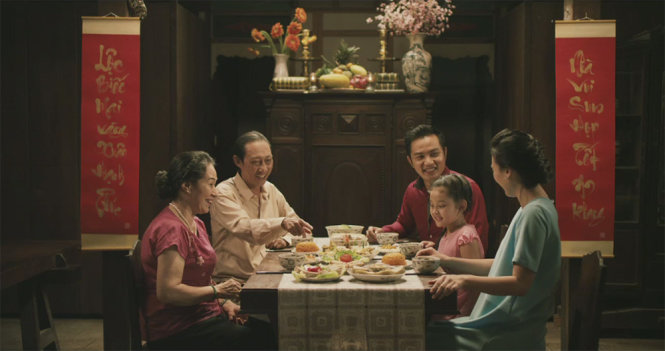

## Kỳ 2 - Vị Tết, vị quê hương, vị đoàn tụ... 🏡

_Xin chào, đây là bài viết thứ hai của năm 2025 trong series Câu chuyện mùa xuân. Hiếm khi có năm nào mà thời gian cho việc viết lách lại được dư dả nhiều như năm nay. **Bởi Tết mà, không sợ thiếu, chỉ sợ không đủ vui**..._ 

_Bây giờ, cùng bắt đầu chuyến hành trình khám phá hương vị của Tết trong bài viết này nhé._

### Vị Tết 🧧

_**Bạn nghĩ gì về vị Tết?** Đó có thể là mùi hương của bánh, của hoa, của những thức quà mà không bao giờ mọi người đem ra dùng - trừ dịp Tết. Nhưng với mình, vị Tết có lẽ là cái không khí của những ngày xuân thế này._

**_Nói đúng hơn thì cái vị Tết đúng nghĩa thường xuất hiện vào những ngày trước Giao thừa._**

- **Nguồn**: [VTC News](https://vtcnews.vn/nhung-chiec-xe-hoa-cho-mua-xuan-tren-pho-ha-noi-ngay-giap-tet-ar736506.html)

_Ở đó, mọi người tất bật sắm sửa, không khí trở nên trong lành hơn, nhịp sống cũng trôi chậm hơn hẳn..._

_Ở đó, mỗi người đều dành ra chút ít thời gian để ngẫm lại bản thân, sau một năm dài đằng đẳng..._

_Ở đó, dù bạn là ai, dù bạn ở đâu, dù bạn làm gì, đều thiết tha hai tiếng "**Về nhà...**"_

_Cũng có những người con xa quê, phải gác lại cái niềm vui sum vầy, để kiếm thêm chút tiền, lo cho cái nhà cấp 4 nho nhỏ hay thậm chí là làm lại mái lá chắc hơn cho căn nhà lá gắn liền với tuổi thơ cùa mình..._

_**Mùa xuân - chẳng biết bắt đầu tự lúc nào, cũng chẳng biết kết thúc ra sao**. Chỉ biết, khi những cơn gió nhè nhẹ  chợt lướt qua hiên nhà sau chuỗi ngày đông lạnh giá, khi những đóa hoa bẵng đi một thời gian lại dần khoe sắc, khi đó, con người ta mới nhận ra, mùa xuân lại sắp về, mang theo những hương vị rất riêng, đủ khiến lòng người bồi hồi, xao xuyến..._

### Vị quê hương... 🏡

_**Đã bảo lâu rồi, bạn chưa về nhà dịp Tết?** - Câu hỏi này, có lẽ khiến nhiều người sẽ rơi nước mắt..._

_Mình thì may mắn hơn nhiều người - mình có một gia đình để về, thậm chí gần như là hàng tuần vì mình đi làm theo dạng hỗn hợp. Nhưng sẽ thật là bất công khi nói rằng **mình chỉ có một ngôi nhà**..._

_Cái vị Tết nó lan tỏa khắp mọi ngả phố, khắp mọi không gian. Nó từ từ chạm đến ngôi nhà thứ hai của mình hồi ngày xưa - **những ngôi trường**._

_Nếu ai đó hỏi mình câu hỏi kia mà chỉ đến ngôi nhà thứ hai, chắc chắn câu trả lời chỉ có một: **Quá lâu cho một chuyến trở về**..._

_Ắt hẳn, khát vọng lớn nhất của mỗi con người dịp năm mới, đó là được về nhà - tất nhiên là không có ngoại lệ rồi. Ấy vậy, khi cuộc sống trở nên bận rộn, việc dành cho ngôi nhà thứ hai ấy một vài tiếng thôi, **đôi khi là một sự xa xỉ**..._

_Dẫu có muôn trùng xa cách, dẫu có những khác biệt về suy nghĩ - xin mọi người hãy nhớ lấy một câu rất hay trong tiếng Việt - **một thứ ngôn ngữ giàu bản sắc và niềm tự hào**:_

> **_Mùng Một Tết cha, Mùng Hai Tết mẹ, Mùng Ba Tết thầy..._**

### Vị đoàn tụ... 

_Chả biết tự bao giờ, những chuyến xe về quê trở thành một phần không thể thiếu trong hành trình lập nghiệp xa nhà của mình. Bình thường, minh đi xe, mình luôn có hai tâm trạng: Một là cái cảm giác trống rỗng, hai là cái cảm giác tĩnh lặng.Và chắc mọi người cũng đoán được chiều di chuyển của những chuyến xe ứng với hai dòng cảm xúc này rồi..._

_Cái tĩnh lặng luôn xen lẫn với bình yên. Bởi, **bình yên là khi trở về**..._

- **Nguồn**: [Tuổi trẻ](https://tuoitre.vn/tet-doan-vien-thong-diep-thoi-thuc-moi-nguoi-viet-ve-nha-don-tet-1044691.htm)

_Đoàn tụ - cái hương vị ấy luôn làm cho con người ta bùi ngùi, xúc động. **Không một thứ gì và không một ai có thể ngăn cản những cuộc đoàn tụ**. Bởi cuộc sống luôn có những khoảnh khắc thăng trầm - người ta thường gọi đây là **những gia vị của cuộc sống**. Nếu chẳng có hương vị này, chắc chắn cuộc sống sẽ vô cùng **tẻ nhạt**..._

_Bởi ai cũng say mê hương say ngây ngất của mùa xuân, nên cũng sẽ chẳng ai có thể chối từ hương vị của tình thân, của sự đoàn viên, sum vầy. **Bởi hoa mai luôn phải có hoa đào. Bởi ta với mình luôn phải có nhau**..._

_Con người ta, ai rồi cũng sẽ trải qua sinh lão bệnh tử, nên khi mùa xuân trở lại, người ta như lại được tái sinh. Tái sinh để hướng đến một năm mới tốt đẹp hơn, cho bản thân, cho gia đình và cho mọi người. Nên xin hãy tận hưởng mùa xuân này như một món quà mà tạo hóa đã trao tặng._

**_Để ta thêm yêu thế giới này. Để ta được sống hết mình với những điều kỳ diệu, tuyệt hảo nhất cuộc đời._**

_Xin cảm ơn quý vị đã đón đọc bài viết này. Hành trình của năm 2025 sẽ vẫn còn tiếp tục trong một bài viết thứ ba - **hẹn gặp lại mọi người trong bài tiếp theo!**_