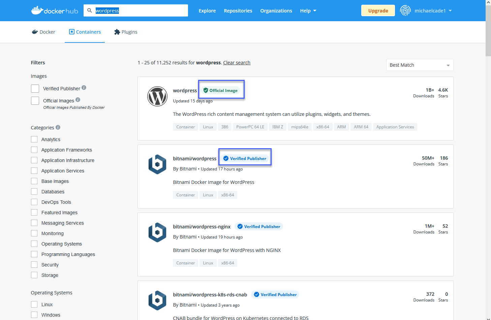
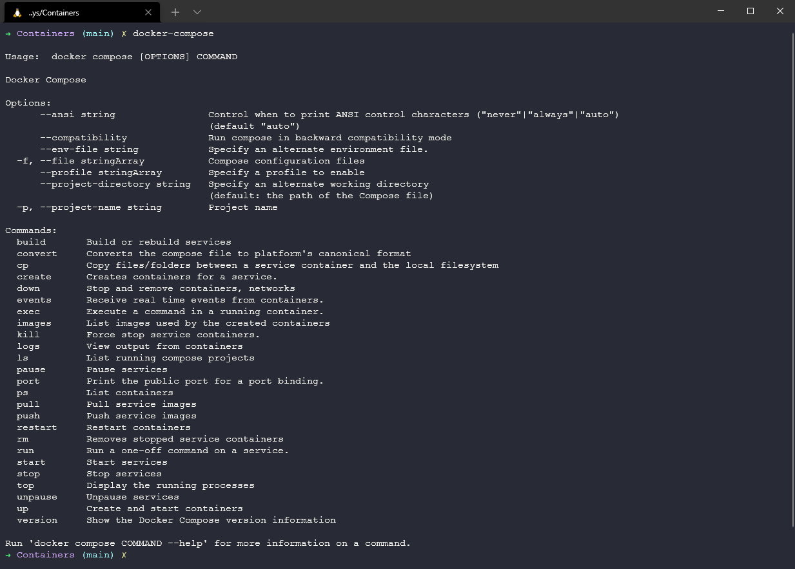

import { Steps, Aside } from '@astrojs/starlight/components';

## Ngày 38 - Dáng hình của Docker 🖼

_Xin chào, cuối cùng thì chúng ta cũng đã sẵn sàng cho ngày tiếp theo của hành trình đầy chông gai này. Hôm nay chúng ta 
sẽ tìm hiểu về Docker image, bản ảnh của Docker, và cách tạo ra một bản ảnh từ một Dockerfile._

**_Nếu bạn đã đóng gói đầy đủ tư trang, hãy cùng nhau bắt đầu hành trình mới này nhé!_** 🚋

### Khởi động

_Sau khi cài đặt Docker, chúng ta sẽ bắt đầu bằng việc chạy câu lệnh sau._

```bash title="Running a container"

docker run -d -p 80:80 docker/getting-started

```

**_Khi các bạn chạy lệnh này, những việc sau đây sẽ xảy ra._**

<Steps>
1. _Docker sẽ tìm kiếm image `docker/getting-started` trên máy tính của bạn. Nếu không tìm thấy, Docker sẽ **tải image** 
này từ DockerHub hoặc bất kỳ registry lưu trữ nào có bản ảnh này. Việc này cũng sẽ diễn ra tương tự với các bản ảnh khác._
2. _Docker sẽ tạo một container từ image này. Trong trường hợp này, container sẽ chạy một ứng dụng web trên cổng 80._
3. _Docker sẽ **chuyển tiếp** cổng 80 của máy tính của bạn tới cổng 80 của container (```-p``` - port)._
4. _Việc chạy container này sẽ diễn ra ở **chế độ nền** (background mode) (```-d``` - detach)._
5. _Kết quả cuối cùng, bạn sẽ có một ứng dụng hoàn chỉnh, khi truy cập vào `http://localhost/tutorial` trên trình duyệt._
</Steps>


_Đối với các bản ảnh, chúng ta có thể phân loại làm ba nhóm như sau._

- _**Official Image**: Là những bản ảnh được Docker cung cấp, chúng ta có thể tìm thấy trên 
[DockerHub](https://hub.docker.com/)._
- _**Verified Publisher**: Là những bản ảnh được xác thực bởi Docker, cung cấp bởi các nhà cung cấp phần mềm._
- _**User-defined images**: Là những bản ảnh được tạo ra bởi người dùng và đăng tải trên DockerHub hoặc các 
registry khác._



_Để dừng container đang chạy, cần phải xác định `container ID` hoặc `container name` và chạy lệnh sau._

```bash title="Stopping a container"

docker ps
docker stop <container ID or container name>

```

### Tham vọng to lớn với cả một hệ điều hành...

```bash title="Running a container with OS"

docker run -it ubuntu bash

```
_Khi bạn chạy lệnh này, ngay lập tức bạn có một bản ảnh của Ubuntu trên Docker với Bash._

_**Bạn có tin được không, nhưng đó là sự thật**. Khi bạn chạy xong lệnh trên, bạn sẽ thấy một dấu nhắc mới, đó chính là
một cửa sổ dòng lệnh của Ubuntu. Tất nhiên Ubuntu trên Docker chỉ **cỡ đâu đó 30MB** thôi, nhưng tất nhiên là bạn có 
thể thêm các gói phần mềm khác vào bản ảnh này._


### Tìm hiểu về Dockerfile

_Dockerfile là một tập tin văn bản chứa một loạt các hướng dẫn để tạo ra một bản ảnh. Mỗi hướng dẫn trong Dockerfile
thường được tổ chức theo dạng một **"lớp" (layer)** và mỗi lớp sẽ tạo ra một image mới._

_Cấu trúc của các lớp, sẽ đi theo phương thức **xếp chồng (stacked)** và mỗi lớp sẽ kế thừa lớp trước đó._


_Theo thứ tự, chúng ta sẽ có **Dockerfile dựng thành image**, và c**ontainer thì chạy từ image đó**. Mỗi bản ảnh sẽ còn 
có manifest. Manifest trong tiếng Anh có nghĩa là "bản thể", và nó chứa thông tin về các lớp, cấu trúc, và metadata của
bản ảnh._

#### Ví dụ về Dockerfile

```bash title="Dockerfile"

FROM node:18-alpine
WORKDIR /app/
COPY ./sources/ .
RUN npm install
EXPOSE 3000
CMD ["npm", "start"]

```

**_Dưới đây là một số từ khóa hiệu lệnh của Dockerfile mà bạn sẽ thường xuyên gặp._**

|    Lệnh          |                                        Mục đích                                      |
|:----------------:|:------------------------------------------------------------------------------------:|
| ```FROM```       | _Để chỉ định bản ảnh gốc._                                                           |
| ```WORKDIR```    | _Để đặt thư mục làm việc cho bất kỳ lệnh nào phía sau trong Dockerfile._             |
| ```RUN```        | _Để chạy lệnh giúp cài đặt bất kỳ ứng dụng và gói phụ trợ cần thiết cho container._  |
| ```COPY```       | _Để sao chép các tệp hoặc thư mục từ một vị trí cụ thể._                             |
| ```ADD```        | _Là COPY, nhưng cũng có thể xử lý các URL và giải nén các tệp nén._                  |
| ```ENTRYPOINT``` | _Lệnh sẽ thực thi khi container khởi động. Mặc định là ```/bin/sh -c```_             |
| ```CMD```        | _Các đối số truyền vào. Nếu ENTRYPOINT mặc định, CMD là lệnh thực thi._              |
| ```EXPOSE```     | _Để xác định cổng truy cập ứng dụng container._                                      |
| ```LABEL```      | _Để thêm metadata vào bản ảnh._                                                      |

_Dựa trên Dockerfile phía trên ta sẽ có những bước sau._

<Steps>

1. _Lấy bản ảnh gốc (base image) từ `node:18-alpine`, tức là một bản ảnh của Node.js trên Alpine Linux._
2. _Đặt thư mục làm việc cho container là `/app/`._
3. _Sao chép tất cả các tệp từ thư mục `./sources/` vào thư mục làm việc của container._
4. _Cài đặt các gói phụ trợ cần thiết cho ứng dụng Node.js._
5. _Mở cổng 3000 để truy cập ứng dụng._
6. _Chạy ứng dụng Node.js bằng lệnh `npm start`._

</Steps>

_Lúc này, ta có thể truy cập ứng dụng Node.js thông qua cổng 3000 của máy tính 
(đúng hơn là ```http://localhost:3000```)._

#### Dựng Dockerfile

_Chạy câu lệnh sau để dựng Dockerfile này thành bản ảnh mới._

```bash title="Building a Dockerfile"

docker build -t my-node-app:1.0 .
# -t: tag cho bản ảnh
# .: thư mục chứa Dockerfile

```

**_Và đó là cách bạn có một bản ảnh mới toanh, tự dựng từ một Dockerfile._** 🎉

### Compose - Sức mạnh của sự đoàn kết

_Trường hợp khó hơn là đây - về mặt nguyên tắc, một ứng dụng không nên chỉ tập trung trên một container mà còn phải
phân tán trên nhiều container để ngăn tình trạng **Điểm chết duy nhất - Single Point of Failure**. Điều này đặt ra một 
thách thức lớn với việc quản lý nhiều container cùng một lúc._

_Docker Compose giúp chúng ta giải quyết vấn đề này bằng cách cho phép chúng ta định nghĩa và chạy nhiều container cùng
một thời điểm. Sử dụng Compose cũng cực kỳ đơn giản, bởi chúng ta có thể tải xuống tại 
**[đây](https://docs.docker.com/compose/install/)**. Trong nội dung của bài viết này, chúng ta sẽ tạo một website đơn giản
sử dụng WordPress và MySQL, và chúng ta sẽ dựa trên bài viết **[này](https://docs.docker.com/samples/wordpress/)** dể bắt 
đầu. **Okay, thử nghiệm thôi**._

#### Gọi Compose

```bash title="Checking Compose version"

docker-compose

```



_Lệnh này, sau khi cài đặt Compose và chạy lên, sẽ giúp ta kiểm tra xem ứng dụng đã được cài đặt chuẩn xác hay chưa._

#### Tập tin Compose

```yaml title="docker-compose.yml"

version: "3.9"

services:
  DB:
    image: mysql:5.7
    volumes:
      - db_data:/var/lib/mysql
    restart: always
    environment:
      MYSQL_ROOT_PASSWORD: somewordpress
      MYSQL_DATABASE: wordpress
      MYSQL_USER: wordpress
      MYSQL_PASSWORD: wordpress

  wordpress:
    depends_on:
      - db
    image: wordpress:latest
    volumes:
      - wordpress_data:/var/www/html
    ports:
      - "8000:80"
    restart: always
    environment:
      WORDPRESS_DB_HOST: db
      WORDPRESS_DB_USER: wordpress
      WORDPRESS_DB_PASSWORD: wordpress
      WORDPRESS_DB_NAME: wordpress
volumes:
  db_data: {}
  wordpress_data: {}

```

_**YAML - YAML Ain't Markup Language** (YAML chả phải ngôn ngữ đánh dấu) là một ngôn ngữ tuần tự hóa dữ liệu dùng để biểu 
diễn dữ liệu dưới dạng cấu trúc dữ liệu (**chả hiểu sao đã lấy tên YAML, mà nó lại còn có tên đầy đủ có chữ YAML ở trong 
đó nữa**). Nếu mọi người đã quen với các tập tin XML để biểu diễn cấu hình, thì YAML là một cách đơn giản hơn._

_YAML trong những năm gần đây đang có xu hướng thay thế **JSON - JavaScript Object Notation**, vì nó dễ đọc hơn, dễ viết 
hơn, và dễ hiểu hơn._

<Aside type="tip" title="Tản mạn">

_Cái tên ban đầu của YAML là **Yet Another Markup Language** (Một ngôn ngữ đánh dấu khác), nhưng sau đó nó được đổi thành
**YAML Ain't Markup Language** (YAML chả phải ngôn ngữ đánh dấu) - thật là khó hiểu_ 🤣 

</Aside>

_Phía trên ta có thể thấy, cấu trúc tập tin YAML này chứa hai dịch vụ: `DB` và `wordpress`. Mỗi dịch vụ sẽ chứa các thông
số cấu hình như `image` - bản ảnh, `volumes`, `ports` - cổng, `environment` - biến môi trường, và `restart` - tái khởi 
động. Sau khi chạy lệnh sau, chúng ta sẽ có một website WordPress chạy trên cổng 8000._

```bash title="Running Compose"

docker-compose up -d # -d: chạy ở chế độ nền

```


_Làm theo hướng dẫn, chúng ta sẽ có một website hoàn chỉnh. Dọn dẹp tất cả container bằng lệnh sau._

```bash title="Cleaning up"

docker-compose down 
docker-compose down --volumes # xóa cả volumes

```
_Vì các bản ảnh đã có sẵn trên máy, chúng ta khi chạy lại lệnh `docker-compose up -d` sẽ không cần phải tải lại bản ảnh
nữa, mà chỉ cần chạy container từ bản ảnh đã có sẵn._

_Có một nguồn tài nguyên rất đỉnh cho Compose mà mọi người có thể khám phá tại 
[dây](https://github.com/docker/awesome-compose)._

_Website nàynày cũng sẽ cập nhật một dạng thức khác của Docker Compose - đó là việc xây dựng **ELK Stack (Elasticsearch, 
Logstash, Kibana)** trong một bài viết khác. **Để biết thêm thông tin, mọi người hãy theo dõi trên website nhé!**_ 🚀