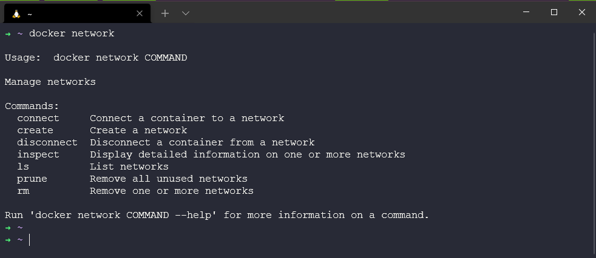
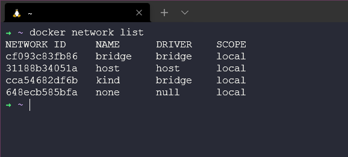

import {Aside} from '@astrojs/starlight/components'

## Ngày 39 - Mạng và Bảo mật trong Docker

_Một trong những vấn đề được đề cập rất nhiều trong chặng hành trình của chúng ta chính là Mạng và Bảo mật.
Hôm nay, chúng ta sẽ nói về hai chủ đề này trong Docker._

**_Hãy sẵn sàng để bắt đầu ngày mới với Docker nhé!_** 🏕

### Cấu hình mạng

```bash title="Getting the manual of docker network"

docker network
docker network ls # Liệt kê các card mạng

```





_Lệnh ```docker network``` là lệnh giúp chúng ta có thể thao tác với các card mạng trong Docker.
Mỗi card mạng có một cái tên và mã định danh duy nhất, cũng như được liên kết với một driver cụ thể._

```bash title="Inspecting a network"

docker network inspect bridge

```


_Lệnh ```docker network inspect``` giúp chúng ta xem thông tin chi tiết của một card mạng cụ thể. Trong ví dụ trên, 
ta thấy được card mạng bridge có một số thông tin như: tên, mã định danh, driver, mạng con, cổng vào, ... và nó đang 
trỏ về driver bridge, có địa chỉ là ```172.17.0.1``` - địa chỉ nội bộ của máy chủ, đồng nghĩa với việc chỉ có thể truy 
cập trong nội bộ máy chủ. Nếu bạn đứng ở trình duyệt mà gõ địa chỉ của container, **bạn sẽ không thể truy cập được**._

#### Kết nối mạng giữa container với Internet

_Mặc định card bridge gắn cho các container mới - **trừ khi chỉ định cụ thể**. Ta có thể dùng cách sau để kết nối mạng
từ container ra ngoài. Một thí dụ điển hình để giúp chúng ta thao tác về mạng cho container như phần dưới._

```bash title="Creating a new container, and get into the container..."

docker run -dt ubuntu sleep infinity # Tạo một container mới
docker network inspect bridge # Xem thông tin card mạng bridge
docker exec -it <container_id> bash # Truy cập vào container
    root@<container_id>:/# apt update && apt install iputils-ping -y ## Cài đặt gói ping
    root@<container_id>:/# ping -c4 google.com # Kiểm tra kết nối mạng
    root@<container_id>:/# exit # Thoát khỏi container
docker stop <container_id> # Dừng container
docker ps -a # Xem danh sách các container

```

#### Xuất cổng

```bash title="Publishing a port"

# Chạy một container nginx, mở cổng 8080 trên máy chủ và chuyển hướng vào cổng 80 của container
docker run --name webapp1 -dt -p 8080:80 nginx 
docker ps # Kiểm tra cổng đã được mở chưa
ip addr # Từ máy tính, mở WSL2, gõ lệnh này và tìm địa chỉ IP của container
 
```


_Đứng ở trình duyệt, gõ địa chỉ IP của container và cổng 8080, bạn sẽ thấy trang web của nginx._


### Bảo mật trong Docker

**_Điểm mấu chốt trong bảo mật Docker chính là việc cấu hình mức công khai và phân quyền._**

#### Phân quyền

_Mỗi container đều được chạy ở quyền root, điều này có thể tạo ra một số vấn đề về bảo mật. Để bảo mật, trong
tệp cấu hình Docker (Dockerfile), ta có thể thêm một số lệnh để giảm quyền root._

```bash title="Adding a user to a container"

FROM ubuntu:latest
RUN apt update && apt install upgrade -y
RUN groupadd -g 1000 appuser && useradd -r -u 1000 -g appuser appuser
USER appuser

```

<Aside title="Lưu ý" type="caution">

**_Ta có thể chạy lệnh bằng cách sau - tuy nhiên cách này có thể không giải quyết lỗ hổng bảo mật tiềm ẩn của chính
bản ảnh đó._**

```bash title="Running a container with a normal user"

docker run -dt --name webapp2 --user 1009 nginx

```
</Aside>

#### Mức công khai

_Các kho lưu trữ bản ảnh công khai (Registry) như Docker Hub, GitHub, ... đều có thể chứa các bản ảnh không an toàn.
Để bảo mật, ta có thể tạo một bản ảnh riêng, hoặc kiểm tra bản ảnh trước khi sử dụng. Điều này giúp kiểm soát hoàn
toàn các bản ảnh mà chúng ta sử dụng._

### Cách mạng về tinh gọn bộ máy

_Nếu chúng ta chạy câu lệnh sau, chúng ta có thể biết được kích thước của bản ảnh, từ đó có thể tối ưu hóa dung lượng
lưu trữ của máy chủ._

```bash title="Checking the size of an image"

docker images

```

<Aside title="Mẹo vặt" type="tip">

- _**Đừng bao giờ sử dụng tag ```latest``` cho bản ảnh của mình**. Điều này giúp chúng ta kiểm soát được phiên bản của 
bản ảnh mà chúng ta sử dụng, tránh việc sử dụng bản ảnh không an toàn._
- _Thông thường, các bản ảnh ```alpine``` sẽ có **kích thước nhỏ hơn** so với các bản ảnh khác. Điều này giúp chúng ta 
giảm dung lượng lưu trữ của máy chủ._

</Aside>

_Tất nhiên, sử dụng Docker tưởng là đơn giản nhưng thực chất không hề đơn giản như vậy. Chúng ta sẽ có rất nhiều lựa chọn
khác nhau thay thế cho Docker trong phát triển container. Quý vị có thể theo dõi những lựa chọn trong bài viết 
[này](https://www.builetuananh.name.vn/2024-01/) để có cái nhìn tổng quan nhất về container._