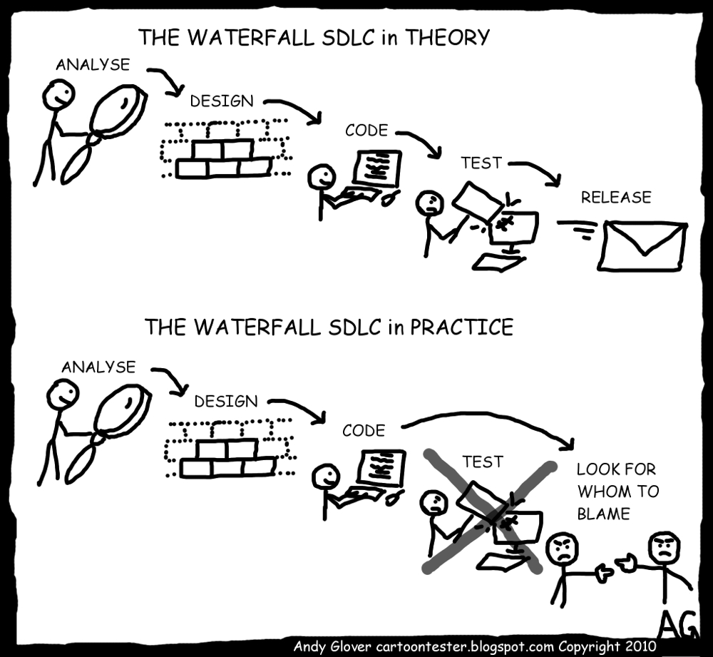
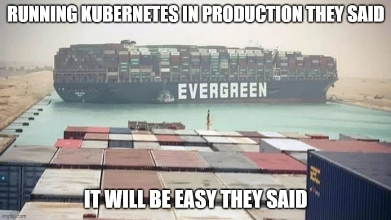
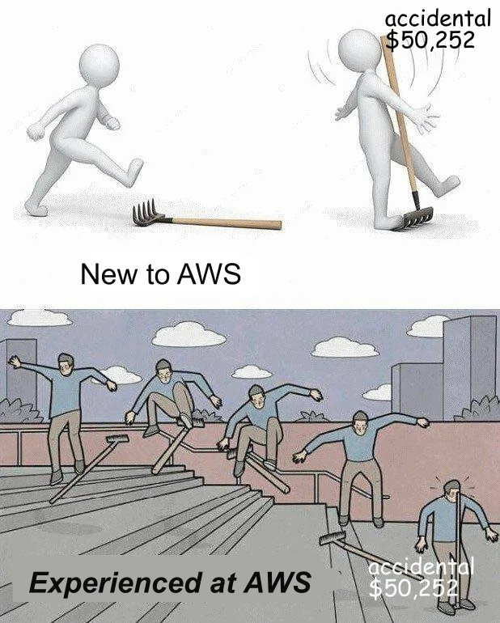

## Ngày 3: Vòng đời của DevOps - Lấy ứng dụng làm trung tâm 📱

_Chào mừng quý vị và các bạn đến với ngày thứ ba của hành trình **90 ngày cùng DevOps**._

_Ngày hôm nay, điểm dừng chân tiếp theo của chúng ta sẽ là **Vòng đời của DevOps**. Chúng ta sẽ tìm hiểu về các giai đoạn 
của vòng đời này, từ khi ứng dụng được phát triển cho đến khi nó được triển khai và vận hành trên môi trường sản xuất. 
Tất nhiên, chúng ta sẽ dừng chân ở đây khá lâu, và di chuyển tới lui chỗ này rất nhiều lần, nhưng không vì thế mà nơi đây
trở nên **kém hấp dẫn hơn** với du khách thập phương mỗi lần ghé thăm và **thay đổi cách trải nghiệm** của riêng mình._ 

> **Nguồn**: [Reddit](https://www.reddit.com/r/memes/comments/xi7eq6/i_hate_how_some_people_actually_take_the_new/)

**_Nếu bạn đã sẵn sàng thì nào, lên đưòng thôiiii!_** 🚗

### Điểm đến đầu tiên - Phát triển ứng dụng 🛠

_Hãy tưởng tượng bạn đang bắt đầu phát triển một ứng dụng hoàn toàn mới, ví dụ như một **mạng xã hội thuần Việt** chẳng hạn, 
thu hút sự ủng hộ và hàng triệu đô la từ hàng chục triệu con người đang chờ đợi ngoài kia (**nghe có vẻ xa vời ở hiện tại, 
vì khá nhiều đơn vị đã thất bại ê chề rồi**)._ 🤣

> **Nguồn**: [ContentStudio Blog](https://blog.contentstudio.io/social-media-meme/)

_Nếu bạn là một kỹ sư phần mềm, việc đầu tiên cần làm là **thảo luận** với khách hàng hoặc người dùng cuối về các yêu cầu của họ
rồi đưa ra một **bản kế hoạch** tầm cỡ, những mục tiêu cho **tính năng, thiết kế** cho ứng dụng. Cuối cùng là tạo ra ứng dụng
từ chính những mục tiêu đó._

_Nói tới các công cụ có thể dùng được ở quá trình này, không có gì khác ngoài việc phải chọn ra một **Môi trường phát triển
tích hợp (IDE)** và những ngôn ngữ lập trình phù hợp để viết ứng dụng._

_Hãy nhớ rằng: Là một kỹ sư DevOps, bạn có thể **không phải là người lên kế hoạch** cũng như **lập trình ứng dụng**. 
Việc này thường sẽ được một **kỹ sư phần mềm phụ trách**. Tuy nhiên, sẽ là **vi diệu** nếu bạn có thể đọc được một vài đoạn 
mã nguồn trong đó và hiểu được cách ứng dụng hoạt động, từ đó đưa ra quyết định tốt nhất cho **cơ sở hạ tầng của hệ thống mới**._

_Ứng dụng này có thể được viết bằng bất cứ ngôn ngữ nào, nhưng điều quan trọng đáng lưu tâm là mã nguồn của nó nên được quản lý
bởi một **hệ thống quản lý phiên bản (Version Control System)**. Chúng ta sẽ ghé thăm **Git** ở điểm dừng chân tiếp theo trong 
hành trình "**bất ổn**" này._

_Và dù dự án triệu đô này đi theo lối nào, một mình hay nhóm lại với nhau (nhưng vẫn là **tui-work... à nhầm teamwork**), 
phương pháp tốt nhất vẫn là sử dụng một **kho lưu trữ (Repository)** để giúp các thanh viên có thể cộng tác với nhau
khi làm việc với mã nguồn. Kho lưu trữ này có thể được **Công khai** hoặc lưu **Riêng tư**. Trong hành trình này, đôi lúc 
bạn cũng có thể sẽ nghe tôi nói về việc sử dụng **GitHub** hoặc **GitLab** làm kho lưu trữ. Chúng ta sẽ nhắc đến tụi kia 
cũng trong điểm dừng chân tiếp theo về **Git**._

### Điểm đến thứ hai - Kiểm thử và xác thực 🧪

_Ở điểm đến này, chúng ta đã có các mục tiêu và đang phát triển ứng dụng. Vấn đề tiếp theo là chúng ta cần đảm bảo rằng 
mã nguồn ứng dụng cần được kiểm thử ở các môi trường khác nhau hoặc cụ thể hơn là với ngôn ngữ lập trình đã chọn._

_Quá trình này cho phép **Nhóm quản lý chất lượng (QA)** kiểm tra lỗi trên các **container**, mô phỏng môi trường kiểm thử. 
Điều này giúp **giảm thiểu chi phí** cho các máy chủ vật lý hoặc cơ sở hạ tầng trên Điện toán đám mây._

_Quá trình này tại nhiều doanh nghiệp rất nhiều khả năng là sẽ được tự động hoá như một phần của 
**Tích hợp liên tục** - Điểm đến tiếp theo ngay sau đây._

_Tự động hoá quá trình kiểm thử sẽ giải phóng **hàng chục, hàng trăm, thậm chí hàng nghìn** kỹ sư quản lý chất lượng 
khỏi việc phải thực hiện các bước của quy trình một cách thủ công. Từ đó, họ có thể tập trung vào các phần khác trong hệ thống 
giúp tăng tốc độ phát triển, tạo ra nhiều tính năng mới hơn thay vì sa lầy vào việc kiểm lỗi, làm chậm quá trình phát hành các
phiên bản mới theo mô hình **thác nước** truyền thống. Bởi nếu theo thác nước truyền thống, **kịch bản sẽ như thế này**:_

> **Nguồn**: [Markus Gärtner](https://www.shino.de/2010/08/28/waterfall-in-theory-or-why-blaming-doesnt-help-at-all/)

### Điểm đến thứ ba - Tích hợp 🎚

_Ở giữa vòng đời DevOps là **Tích hợp** - một phần cực kỳ quan trọng. Đây là một điểm đến các lập trình viên ghé thăm mỗi khi
thay đổi mã nguồn một cách thường xuyên hơn, hàng ngày hoặc hàng tuần._

_Với mỗi thay đổi diễn ra trên kho lưu trữ, ứng dụng sẽ được **kiểm thử tự động**, giúp phát hiện sớm các vấn đề phát sinh
trước khi đi tới điểm đến tiếp theo._

> **_Khoan đã, chúng tôi không tạo ra ứng dụng, chúng tôi đi mua nó từ một nhà cung cấp phần mềm mà!!!_**

_Gượm đã, rất nhiều doanh nghiệp hiện nay đang làm vậy và **sẽ tiếp tục làm vậy**. Nhà cung cấp dịch vụ sẽ là người thực hiện
hành trình ba điểm đến kia nhưng đôi lúc, chính bạn vẫn muốn ghé qua điểm đến này và đưa nó vào trong ứng dụng của bạn. 
Việc này cho phép việc triển khai ứng dụng nhanh chóng và hiệu quả hơn._

_Nắm rõ các quá trình thực sự rất quan trọng, bởi lẽ có thể bạn sẽ mua các ứng dụng từ bên thứ ba ngày hôm nay, nhưng bạn có 
chắc sẽ **làm điều tương tự vào ngày mai?** Hay nếu ngày mai bạn nhảy việc, **thì sao? Bạn sẽ làm gì tiếp theo?**_

> **Nguồn**: [9GAG](https://9gag.com/gag/a1P4z92)

### Điểm đến thứ tư - Triển khai 🚀

_Ghé xong ba điểm đến kia rồi, đến điểm thứ tư: **Triển khai thôi!!!**_

_Đây chính là quá trình mà mã nguồn sẽ được triển khai lên các máy chủ của môi trường sản xuất. Đây cũng là những gì chúng ta sẽ 
đi vào khám phá sâu hơn trong 86 ngày còn lại của hành trình này._

_Các ứng dụng khác nhau đòi hỏi các yêu cầu khác nhau về phần cứng và cấu hình. Đó là khi việc **quản lý cấu hình ứng dụng 
(Application Configuration Management)** và triển khai **cơ sở hạ tầng dưới dạng mã nguồn (Infrastructure as Code)** 
phát huy thế mạnh của mình trong vòng đời DevOps. Các ứng dụng có thể được đóng gói và chạy trong các **container** hoặc 
chạy trên các **máy ảo (VM)**. Điều này cũng khiến chúng ta cần phải xem xét sử dụng **Kubernetes** để điều phối các container
này và đảm bảo ứng dụng luôn ở trong trạng thái "**sẵn sàng chiến đấu**" nhằm phục vụ người dùng cuối._ 

_Hãy tưởng tượng khi sử dụng Kubernetes, **việc này sẽ xảy ra**:_

> **Nguồn**: [Dev Community](https://dev.to/willvelida/introduction-to-azure-kubernetes-service-2a1)

_Chúng ta sẽ tìm hiểu chi tiết về các chủ đề quan trọng này trong vài tuần tới để có kiến thức nền tảng cũng như biết 
được khi nào thì nên sử dụng cái nào trong quá trình phát triển ứng dụng, bởi lẽ nếu mà bạn dùng sai, hậu quả có thể đong 
đếm bằng rất nhiều **dollar**!!!_ 💸

### Điểm dừng chân cuối cùng - Vận hành và giám sát 🛡

_Mọi thứ đã xong, điểm đến cuối cùng. Câu hỏi được đặt ra: **Làm sao người dùng cuối có được trải nghiệm theo đúng những gì 
họ mong đợi?**_

_Lúc này, chúng ta cần phải đảm bảo rằng hiệu suất của ứng dụng được **theo dõi liên tục**. Việc này cũng giúp các kỹ sư 
phần mềm có thể đưa ra quyết định cải tiến ứng dụng trong các bản phát hành tiếp theo nhằm đem đến những trải nghiệm tốt hơn._

_Giai đoạn này cũng là khi chúng ta **nhận các phản hồi** về các tính năng và nhu cầu của người dùng cuối với ứng dụng._

_**Độ tin cậy (reliability)** cũng là một yếu tố quan trọng cần chú ý. Bởi suy cho cùng, chúng ta muốn ứng dụng của mình luôn 
**sẵn sàng 24/7/365**, bất cứ khi nào người dùng cần. Chính vì vậy, các yếu tố như **tính tối mật, tính toàn diện, 
và tính khả dụng ([Tam giác CIA](https://www.fortinet.com/resources/cyberglossary/cia-triad))** cần được giám sát liên tục
để liên tục cải tiến, cập nhật ứng dụng bằng việc phát hành các phiên bản mới cho phù hợp với điều kiện thực tế._

_Có một số ý kiến khác nhau từ cộng đồng như của [@_ediri](https://twitter.com/_ediri) cho rằng, **FinOps** 
cũng nên là một phần của quá trình liên tục này. **Ứng dụng và Dữ liệu lưu trữ** cũng nên được theo dõi liên tục để đảm bảo 
mọi thay đổi hệ thống không gây ra thiệt hại đáng kể về mặt tài chính, đặc biệt với hoá đơn **điện toán đám mây** của tổ chức._

> **_FinOps, viết tắt của Financial Operations, là một phương thức quản lý nhằm nâng cao trách nhiệm chung đối với cơ sở hạ tầng
> và chi phí điện toán đám mây của một tổ chức._**

_Hãy tưởng tượng, vào một ngày đẹp trời, bạn nhận được một **hoá đơn điện toán đám mây** như thế này, bạn sẽ có góc nhìn rõ nét
hơn từ chính ý kiến trên:_

> **Nguồn**: [Reddit](https://www.reddit.com/r/ProgrammerHumor/comments/w4eo12/using_aws/)

:::tip[Lưu ý]

_Đây cũng là thời điểm thích hợp để nói về danh xưng "**Kỹ sư DevOps**" được nhắc tới trước đó. Mặc dù có rất nhiều người 
đang nắm giữ vị trí Kỹ sư DevOps nhưng đó **không phải là vị trí duy nhất** áp dụng DevOps. Vị trí này cũng 
**không nên là mục tiêu** cho bất kỳ ai vì dù làm việc ở bất cứ vị trí nào, bạn cũng nên áp dụng các quy trình, 
văn hoá DevOps được nhắc tới ở đây._ 

_DevOps thực chất nên được sử dụng ở các vị trí khác nhau như: **Kỹ sư/Kiến trúc sư Điện
toán đám mây, Kỹ sư quản lý ảo hoá, Kỹ sư quản lý cơ sở hạ tầng,...** Việc sử dụng tên gọi "Kỹ sư DevOps" ở trên chỉ để làm 
nổi bật hơn phạm vi mà vòng đời DevOps được sử dụng bởi bất kỳ vị trí nào đã liệt kê, cũng như các vị trí khác có liên quan._

:::