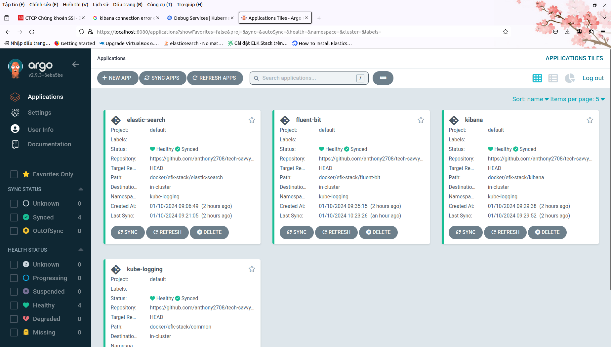

## Giai đoạn 11 - Tích hợp và Triển khai Liên tục (CI/CD)

_Để mà nói về giai đoạn này thì thực ra mình đã có một bài viết riêng rồi, mọi người có thể xem lại phần
2 của **Câu chuyện Cloud** tại **[đây](../../2023-04)** để hiểu thêm về CI/CD và các công cụ phổ biến hiện nay._

_CI/CD có thể hiểu đơn giản là **tự động hoá** quy trình phát triển phần mềm, ngay từ giai đoạn đầu tiên, 
giúp **tối ưu thời gian và chi phí** phát triển._

_Phía dưới này sẽ là những tài liệu tham khảo chi tiết hơn về các công cụ CI/CD phổ biến, trong 
đó bao gồm **Jenkins, Argo CD & GitHub Actions**._

_Đọc nhanh ở bài viết trên để có cái nhìn tổng quan nhất, rồi sau đó **hãy quay lại tiếp tục hành trình cùng 
mình nhé!**_ 🚀