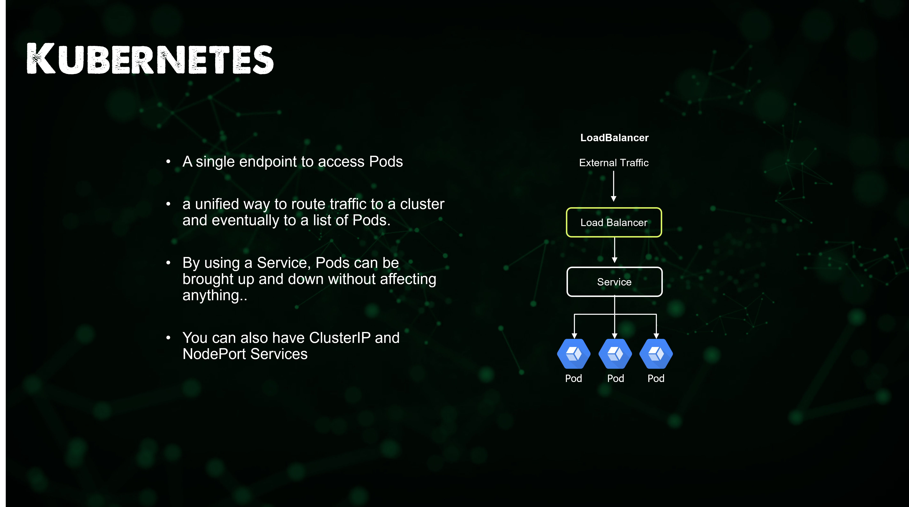

import { Steps } from '@astrojs/starlight/components';

## Giai đoạn 8 - Kubernetes

_Kubernetes nói một cách đơn giản, chính là **bản nâng cấp của Docker**. Nếu so về độ mở rộng thì Kubernetes có 
phần **nhỉnh hơn Docker** một chút - đặc biệt là tính **tự động mở rộng** khi tăng/giảm tải người dùng._

_Kubernetes có thể sắp xếp các container thành các **cụm (cluster)** theo trạng thái mong muốn. Đây là một đặc
trưng của **Điều phối container** - thuật ngữ chỉ việc quản lý và tự động hóa việc triển khai, mở rộng và vận hành 
vòng đời các ứng dụng container._

_Tất nhiên, điều phối container có thể dùng nhiều hơn một công cụ: Chúng ta có cả **Docker Swarm, Apache Mesos,
HashiCorp Nomad**, nhưng Kubernetes là công cụ phổ biến nhất hiện nay. Trang web chính thức thức của Kubernetes
tại **[đây](https://kubernetes.io/)** là một trong những nơi tốt nhất để tìm hiểu về Kubernetes._

### Kubernetes (K8s) là gì?

> _Kubernetes là một nền tảng mã nguồn mở, di động, có thể mở rộng để quản lý khối lượng công việc và dịch vụ được 
> chạy trên container, hỗ trợ cả cấu hình khai báo và tự động hóa. Nó có một hệ sinh thái lớn, phát triển nhanh chóng. 
> Các dịch vụ, hỗ trợ và công cụ Kubernetes được phổ biến rộng rãi._

_Kubernetes là một dự án mã nguồn mở được Google phát triển và hiện đang được **Cloud Native Computing Foundation (CNCF)** 
duy trì. Kubernetes cung cấp các tính năng sau đây như một dạng của **Điều phối containers**._

<Steps>
1. _**Phát hiện dịch vụ** và **cân bằng tải**: K8s có thể mở truy cập một container bằng cách sử dụng DNS hoặc 
địa chỉ IP của chúng. Nếu lưu lượng truy cập vào container cao, K8s có thể cân bằng tải và điều phối 
lưu lượng mạng để quá trình triển khai được ổn định._
2. _**Điều phối lưu trữ**: K8s cho phép bạn tự động gắn hệ thống lưu trữ mà bạn chọn, 
chẳng hạn như lưu trữ cục bộ hoặc các dịch vụ lưu trữ sử dụng điện toán đám mây công cộng,..._
3. _**Tự động triển khai**: Bạn có thể mô tả trạng thái mong muốn cho các containers đã triển khai 
của mình bằng K8s và nó có thể thay đổi trạng thái với tốc độ được kiểm soát. Ví dụ, bạn có thể tự động hoá 
K8s để tạo container mới cho quá trình triển khai của mình, xoá container hiện có và sử dụng tất cả các 
tài nguyên của chúng ta cho container mới được tạo._
4. _**Đóng gói tự động**: Bạn cung cấp cho K8 một cụm gồm nhiều **nút (nodes)** mà nó có thể sử dụng để chạy các 
tác vụ được đóng gói trong các containers. Bạn cho K8s biết **lượng CPU** và **bộ nhớ (RAM)** mà mỗi container 
cần. K8s có thể sắp xếp các containers và các nodes của bạn để có thể tận dụng các tài nguyên một cách tốt nhất._
5. _**Tự phục hồi**: K8s khởi động lại các container bị lỗi, thay thế các container, xoá bỏ các container không phản 
hồi các bài kiểm tra do người dùng quy định và không sử dụng các container cho các yêu cầu từ người dùng cho đến khi 
chúng ở trạng thái sẵn sàng._
6. _**Quản lý cấu hình và khóa bí mật**: K8s cho phép bạn lưu trữ và quản lý thông tin nhạy cảm, 
chẳng hạn như **mật khẩu, OAuth tokens hoặc khóa SSH**. Bạn có thể triển khai và cập nhật các giá trị bí mật cũng 
như cấu hình ứng dụng mà không cần xây dựng lại bản ảnh container cũng như không để lộ các giá trị đó trong cấu hình 
hệ thống của bạn._
</Steps>

_K8s giúp triển khai các ứng dụng theo dạng phân tán và có thể mở rộng một cách tốt nhất._

### Cấu trúc của Kubernetes

_K8s phân lập các thành phần của máy chủ thành những phần nhỏ hơn, mỗi phần có một chức năng riêng biệt._

#### Cụm (Cluster)

_Bao gồm các nút khác nhau, mỗi nút có thể là một máy chủ thật/ảo. Mỗi cụm sẽ có một Control Plane với những thành phần
nhỏ như sau._

##### Các thành phần con của Control Plane

###### Máy chủ Kube API 

_Máy chủ Kubernetes API xác thực và định cấu hình dữ liệu cho các đối tượng API bao gồm **các hạt, 
các dịch vụ, các bộ xử lý tạo lập** và các đối tượng khác. Máy chủ API phụ vụ các tác vụ **REST (đọc/ghi)** 
và cung cấp **giao diện người dùng** cho các trạng thái được chia sẻ của cụm qua đó tất cả các thành phần 
khác có thể tương tác. Đại loại như một **cổng API** để các nút khác trong cụm có thể giao tiếp với nhau._

:::note[Lưu ý]

_Để tương tác với API này, thường người ta sẽ sử dụng **kubectl**._

:::

###### Bộ lập lịch

_Một quy trình của control plane lập lịch các hạt cho các nút. Bộ lập lịch sẽ xác định nút nào là vị trí 
thích hợp cho từng hạt trong hàng đợi lập lịch theo các ràng buộc và tài nguyên sẵn có. Sau đó, sẽ xếp hạng 
từng nút hợp lệ theo thứ tự ưu tiên để gắn hạt vào một nút thích hợp. Nói đơn giản thì đây là nơi xác định vị
trí các hạt chứa **mã nguồn ứng dụng** trong cụm._

###### Controller Manager

_Là một trình **chạy nền** có các vòng điều khiển lõi được cài đặt cùng với Kubernetes. Trong các ứng dụng của người 
máy hoặc tự động hoá, vòng điểu khiển là một **vòng lặp không kết thúc** để điều chỉnh trạng thái của hệ thống. 
Trong K8s, bộ điều khiển là một vòng điều khiển **theo dõi trạng thái** được chia sẽ của cụm thông qua **máy chủ 
API** và thực hiện các thay đổi nhằm chuyển trạng thái hiện tại sang trạng thái mong muốn._

###### etcd

_Kho lưu trữ dạng cặp **khóa-giá trị** có tính **nhất quán** và **độ sẵn sàng cao** được sử dụng để lưu trữ toàn bộ 
cấu hình, trạng thái của cụm K8s._

#### Nút (Node)

**_Có hai loại nút chính trong K8s._**

1. _**Control Plane (tầng điều khiển)**: Là nút điều khiển, nơi mà các thành phần của K8s chạy. Control Plane 
có thể chạy trên một hoặc nhiều máy chủ. Control Plane đưa ra quyết định về việc triển khai, lập lịch và theo dõi
cụm K8s._
2. _**Worker Node (tầng làm việc)**: Là nút làm việc, nơi mà các ứng dụng chạy. Worker Node có thể chạy trên một hoặc 
nhiều máy chủ (thật hoặc ảo). Mỗi nút có thể chứa nhiều **hạt (pod)** và được quản lý bởi Control Plane._

##### Các thành phần con của Nút

###### kubelet

_Một agent chạy trên mọi nút trong cụm. Nó đảm bảo rằng các containers đang được chạy trong hạt. Kubelet nhận một bộ 
PodSpecs được cung cấp thông qua các cơ chế khác nhau và đảm bảo rằng các vùng chứa được mô tả trong các PodSpec đó 
đang chạy và hoạt động tốt._

:::danger[Quan trọng]

**_Kubelet không quản lý các containers không được tạo bởi K8s._**

:::

###### kube-proxy

_Là một **mạng ảo** mạng chạy trên mỗi nút trong cụm, triển khai một phần của khái niệm **Dịch vụ K8s**. 
kube-proxy duy trì các quy tắc mạng trên các nút. Các quy tắc mạng này cho phép giao tiếp mạng với các hạt từ các 
phiên bên trong hoặc bên ngoài cụm._

:::note[Lưu ý]

**_kube-proxy sử dụng lớp lọc gói tin của hệ điều hành nếu có thể. Nếu không, kube-proxy tự chuyển tiếp lưu lượng mạng._**

:::

###### Runtime

_Là phần mềm chịu trách nhiệm chạy các containers. K8s hỗ trợ một số container runtimes **Docker, containerd, 
CRI-O và Kubernetes CRI** (Container Runtime Interface)._

#### Hạt (Pod)

_Hạt là đơn vị triển khai nhỏ nhất trong K8s. Một hạt có thể chứa một hoặc nhiều containers, các hạt có thể chia sẻ 
các tài nguyên như **IP, cổng, bộ nhớ** và **tệp hệ thống**. Hạt có thể được triển khai trên một hoặc nhiều nút trong
cụm. Hạt mang tính **tạm thời**, có thể được tạo ra theo chiều ngang bởi **ReplicaSet (tập mở rộng)** hoặc bị xóa bất 
cứ lúc nào khi gặp lỗi, và các hạt chia sẻ chung **không gian tên mạng**._

:::note[Lưu ý]

**_K8s sử dụng nhãn (cặp khóa - giá trị) để xác định các hạt và các đối tượng khác trong cụm._**

:::

_Mỗi hạt có thể xử lý bộ nhớ, giá trị biến môi trường, cổng và các thông số khác nhau. Các hạt giống nhau chạy 
**cùng mã nguồn container** trên các **nút làm việc (worker node)** trong cụm._

##### Các thành phần liên quan của Hạt

###### Deployments (Tệp triển khai)

_Mỗi hạt đều có một tệp triển khai, tệp này chứa các thông tin cho phép hạt chạy liên tục và tự khởi động lại 
khi gặp lỗi._

###### ReplicaSet (Tập mở rộng)

_Mỗi tệp triển khai có thể cho ra một tập mở rộng, giúp xác định số hạt mong muốn._

###### StatefulSets (Tập trạng thái)

_Cho phép lưu giữ trạng thái ứng dụng - chẳng hạn như **Cơ sở dữ liệu**. Mỗi tập sẽ có một **mã định danh duy nhất**
để hệ thống quản lý duy trì trong mỗi lần lập lịch đưa hạt vào nút._

###### DaemonSets (Tập Daemon)

_Sử dụng cho các **tiến trình liên tục** như **giám sát hay thu thập nhật trình**. Mỗi hạt thuộc dạng này cũng có một 
**mã định danh duy nhất** để hệ thống quản lý duy trì trong mỗi lần lập lịch đưa hạt vào nút._

:::note[Lưu ý]

**_Mỗi tập Daemon sẽ tạo ra chỉ một hạt trên mỗi nút trong cụm. Nếu có thêm một nút mới được thêm vào cụm,
K8s sẽ tự động tạo một hạt mới cho tập Daemon trên nút đó._**

:::

#### Dịch vụ (Service)

_Là một **điểm đến duy nhất** để truy cập các hạt, đây là một cách thống nhất để **định tuyến lưu lượng truy cập** đến 
một cụm và cuối cùng là các hạt. Bằng cách sử dụng tính năng này, các hạt có thể được bật/tắt mà không ảnh hưởng đến bất 
cứ dịch vụ khác._

_Vẫn sẽ còn đó rất nhiều những thành phần khác trong K8s như **ConfigMap, Secret, Ingress, Volume**,... nhưng đây là những
điều cơ bản nhất mà bạn cần biết về K8s. Nếu bạn muốn tìm hiểu sâu hơn về K8s, hãy tham khảo tài liệu chính thức tại phần
dưới đây nhé._ 

**_Còn bây giờ thì xin hẹn gặp lại các bạn trong các bài viết sau!_** 👋