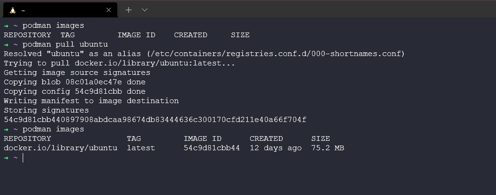

import FirstPost from "../../chunks/2024/03-22-TechBlog-04/_p1.md";
import SecondPost from "../../chunks/2024/03-22-TechBlog-04/_p2.md";
import ThirdPost from "../../chunks/2024/03-22-TechBlog-04/_p3.md";

Kính chào quý độc giả, đây là bài thứ tư của **Tech Blog** xuất hiện trở lại trên website này.
Ngày hôm nay, rất nhiều nội dung thú vị sẽ được chia sẻ tại chiếc Tech Blog này. Với tựa đề
**Tản mạn đầu năm**, đây sẽ là những câu chuyện được tổng hợp lại dưới góc nhìn hài hước
và dễ hiểu nhất về những vấn đề khác nhau. Mời quý vị chuyển sang các thẻ khác nhau ứng với
từng phần của bài viết.

<NewTabs client:load>
<NewTab name="P1">
  <FirstPost />
</NewTab>
<NewTab name="P2">
  <SecondPost />
</NewTab>
<NewTab name="P3">
  <ThirdPost />
</NewTab>
</NewTabs>

### Phụ lục Phần 3: Điều khiển Podman

**_Hướng dẫn dưới đây, dành riêng cho hệ điều hành Ubuntu._**

_Bạn có thể xem hướng dẫn cho các distro Linux khác tại **[đây](https://podman.io/docs/installation#installing-on-linux)**._

```bash title="Install Podman on Ubuntu"
# Ubuntu 20.10 and newer
sudo apt-get update && sudo apt-get upgrade -y
sudo apt-get -y install podman
```

_Sau khi mời tụi nó lên tàu, chúng ta sẽ khám phá chúng như cái cách chúng ta khám phá Docker vậy._

```bash title="Podman Commands"
# Gán thuộc tính alias - thay thế các câu lệnh Docker và ứng dụng cho Podman
alias docker=podman
podman images # Lấy toàn bộ bản ảnh của Podman
podman run -dit ubuntu # Chạy container từ bản ảnh Ubuntu
podman ps # Lấy danh sách container
podman attach <container_name> # Truy cập vào container
```



### Tổng kết bài viết

Vừa rồi là toàn bộ bài đăng số 4 của series **Tech Blog**. Mời quý độc giả theo dõi các bài đăng
tiếp theo và đóng góp ý kiến cũng trên website này. Trân trọng cảm ơn và kính chào 👋.

