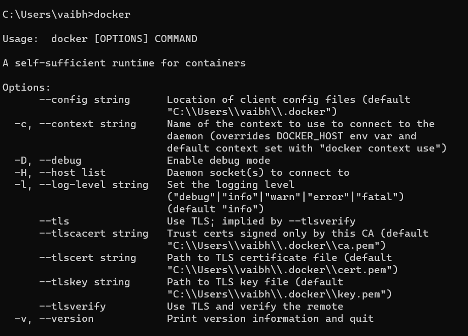
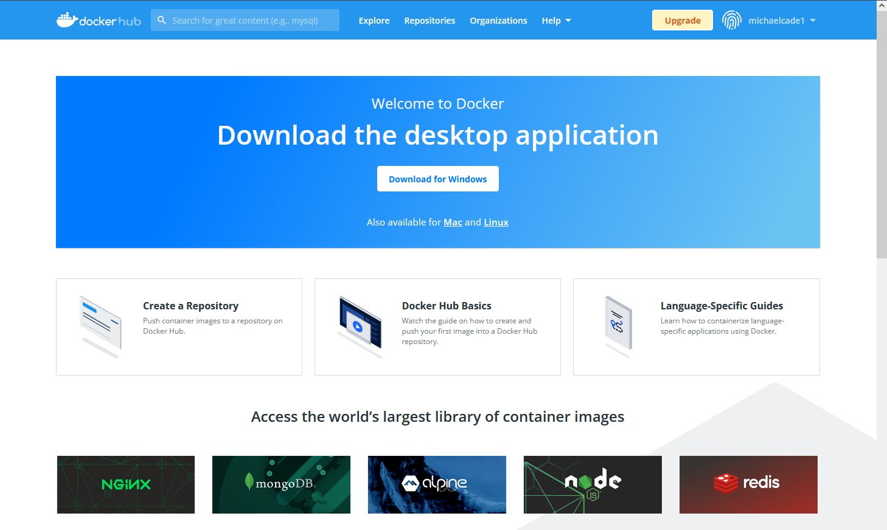

## Ngày 37 - Docker & những câu chuyện đầu tiên 📚

_Xin chào, đây là bài viết đầu tiên sau khoảng thời gian nghỉ lễ kéo dài, và đây sẽ là chuyến hành trình tiếp theo của
chúng ta. Ngày hôm nay, chúng ta nhắc đến Docker và bản ảnh của nó, tìm hiểu cách biến một bản ảnh thành một hệ thống
ứng dụng vận hành hoàn chỉnh._ 

**_Không tấu hài nữa, bắt đầu hành trình thôi!_** 🚋

### Docker

_**Docker, CRI-O, Podman, Containerd** đều là những sản phẩm của tiêu chuẩn **OCI - Open Container Initiative**. Docker 
là một bộ khung dựa trên những tập tin cấu hình, được gọi là **Dockerfile**, giúp chúng ta tạo ra một bản ảnh của ứng 
dụng hoàn chỉnh. Ngoài Docker image ra, chúng ta cũng sẽ nhắc đến lớp nền chạy container, được gọi là **Docker Engine**._

_Sử dụng Docker cũng khá đơn giản, việc cài đặt phiên bản giao diện (Desktop) chỉ cần thực hiện theo hướng dẫn tại 
[dây](https://docs.docker.com/engine/install/). Lưu ý một số yêu cầu về thiết bị và hệ điều hành trước khi cài đặt._

_À mà khoan, Docker Desktop là gì đây, và Docker còn có những gì, cùng tìm hiểu nhé._

#### [Docker Engine](https://docs.docker.com/engine/)

_Từ khóa Engine có nghĩa là động cơ, và Docker Engine chính là động cơ của Docker. Nó giúp chúng ta quản lý các container
và hoạt động theo mô hình **chủ - khách**, bao gồm: **Docker Daemon (máy chủ), API giao tiếp và Docker CLI (máy khách)**._

#### Docker Desktop

_Đây chẳng khác gì một IDE thực thụ cả - giúp chúng ta tạo ra các container, quản lý và chạy chúng. Docker Desktop có 
sẵn trên Windows và MacOS. Trên Windows còn có cả **WSL2 (Windows Subsystem for Linux)** và **Hyper-V**, và tất nhiên 
với WSL2, chúng ta có thể tương tác hẳn với Linux._

**_Sau khi tải xong Docker Desktop, hãy kiểm tra bằng lệnh sau để biết Docker có tồn tại trên máy hay chưa._**

```bash title="Checking Docker Engine"

docker

```



#### Docker Compose

_Compose trong tiếng Anh có nghĩa là sáng tạo, và Docker Compose chính là công cụ giúp chúng ta tạo ra một tập hợp các
containers hình thành một ứng dụng phức tạp. Chỉ với một tập tin YAML đơn giản, chúng ta có thể làm được những điều vô 
cùng phi thường._

#### [Dockerhub](https://hub.docker.com/)

_Hub là nơi chứa, và Dockerhub chính là nơi chứa các Docker image. Chúng ta có thể tìm kiếm, tải về và chia sẻ các bản
ảnh để làm được gần như mọi thứ._ 

_Tạo một tài khoản trên Dockerhub giúp bạn khám phá được rất nhiều bản ảnh dùng cho tất tần tật mọi ứng dụng từ lớn
đến nhỏ._



#### Dockerfile

_Xương sống của Docker image, Dockerfile chứa các hướng dẫn cần thiết để tạo ra một bản ảnh hoàn chỉnh. Hệ thống sẽ đọc
các tập tin cấu hình này và thực hiện theo hướng dẫn._

**_Và tất nhiên, sẽ còn rất nhiều điều nữa sẽ được cập nhật, ngay trong bài viết này, hãy cùng chờ đón nhé!_**