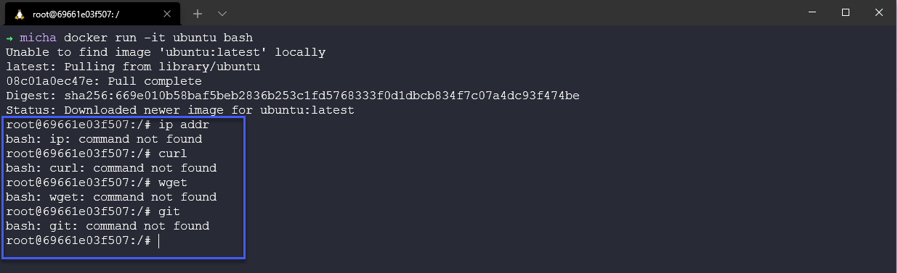
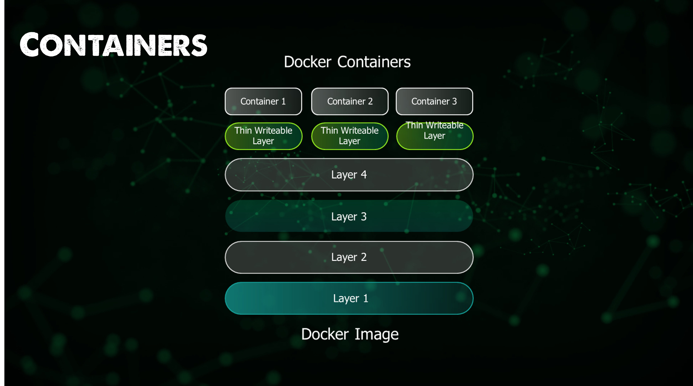

import { Steps, Aside } from '@astrojs/starlight/components';

## Ngày 38 - Dáng hình của Docker 🖼

_Xin chào, cuối cùng thì chúng ta cũng đã sẵn sàng cho ngày tiếp theo của hành trình đầy chông gai này. Hôm nay chúng ta 
sẽ tìm hiểu về Docker image, bản ảnh của Docker, và cách tạo ra một bản ảnh từ một Dockerfile._

**_Nếu bạn đã đóng gói đầy đủ tư trang, hãy cùng nhau bắt đầu hành trình mới này nhé!_** 🚋

### Khởi động

_Sau khi cài đặt Docker, chúng ta sẽ bắt đầu bằng việc chạy câu lệnh sau._

```bash title="Running a container"

docker run -d -p 80:80 docker/getting-started

```

**_Khi các bạn chạy lệnh này, những việc sau đây sẽ xảy ra._**

<Steps>
1. _Docker sẽ tìm kiếm image `docker/getting-started` trên máy tính của bạn. Nếu không tìm thấy, Docker sẽ **tải image** 
này từ DockerHub hoặc bất kỳ registry lưu trữ nào có bản ảnh này. Việc này cũng sẽ diễn ra tương tự với các bản ảnh khác._
2. _Docker sẽ tạo một container từ image này. Trong trường hợp này, container sẽ chạy một ứng dụng web trên cổng 80._
3. _Docker sẽ **chuyển tiếp** cổng 80 của máy tính của bạn tới cổng 80 của container (```-p``` - port)._
4. _Việc chạy container này sẽ diễn ra ở **chế độ nền** (background mode) (```-d``` - detach)._
5. _Kết quả cuối cùng, bạn sẽ có một ứng dụng hoàn chỉnh, khi truy cập vào `http://localhost/tutorial` trên trình duyệt._
</Steps>


_Đối với các bản ảnh, chúng ta có thể phân loại làm ba nhóm như sau._

- _**Official Image**: Là những bản ảnh được Docker cung cấp, chúng ta có thể tìm thấy trên 
[DockerHub](https://hub.docker.com/)._
- _**Verified Publisher**: Là những bản ảnh được xác thực bởi Docker, cung cấp bởi các nhà cung cấp phần mềm._
- _**User-defined images**: Là những bản ảnh được tạo ra bởi người dùng và đăng tải trên DockerHub hoặc các 
registry khác._


_Để dừng container đang chạy, cần phải xác định `container ID` hoặc `container name` và chạy lệnh sau._

```bash title="Stopping a container"

docker ps
docker stop <container ID or container name>

```

### Tham vọng to lớn với cả một hệ điều hành...

```bash title="Running a container with OS"

docker run -it ubuntu bash

```
_Khi bạn chạy lệnh này, ngay lập tức bạn có một bản ảnh của Ubuntu trên Docker với Bash._

_**Bạn có tin được không, nhưng đó là sự thật**. Khi bạn chạy xong lệnh trên, bạn sẽ thấy một dấu nhắc mới, đó chính là
một cửa sổ dòng lệnh của Ubuntu. Tất nhiên Ubuntu trên Docker chỉ **cỡ đâu đó 30MB** thôi, nhưng tất nhiên là bạn có 
thể thêm các gói phần mềm khác vào bản ảnh này._




### Tìm hiểu về Dockerfile

_Dockerfile là một tập tin văn bản chứa một loạt các hướng dẫn để tạo ra một bản ảnh. Mỗi hướng dẫn trong Dockerfile
thường được tổ chức theo dạng một **"lớp" (layer)** và mỗi lớp này sẽ tạo ra một image mới._

_Cấu trúc của các lớp, sẽ đi theo phương thức **xếp chồng (stacked)** và mỗi lớp sẽ kế thừa từ lớp trước đó._



_Theo thứ tự, chúng ta sẽ có **Dockerfile dựng thành image**, và c**ontainer thì chạy từ image đó**. Mỗi bản ảnh sẽ còn 
có manifest. Manifest trong tiếng Anh có nghĩa là "bản thể", và nó chứa thông tin về các lớp, cấu trúc, và metadata của
bản ảnh._

#### Ví dụ về Dockerfile

```bash title="Dockerfile"

FROM node:18-alpine
WORKDIR /app/
COPY ./sources/ .
RUN npm install
EXPOSE 3000
CMD ["npm", "start"]

```

**_Dưới đây là một số từ khóa hiệu lệnh của Dockerfile mà bạn sẽ thường xuyên gặp._**

|    Lệnh          |                                        Mục đích                                      |
|:----------------:|:------------------------------------------------------------------------------------:|
| ```FROM```       | _Để chỉ định bản ảnh gốc._                                                           |
| ```WORKDIR```    | _Để đặt thư mục làm việc cho bất kỳ lệnh nào phía sau trong Dockerfile._             |
| ```RUN```        | _Để chạy lệnh giúp cài đặt bất kỳ ứng dụng và gói phụ trợ cần thiết cho container._  |
| ```COPY```       | _Để sao chép các tệp hoặc thư mục từ một vị trí cụ thể._                             |
| ```ADD```        | _Là COPY, nhưng cũng có thể xử lý các URL và giải nén các tệp nén._                  |
| ```ENTRYPOINT``` | _Lệnh sẽ thực thi khi container khởi động. Mặc định là ```/bin/sh -c```_             |
| ```CMD```        | _Các đối số truyền vào. Nếu ENTRYPOINT mặc định, CMD là lệnh thực thi._              |
| ```EXPOSE```     | _Để xác định cổng truy cập ứng dụng container._                                      |
| ```LABEL```      | _Để thêm metadata vào bản ảnh._                                                      |

_Dựa trên Dockerfile phía trên ta sẽ có những bước sau._

<Steps>

1. _Lấy bản ảnh gốc (base image) từ `node:18-alpine`, tức là một bản ảnh của Node.js trên Alpine Linux._
2. _Đặt thư mục làm việc cho container là `/app/`._
3. _Sao chép tất cả các tệp từ thư mục `./sources/` vào thư mục làm việc của container._
4. _Cài đặt các gói phụ trợ cần thiết cho ứng dụng Node.js._
5. _Mở cổng 3000 để truy cập ứng dụng._
6. _Chạy ứng dụng Node.js bằng lệnh `npm start`._

</Steps>

_Lúc này, ta có thể truy cập ứng dụng Node.js thông qua cổng 3000 của máy tính 
(đúng hơn là ```http://localhost:3000```)._

#### Dựng Dockerfile
Chạy câu lệnh sau để dựng Dockerfile này thành bản ảnh mới.

```bash title="Building a Dockerfile"

docker build -t my-node-app:1.0 .
# -t: tag cho bản ảnh
# .: thư mục chứa Dockerfile

```

**_Và đó là cách bạn có một bản ảnh mới toanh, tự dựng từ một Dockerfile._** 🎉

<Aside type="tip" title="Chưa dừng lại ở đó...">

**_Nếu bạn nghĩ chỉ một Dockerfile là đủ, thì bạn đã lầm to._**

_Nếu bạn nghĩ rằng việc chỉ có một Dockerfile là quá đơn giản, thì bạn hoàn toàn có thể tạo ra một cụm các container.
Với Docker Compose, bạn có thể tạo ra một tập hợp các container, cùng chạy một ứng dụng lớn._

**_Chúng ta sẽ còn gặp lại nhau trong ngày mai, với nhiều điều thú vị hơn nữa về Compose. Byebye!!!_** 🚀

</Aside>