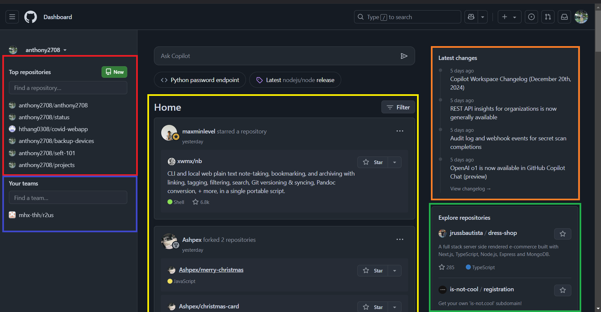
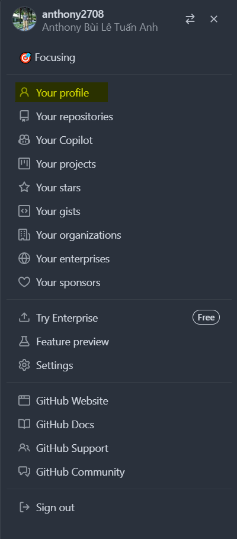
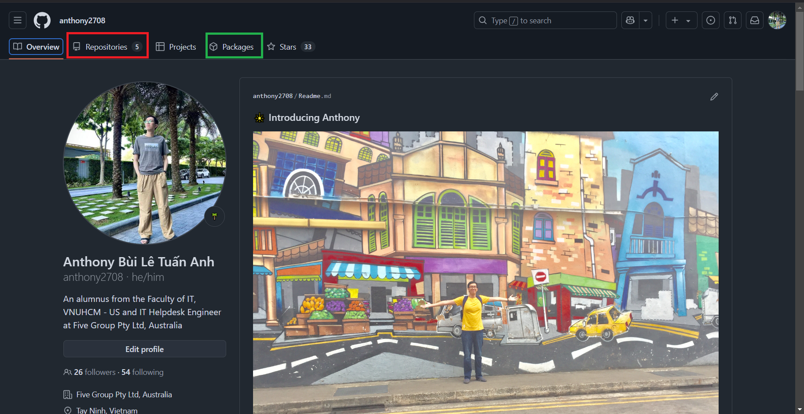
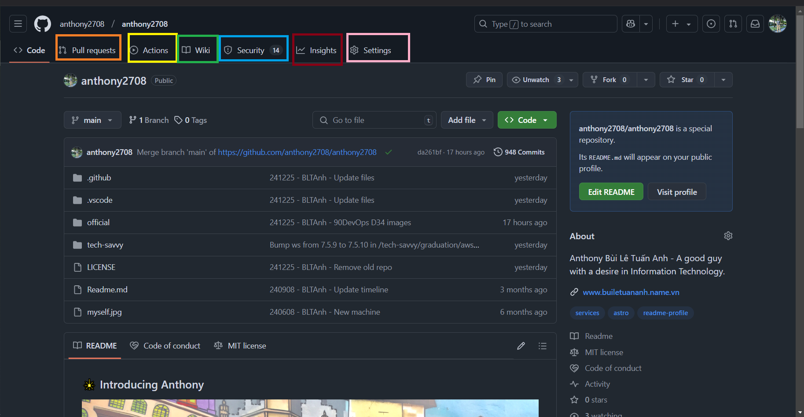
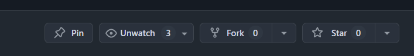
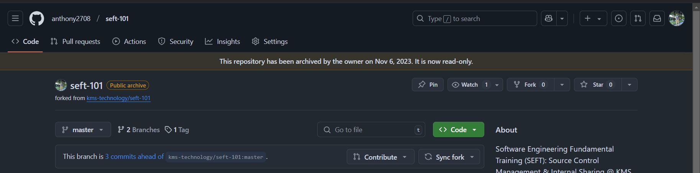
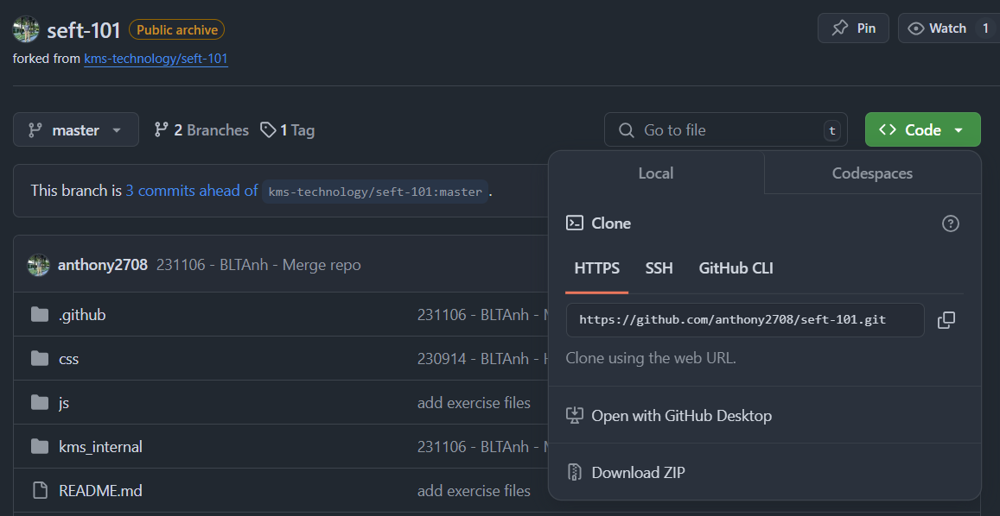
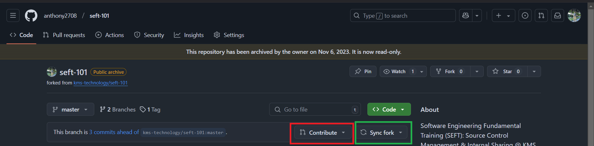
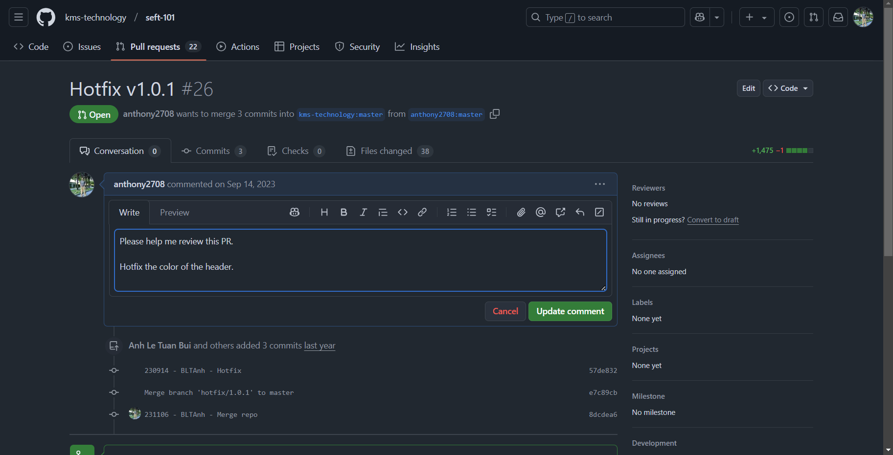

import { Steps } from '@astrojs/starlight/components';

## Ngày 35 - GitHub - Mạng xã hội dành cho mã nguồn

_Xin chào, đây là ngày thứ 35 - cũng sẽ là **ngày cuối cùng** của giai đoạn này. Ngày hôm nay, chúng
ta sẽ đi vào tìm hiểu về các nền tảng như **GitHub, GitLab hay Bitbucket** - các nền tảng lưu trữ 
mã nguồn trên điện toán đám mây phổ quát nhất được sử dụng hiện nay._

_Những nội dung cơ bản nhất của GitHub sẽ được cập nhật, mang đến những cái nhìn tổng quan và giúp
mọi người có thể sử dụng một cách hiệu quả nhất. **Nào, cùng xách ba lô lên và đi thôi!**_ 🎒

### GitHub

_GitHub ra mắt vào những năm **2007 - 2008 (cũng đã gần 17 năm)**. Hiện nay, **Microsoft** chính 
là những người đứng sau GitHub, mang đến cho nó những tính năng cộng tác với Git tốt nhất như sau._

<Steps>
1. _Kho lưu trữ mã nguồn_
2. _**Yêu cầu kéo mã nguồn (Pull Requests)** - nhập nhánh các thay đổi liên quan_
3. _Công cụ quản lý dự án - **Issues**_
4. _CI/CD với **GitHub Actions**_
</Steps>

_GitHub là một ứng dụng **Freemium** - tức là miễn phí có giới hạn tính năng. Đối với các doanh nghiệp
có ý định dùng GitHub trong công việc, có thể tham khảo bảng giá tại **[đây](https://github.com/pricing)**._

### Khám phá giao diện GitHub
_Khi tạo xong tài khoản và truy cập vào trang web chính thức, mọi người sẽ được chào đón bởi một 
giao diện như thế này._

#### Giao diện chính



<Steps>
1. _**Top repositories**: Những kho lưu trữ mà mọi người hay làm việc._
2. _**Your teams**: Các nhóm trên GitHub. GitHub cho phép gom các kho về cùng quản lý dưới một tài khoản nhóm. 
Phía trên sẽ thường có mục **Recent Activity** - Hoạt động gần đây, với các yêu cầu kéo mã nguồn/nhập nhánh._
3. _**Home**: Trang nhà - như một bảng tin (feed) trên Facebook/Meta, cung cấp những hoạt động của những người 
mà bạn theo dõi._
4. _**Latest changes**: Thay đổi mới nhất liên quan đến GitHub._
5. _**Explore repositories**: Khám phá các kho lưu trữ được người dùng khắp thế giới quan tâm._ 
</Steps>

#### Trang cá nhân
_Mọi người có thể đi vào trang cá nhân ngay tại mục **Your Profiles**, khi chọn vào hình đại diện của mình._





<Steps>
1. _**Overview - Tổng quan**: Cung cấp những thông tin cơ bản về người dùng_
2. _**Repositories - Kho lưu trữ**: Chứa tất cả những kho lưu trữ (công khai và riêng tư) trên GitHub_
3. _**Packages - Gói**: Đây thực ra là một tính năng rất hay liên quan đến bộ chứa (Containers) mà chúng ta 
sẽ đề cập ở giai đoạn tiếp theo của hành trình._
</Steps>

#### Kho lưu trữ
_Khi bước vào kho lưu trữ bất kỳ, mọi người sẽ bắt gặp một giao diện như thế này._



<Steps>
1. _**Pull Requests - Yêu cầu kéo**: Đây chính là nơi nhập nhánh các thay đổi mã nguồn trên kho._
2. _**Actions - Theo dõi luồng**: Nơi các đường CI/CD được triển khai và giám sát quá trình._
3. _**Wiki - Hướng dẫn**: Nơi chứa tất cả "bí kíp võ công" của kho, giúp việc sử dụng trở nên
đơn giản hơn._
4. _**Security - Bảo mật**: Cung cấp các tùy chọn về bảo mật, các cảnh báo cũng như đề xuất giải
pháp vá lỗi nhằm ngăn chặn nguy cơ bị khai thác các lỗ hổng trên thực tế._
5. _**Insights - Thăm dò**: Theo dõi các hoạt động trên kho, như một nhật trình giám sát tất cả
mọi thứ._
6. _**Settings - Cài đặt**: Nơi thiết lập các chế độ cho kho lưu trữ, bao gồm việc ẩn đi một vài
thẻ như **Projects - Dự án** (có vai trò như một bảng **[Kanban](https://www.atlassian.com/agile/kanban)**
theo dõi các đầu việc nhất định) và cả **Sponsor - Tài trợ** cho dự án..._
</Steps>

### Tham gia cuộc chơi "mã nguồn mở"...

_Nếu giả sử bạn thấy có một kho lưu trữ rất hay, có thể mọi người lựa chọn một trong ba giải
pháp sau._



<Steps>
1. _**Watch - Theo dõi** 👁: Tương tự tính năng Đang theo dõi trên Facebook, thông tin của kho sẽ được hiện
lên trên Trang nhà._
2. _**Fork - Sao chép** 🍴: Đây là cách chúng ta sao chép nguyên bản một kho lưu trữ về trang cá nhân và làm
việc với những thay đổi trên bản sao này, trước khi nghĩ đến việc gửi lại bản sao với những cải thiện cho
bên giữ bản gốc. Fork trong tiếng Anh có nghĩa là **chiếc nĩa** - hãy nhìn hình dạng của nĩa, bạn sẽ có sự tưởng
tượng rõ nét hơn về tính năng này._
3. _**Star - Yêu thích** ⭐: Tương tự tính năng Yêu thích trên Facebook, việc này sẽ giúp đưa kho vào một danh
sách yêu thích để theo dõi riêng biệt._
</Steps>

_Nếu giả sử mọi người muốn sao chép, hãy chọn Fork. Và đây là những gì mọi người sẽ nhìn thấy (**trừ dòng màu vàng
do kho đang chuyển sang chế độ lưu trữ**)._



Tại đây mọi người bắt đầu bấm vào nút Code màu xanh lá - Ở chế độ Clone (Nhân bản) sẽ có một đường dẫn. Mở
cửa sổ dòng lệnh lên và gõ.

```bash title="Cloning the repository..."

git clone <url>

```



_Sau khi thực hiện thay đổi, chạy lần lượt ba câu lệnh sau trên cửa sổ dòng lệnh 
của Visual Studio Code._

```bash title="Committing changes..."

git add .
git commit -m "message"
git push # Đẩy mã nguồn lên kho trên GitHub

```



_Trên màn hình sẽ có hai nút có thể sử dụng với hai chiều ngược nhau._

<Steps>
1. _**Contribute - Chiều đi**: Sau khi cập nhật xong, nút này sẽ giúp tạo một yêu cầu nhập nhánh.
Yêu cầu nhập nhánh này sẽ nhập về bản gốc - sau khi được duyệt thì yêu cầu này sẽ được cập
nhật trên cả bản gốc lẫn bản sao. **Điều này nghĩa là bạn đã tham gia cuộc chơi thành công!**_
2. _**Sync fork - Chiều về**: Nút này có tác dụng cập nhật từ bản gốc những thay đổi đang có, về
lại bản sao của mình._
</Steps>

_Giao diện tạo yêu cầu nhập nhánh sẽ trông như thế này. Hãy nhập những thông tin bình thường nhất,
và lưu lại. Người giữ bản gốc sẽ xem xét bản sao này._



_Đó là tất cả những gì bạn có thể làm, để GitHub thực sự trở thành một người bạn đồng hành lý tưởng.
**Hành trình của giai đoạn 6 sẽ kết thúc tại đây**._ ✅