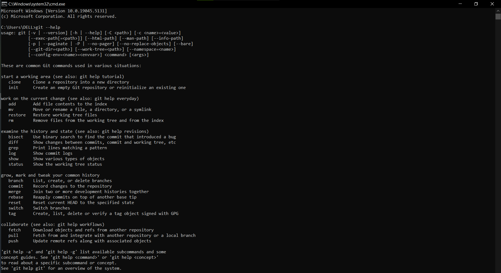

import { LinkCard, Steps } from '@astrojs/starlight/components';

_Xin chào tất cả mọi người. Rất xin lỗi vì để cho chiếc series này kéo dài quá lâu đến không
kịp hoàn thành đúng tiến độ. Thực ra gần đây mình cũng nhận được một công việc mới, ở một
nơi làm mới, khá bận bịu với rất nhiều yêu cầu khác nhau, do đó cũng không thể về đích đúng
hẹn được._ 

_Do vậy, thông qua dịp này, mình cũng sẽ thực hiện một chiến lược mới - **rút gọn các nội dung 
không phù hợp và sáp nhập lại các ngày trong series**. Hy vọng mọi người sẽ tiếp tục ủng hộ 
và theo dõi trong năm 2025._

_Trong ngày hôm nay, nội dung của **ba ngày kế tiếp** sẽ được nhập lại để đưa vào chung trong một
bài viết - **hãy sẵn sàng để trở lại hành trình thôi nào!**_ 🚗

## Giải ngố lệnh Git

_Nếu bạn không biết cách sử dụng các câu lệnh của Git, bạn có hai giải pháp sau đây._

<Steps>
1. _Truy cập vào website chính thức để đọc hướng dẫn: Đường dẫn **[này](http://git-scm.com/docs)**
cung cấp cho mọi người tất cả những gì mà mọi người cần._
2. _Gõ lệnh sau đối với các câu lệnh cần tìm hướng dẫn._ 

   ```bash title="Getting help with Git..."
   git --help # Hướng dẫn chi tiết câu lệnh
   git -h # Hướng dẫn về các tham số có thể sử dụng
   ```

</Steps>



## Những ngộ nhận và thiếu sót "chết người" về Git

_Có những ngộ nhận và thiếu sót rất khó chấp nhận với Git mà chúng ta đôi khi gặp phải._

<Steps>
1. _Dùng Git nghĩa là không có quyền kiểm soát truy cập: **Sai** - bạn có thể trao quyền 
cho một trưởng bộ phận để duy trì mã nguồn._
2. _Git quá nặng: **Sai** - Git có thể cung cấp các kho lưu trữ nông (shallow repositories), 
có nghĩa là lịch sử sẽ được cắt giảm tối đa nếu có một dự án lớn._
3. _Không thích hợp cho các loại tập tin khác ngoài mã nguồn: **Đúng** - video và mấy tập tin
thực thi cỡ lớn không phải là thứ mà Git yêu thích, dù Git có cả **Git LFS**._
4. _Không thân thiện: **Đúng** - Git thực sự có quá nhiều câu lệnh, để thấu hiểu hết cách dùng 
sẽ mất rất nhiều thời gian. Đường cong học tập lớn, dẫn đến không ít người e ngại khi học Git._
</Steps>

## Hệ sinh thái và "Bí kíp võ công" Git

_Hầu như tất cả công cụ phát triển mã nguồn hiện đại đều có Git._

<Steps>
1. _Môi trường phát triển tích hợp: Mình đang viết mã nguồn trên **Visual Studio Code** - một ứng 
dụng có tích hợp với Git._
2. _Điện toán đám mây: AWS, GCP (Google) hay Microsoft Azure tất nhiên đều có các dịch vụ về Git._
3. _"Mạng xã hội" Git: Mã nguồn của trang mạng này được đăng tải trên **GitHub**. Bên cạnh đó, còn có
**GitLab** hay **Bitbucket** (nơi mình tải lên kho lưu trữ mã nguồn của Khóa luận tốt nghiệp) cũng là 
những nơi có sử dụng Git._
</Steps>

_Để làm việc với những công cụ này, tất thảy cần có **"bí kíp"**, và trang web
**[này](https://www.atlassian.com/git/tutorials/atlassian-git-cheatsheet)** chính là một trong số đó.
Ở đây có rất nhiều câu lệnh khác nhau, tuy nhiên chúng ta sẽ chỉ chú ý đến một số câu lệnh sau._

```bash title="Working with Git"

git init # Khởi tạo Git trên thư mục
git status # Kiểm tra trạng thái Git, thêm -s nếu muốn xem vắn tắt
git add <name> # Thêm tập tin vào quản lý với Git
git commit -m "message" # Xác nhận quản lý tập tin trên Git, 
# thêm -a trước tin nhắn nếu muốn gộp việc thêm và xác nhận vào cùng 1 lệnh.
git rm <name> # Loại bỏ tập tin khỏi Git
git mv <old> <new> # Di chuyển/đổi tên tập tin trên Git
git log # Xem lại lịch sử 
git diff # Xem các thay đổi đang được thực hiện trên Git 
# Có thể xem qua Visual Studio Code để dễ nắm bắt hơn
git show <commit-id> # Xem thông tin của một commit xác nhận
git ls-tree <commit-id> # Hiển thị cây thư mục tại commit nhất định
git restore --staged <name> # Quay lui quy trình xác nhận quản lý Git đối với tập tin
git restore --source =<commit-id> <name> # Khôi phục tập tin tại vị trí commit nhất định
git undo # Quay lui về commit gần nhất
```

_Về mặt lời khuyên khi commit xác nhận - lưu ý các yêu cầu sau đây._

<Steps>
1. _Commit liên tục để không làm gián đoạn quy trình. **Không ai muốn commit phút cuối để rồi
đi gỡ lỗi sấp mặt cả!!!**_
2. _Commit cần có nội dung rõ ràng - Không nên ghi chung chung như "upload file" mà cần chỉ rõ
là **"upload file" nào, ở đâu, ai tải lên và ngày nào**._
3. _Commit cần tách biệt giữa những thay đổi khác nhau - **Không gộp chung commit của hai hay nhiều
sự kiện không liên quan nhau**._
</Steps>

:::tip

_Đây là một commit tốt (hoặc ít nhất là chấp nhận được) mà mình thường hay dùng để giải quyết vấn đề._

```241215 - BLTAnh - Upload new official code for 90DevOps D34```

:::

## Rebase và Merge

```bash
git rebase
git merge
```

_Sự khác nhau của hai câu lệnh này cụ thể liên quan đến cách ghi nhật trình commit._

<Steps>
1. ```git merge```: _Lệnh này cho phép nhập một nhánh bất kỳ vào một nhánh khác - tuy nhiên
việc nhập nhánh này đồng nghĩa với việc sẽ xuất hiện **một bản ghi không liên quan của nhánh 
được nhập vào**, gây ra rất nhiều phiền toái trong quản lý về mặt nội dung commit._
2. ```git rebase```: _Lệnh này sẽ cho phép **tạo một commit riêng biệt** nhưng trên nhánh 
được nhập vào, không có chỗ cho một bản ghi nhập nhánh. Điều này sẽ giúp nhật trình được **sạch
và dễ quản lý hơn**._
</Steps>


_Sự đánh đổi ở đây rõ ràng là có - nếu không tuân thủ 
**[Quy tắc vàng](https://www.atlassian.com/git/tutorials/merging-vs-rebasing#the-golden-rule-of-rebasing)**,
rất có thể việc **"viết lại lịch sử"** sẽ là thảm họa - chúng ta sẽ không cung cấp đủ thông tin cho việc
nhập nhánh và khiến việc theo dõi gặp khó khăn._

_Do đó, **lựa chọn là của chính bạn - và duy nhất chỉ có một lựa chọn được xem là tốt nhất, đó là tiếp tục
theo dõi hành trình này ở ngày tiếp theo**. Ngày 34 xin được kết thúc ở đây - trân trọng cảm ơn mọi người
đã tham gia cùng mình._ ✅

## Tài liệu tham khảo 📚

_Mời mọi người chuyển sang trang này để theo dõi tất cả tài liệu liên quan trong giai đoạn 6, 
để giúp bản thân có được những tài liệu hữu ích về Quản lý phiên bản trong làm việc với DevOps._

<LinkCard
  title="Ngày 34 - Tham khảo"
  href="../../reference/git/day32"
/>

_Hẹn gặp mọi người ở những ngày tiếp theo._ 🚀