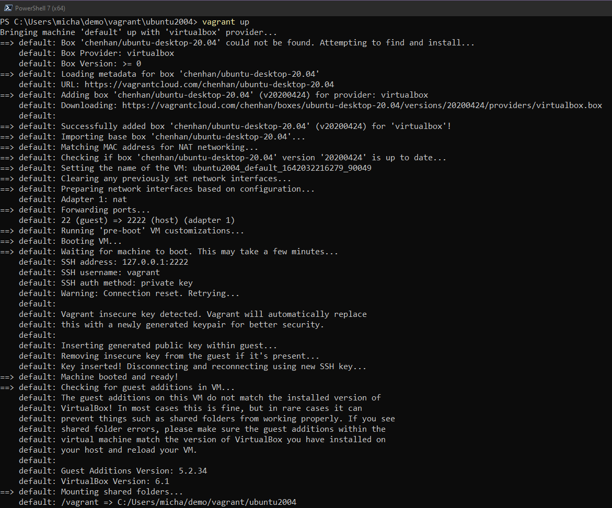

import { FileTree, Code } from '@astrojs/starlight/components';
import importedCode from '/src/assets/linux/code/Vagrantfile?raw';

## Ngày 14 - Bức tranh lớn của Linux

### Khởi động
_Linux và DevOps có những thứ khiến chúng ta liên tưởng đến những sự liên quan mật thiết lẫn nhau:
đó là **khả năng tùy biến** và **khả năng mở rộng**. Rất nhiều công cụ liên quan đến DevOps đã và đang 
được phát triển trên các **máy chủ vận hành bằng Linux**. Và do vậy, cho dù bài viết này đang được 
biên soạn bằng **một máy tính dùng Windows**, thế nhưng Linux vẫn sẽ là trọng tâm phát triển của 
chúng ta trong ít nhất là 1 tuần tới, vì đơn giản, chúng là **mã nguồn mở** và **hoàn toàn miễn phí**._

### Bắt đầu với máy ảo
_Cái gì cũng cần phải có môi trường, và tất nhiên là phải phục dựng được môi trường sao cho hợp lý nhất.
Ở đây chúng ta sẽ sử dụng một máy ảo Linux cho việc thao tác. Nhưng nếu bạn thích sử dụng máy tính thật,
hãy kích hoạt chế độ **Dual Boot** - cài thêm một **distro (phiên bản) Linux** phù hợp lên máy này, và 
nhớ: **Chia lại dung lượng ổ đĩa trước khi cài**._

_Để cài hệ điều hành trên một máy ảo hay thậm chí là một máy thật, ta sẽ phải có **bộ cài (image)** của 
hệ điều hành đó. Mọi người có thể tự mình tải xuống một bộ mong muốn, tuy nhiên chúng ta muốn có một cách 
làm tự động hóa nhanh chóng, hiệu quả hơn, **đúng không?** Thế thì hãy gặp người bạn mới của chúng ta: 
**Hashicorp Vagrant**._

### Thao tác với Hashicorp Vagrant

_Với Vagrant, chúng ta có một công cụ có thể dùng để tương tác với tất tần tật tất cả các loại máy ảo trên 
nhiều nền tảng khác nhau._

_Ở trong bài viết này, chúng ta sẽ sử dụng **[Vagrant](https://www.vagrantup.com/downloads)** để tương tác 
với Ubuntu - một Linux distro được nhiều người quen dùng, cũng như sử dụng 
**[Oracle VirtualBox](https://www.virtualbox.org/wiki/Downloads)** cho việc quản lý các máy ảo. Mọi người 
có thể chọn vào hai đường dẫn để tải cả hai xuống máy của mình._

#### Vagrantfile

_Đây là một tập tin định hình cấu trúc máy ảo mà chúng ta sẽ cài đặt. Mỗi Vagrantfile sẽ nằm trong một thư
mục duy nhất, giúp dễ dàng quản lý cấu hình hơn. Cây thư mục chủ đạo của một máy ảo sẽ như thế này._

<FileTree>
- ubuntu/
  - .vagrant/
  - **Vagrantfile**
</FileTree>

_Còn dưới đây là cấu hình Vagrantfile mà chúng ta sẽ sử dụng._

<Code code={importedCode} lang="hcl" title="ubuntu/Vagrantfile" />

_Đây là một tập tin đơn giản, và dựa trên cấu hình này, ta có thể thấy được những thứ sau đây:_

- _**```box```**: Phiên bản máy ảo mà chúng ta sử dụng. Có một danh sách để mọi người lựa chọn 
tại **[đây](https://app.vagrantup.com/boxes/search)**._
- _**```provider```**: Nền tảng quản lý máy ảo, ở đây là Oracle VirtualBox._
- _Cấu hình RAM và CPU ảo: **RAM 8GB, 4 vCPU (CPU ảo)**._
- _Để ngăn ngừa các sự cố liên quan đến đồ họa, cấu hình tùy chỉnh **vRAM (RAM ảo)** được sử dụng 
là **128MB**._

#### Khởi động máy ảo

_Sau khi viết xong cấu hình, chạy lệnh sau tại thư mục chứa Vagrantfile để khởi tạo máy ảo._

```bash title="Starting VM..."

vagrant up

```



_Về cấu hình mạng, máy ảo này sẽ sử dụng **kiểu mạng NAT** - tuy nhiên, chúng ta có thể tùy biến kiểu mạng
mà máy ảo sẽ sử dụng. Tham khảo thêm tại **[đây](https://www.virtualbox.org/manual/ch06.html#network_nat)**._

#### Đăng nhập máy ảo

_Sau khi hoàn thành, kết nối đến máy ảo bằng SSH với một câu lệnh cũng được Vagrant hỗ trợ._

```bash title="Connecting to VM..."

vagrant ssh

```


_Mở máy ảo trong VirtualBox, mọi người sẽ thấy màn hình đăng nhập của máy._


_Hãy nghĩ thử xem: **Cặp thông tin đăng nhập của máy này là gì?**_

:::tip

**_Nếu bạn tinh ý nhận ra: ```vagrant``` - ```vagrant``` sẽ là chùm thông tin tương ứng._**

:::

_Nếu đã đăng nhập được rồi thì hẹn gặp mọi người vào ngày mai, khi chúng ta sẽ bắt đầu vào cửa 
sổ lệnh của Linux để tương tác và biến mọi thứ thành hiện thực._

:::note

_Tắt máy ảo bằng câu lệnh sau:_

```bash title="Shutting down the VM..."

vagrant halt

```
:::