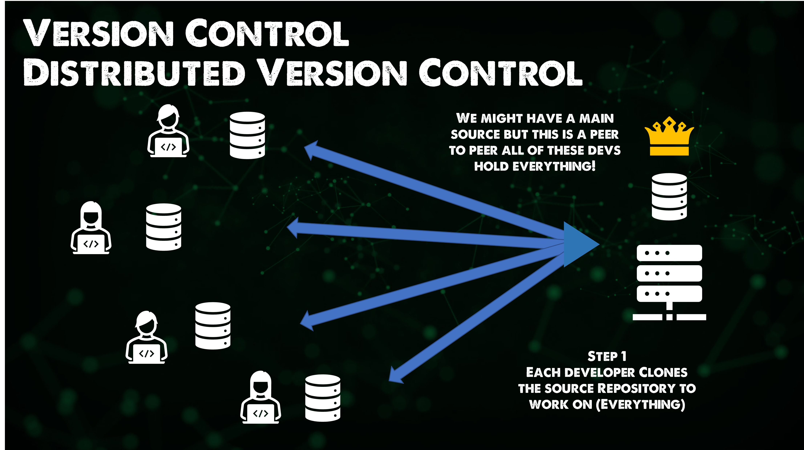

import { LinkCard, Steps, FileTree } from '@astrojs/starlight/components';

_Xin chào mọi người, đây là ngày thứ 33 của hành trình 90 ngày cùng DevOps, và đây là lúc mà
chúng ta sẽ cài đặt phiên bản mới nhất của Git, để cùng sẵn sàng thực hiện một dự án hoàn toàn
mới. **Nào, hãy chuẩn bị sẵn một chiếc máy tính, và bắt đầu hành trình thôi!**_ 🚎

## Tải xuống bộ cài Git

_Tại website **[này](https://git-scm.com/download/win)**, chúng ta có thể tải xuống phiên bản
mới nhất của Git để sử dụng trên máy Windows, với máy Mac dùng đường dẫn 
**[này](https://git-scm.com/book/en/v2/Getting-Started-Installing-Git)**. Kiểm tra phiên bản 
của Git bằng lệnh sau._

```bash title="Checking git version"

git --version
# git version 2.45.2.windows.1

```

_Sau khi tải bộ cài về máy, chỉ cần chạy nó lên, chọn các tính năng cần cài đặt và sau đó 
xác nhận sau khi chờ hoàn thành._


_Đối với Linux, cài đặt bằng các lệnh sau._

```bash title="Installing git..."

sudo add-apt-repository ppa:git-core/ppa -y
sudo apt-get update
sudo apt-get install git -y
git --version

```

## Cấu hình Git

_Kiểm tra và thực hiện cấu hình lần đầu bằng lệnh sau._

```bash title="Checking git configuration..."

git config --global user.email <your email>
git config --global user.name <your name>
git config --global core.editor "code --wait"
git config --global -e

```


_Có ba cấp độ cấu hình, tương ứng với ba phạm vi cấu hình cho Git._

<Steps>

1. _Cấp độ **hệ thống** phục vụ tất cả người dùng._
2. _Cấp độ **toàn cục** phục vụ tất cả kho lưu trữ của người dùng 
hiện thời (```--global```)._
3. _Cấp độ **cục bộ** phục vụ chỉ một kho lưu trữ (```--local```)._

</Steps>

_Thư mục chứa tập tin cấu hình thường là thư mục của người dùng, và tập tin
sẽ có tên là ```.gitconfig```. Dưới đây thường là cây thư mục của máy Windows._

<FileTree>
- C:
  - ...
  - Users
    - ...
    - anthony2708
      - ...
      - .gitconfig
</FileTree>

## Một số kiến thức về Git

_Có hai dạng quản lý mã nguồn là **Quản lý Chủ - Khách** và **Quản lý phân tán**, trong đó
quản lý phân tán là cách mà Git đang sử dụng với những lợi ích như sau._

- **_Nhanh chóng_**
- **_Linh hoạt_**
- **_An toàn & Bảo mật_**
- **_Tính thông minh_**

_Với Git, chỉ có **một bộ mã nguồn tập trung** nơi tất cả người dùng đều tải xuống phiên
bản đã lưu. Việc cập nhật mã nguồn tuân theo nguyên tắc giải quyết xung đột theo mô hình
chủ - khách nhưng **tối giản các bước cần thiết** mà không làm ảnh hưởng đến toàn bộ mã nguồn
đã có sẵn trên hệ thống._



**_Đó là tất cả những gì cơ bản nhất về Git trong ngày thứ 33 này._** ✅

## Tài liệu tham khảo 📚

_Mời mọi người chuyển sang trang này để theo dõi tất cả tài liệu liên quan trong giai đoạn 6, 
để giúp bản thân có được những tài liệu hữu ích về Quản lý phiên bản trong làm việc với DevOps._

<LinkCard
  title="Ngày 33 - Tham khảo"
  href="../../reference/git/day32"
/>

_Hẹn gặp mọi người ở những ngày tiếp theo._ 🚀