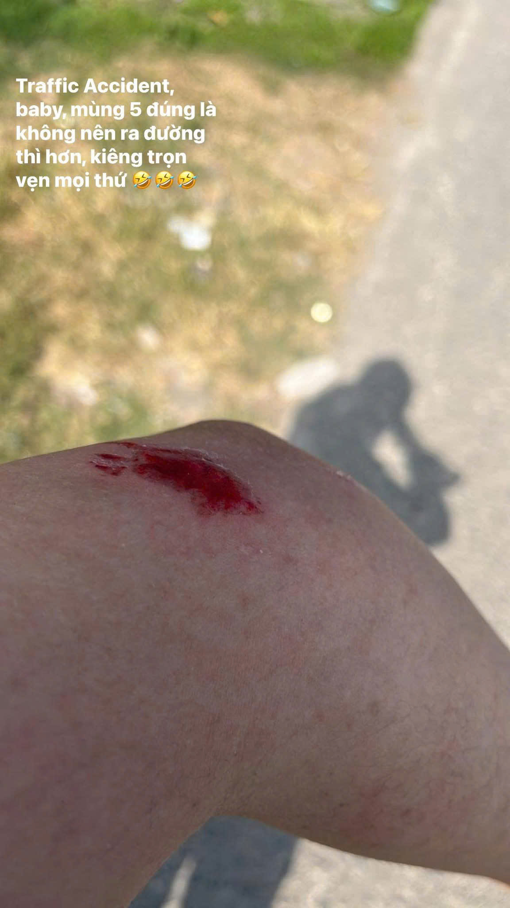
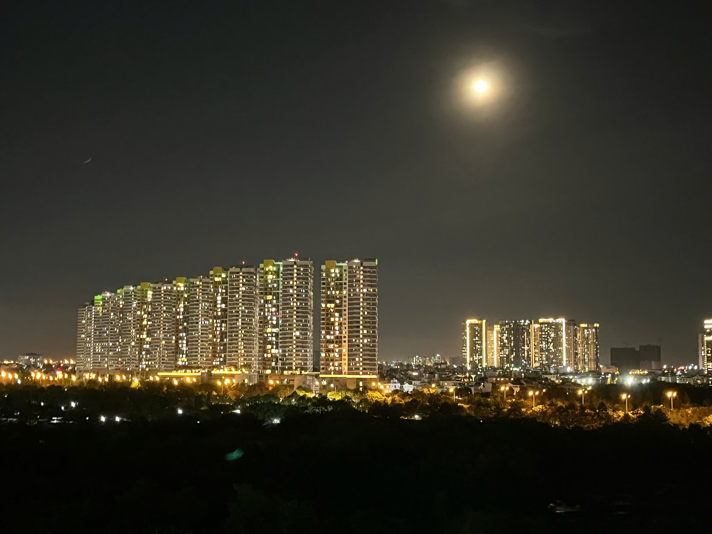
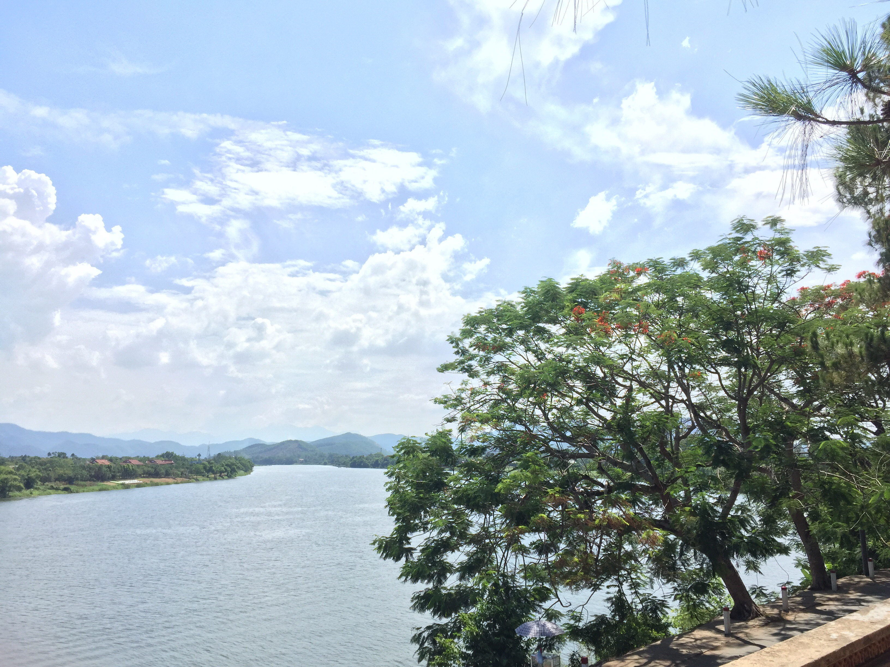
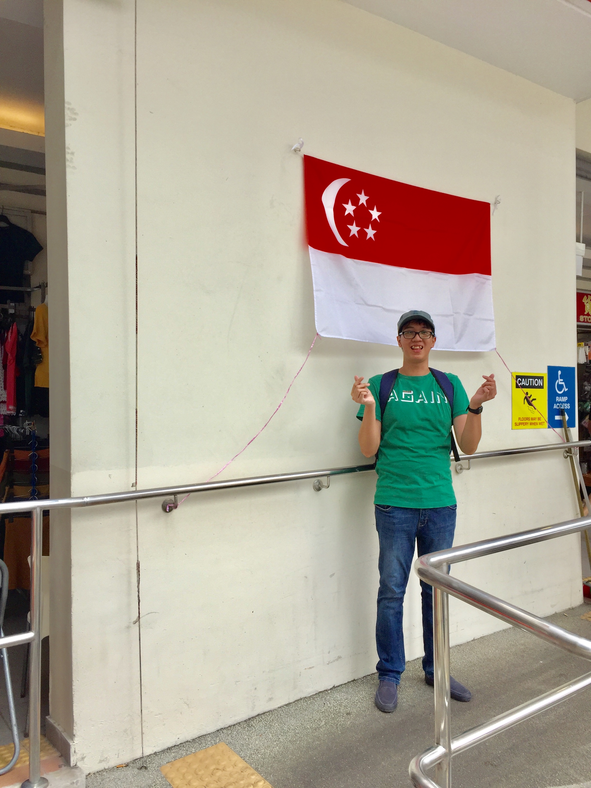
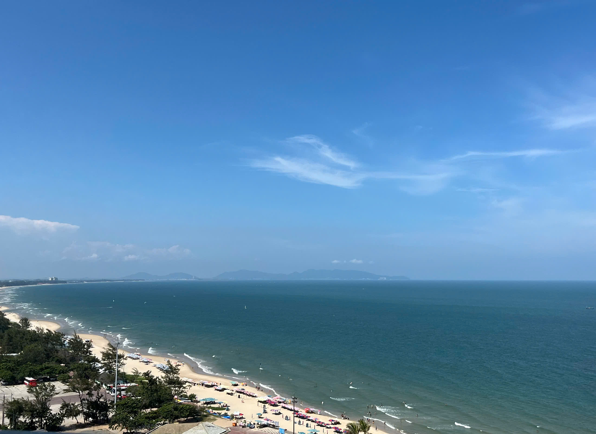
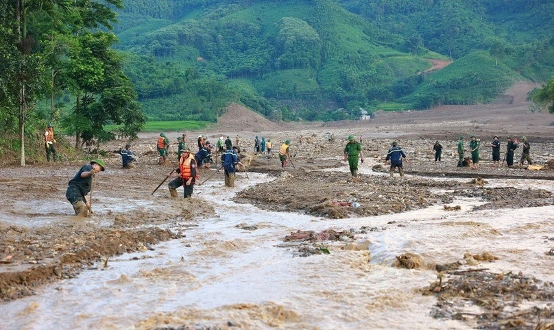
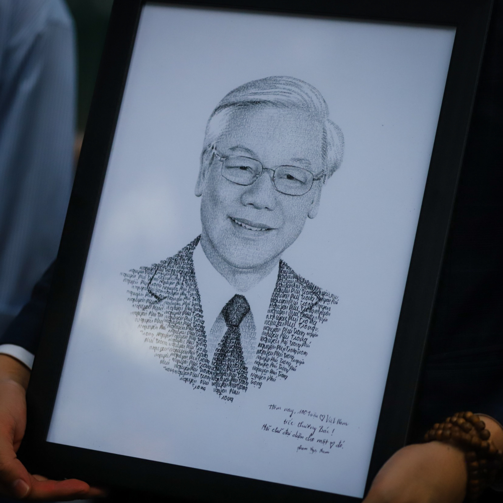
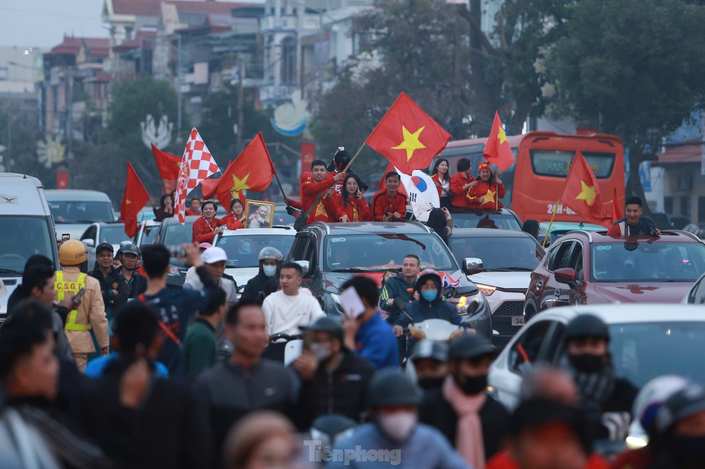

## Kỳ 2: Recap 2024 - Xin chào Việt Nam

_Xin chào. Đáng ra kỳ 2 này phải lên sóng sau kỳ 1 khoảng độ một tháng cho dịp Tết Nguyên đán Giáp Thìn 2024, nhưng do hàng loạt những thay đổi trong lịch trình nên phải hoãn tới tận gần cả năm. Thôi thì, tặng lại cho mọi người chiếc bài viết này thay cho lời cảm ơn và xin lỗi gửi đến tất cả quý độc giả._

_Chuyến hành trình của năm 2024 có thể nói là một chuyến hành trình đầy tính bất ngờ và như một chuyến tàu lượn siêu tốc thực thụ. Hãy cùng mình lên đường và ghé lại những trạm dừng chân trước đây để hồi tưởng lại về một năm đầy biến động này nhé._

### Nước mắt 😭 và nụ cười 😊...

_Đầu năm 2024, mình nhận được một công việc mới. Ngỡ rằng đó sẽ là một cú đào thoát ngoạn mục cho một năm 2023 đầy biến động **nhưng không - đó lại là khởi đầu cho hàng loạt những bi kịch mới**. Mình gặp phải tai nạn giao thông trên đường trở về thành phố đi làm sau Tết năm nay..._

_Những cơn đau như cứa vào tâm can mình - khiến mình gần như chỉ biết khóc. Mình cũng từng nghĩ, mình sẽ trụ lại được thật lâu trên hành trình học hỏi không ngừng về Công nghệ thông tin nhưng không - áp lực quá lớn đã buộc mình phải dừng lại công việc mới kia, chỉ sau có hơn 4 tháng. Thêm một lần, mình nhìn lên bầu trời đêm của **Sài Gòn đầy hoa lệ - nhưng là hoa cho người giàu, lệ cho người nghèo...** - mà khóc như một đứa trẻ._

_Mình buông bỏ hết tất cả mọi thứ ở cái thành phố này, thậm chí còn tuyên bố là sẽ **ngừng lại hết mọi đam mê cháy bỏng về Công nghệ thông tin**, để trở về quê nhà và biến thành **một nhà giáo** - cái nghề mà bản thân còn không nghĩ sẽ phải làm. Ấy vậy mà, đó mới thật sự là cú chuyển mình mà ông Trời muốn nó diễn ra trên người mình._

_Mình học được cách yêu thương bản thân, cách để chữa lành thông qua việc sẻ chia nỗi niềm với nhiều người khác nhau xung quanh thế giới đầy dễ thương này. Mình cũng chọn cách để buông bỏ những thứ không còn thuộc về mình - những công việc, những giá trị xưa cũ, những mối quan hệ, v.v... - để thay đổi, dù có thể là rất chậm chạp. Để rồi, **(chắc là thần may mắn đã thương xót cho tâm hồn đã chịu không ít những tổn thương của mình)**, mình đã được cứu rỗi, trở về lại ngành Công nghệ thông tin để trở thành một Chuyên viên hỗ trợ CNTT cho một tập đoàn của Úc, có chi nhánh ở Việt Nam._

_Tuy công việc lương cũng chả cao là mấy, nhưng ít nhất mình được về nhà thường xuyên **(đúng hơn là xoay theo tuần)** và được học hỏi rất nhiều điều. Giờ thì mình còn có thêm thời gian nghỉ ngơi dịp năm mới nữa - theo lịch thì mình được nghỉ tới ba đợt lễ khác nhau, **mỗi đợt dài 7-10 ngày**, và như thế là đủ để mình làm được nhiều điều, trong đó có cả việc viết bài này._

### Nhìn lại Wishlist

_Không biết mọi người còn nhớ chiếc "**Danh sách mơ ước**" của năm 2024 mà kỳ 1 của bài viết này đã đưa lên không nhỉ? Mời mọi người cùng mình nhìn lại nó xem mình làm được gì nhé!_

✅ _**Tìm kiếm một công việc theo dạng Hybrid hoặc Remote toàn thời gian. Nếu không được, chắc chuyển sang Full-time nhưng ở quê nhà cho vui**. Ồ, hóa ra cái kết của chiếc mục tiêu này vẫn ổn áp, nếu không muốn nói là trúng toàn diện rồi, may quá._ 🤣

❎  _**Đi du lịch thêm nhiều điểm nữa (đặc biệt là ra nước ngoài). Đã gần 6 năm kể từ chuyến đi nước ngoài đầu tiên, đây chắc hẳn là mong muốn lớn nhất của mình**. Mục tiêu này hỏng một phần - thực ra là vẫn có nhưng là một chuyến đi trong nước cùng gia đình - à mà lần nào mình đi chơi về cũng có một sự kiện rất là trời ơi đất hỡi xuất hiện._ 

_Lần đầu bay ra Đà Nẵng thì sau đó đi thi Đại học gặp ngay dòng sông Hương thơ mộng của **Thành phố Huế (Trực thuộc Trung ương từ 2025)** trong đề thi Văn năm đó._ 

_Lần thứ hai đi Singapore thì về đi học Đại học luôn._ 

_Lần thứ ba này thì ra Vũng Tàu chơi nhưng lại phải **vác laptop đi phỏng vấn** để rồi **ăn mừng trúng tuyển ngay trên bãi biển** luôn._ 😂

❎ _**Kiếm được nhiều tiền, và có thể triển khai một dự án gì đó. Thực ra thì cũng chưa biết là dự án gì, nhưng ít ra là có liên quan đến Công nghệ thông tin và Tiếng Anh - hai đối trọng mà mình cùng lúc theo đuổi**. Mục tiêu này hỏng một phần - tiền thì vẫn có dư - đầu tư cổ phiếu cũng có lời nhưng mà dự án thì chưa làm được._

❌ _**Có thể đạt được một số chứng chỉ nào đó, như là AWS, Azure. À thì cái này cũng là mong ước của mình khi theo đuổi Công nghệ thông tin, theo kiểu năm chẵn thi AWS, năm lẻ thi IELTS chẳng hạn để có thể tối ưu được thời gian và lượng kiến thức cần ôn luyện**. Mục tiêu này hỏng toàn bộ - thời gian không đủ để mình có thể đăng ký thi cử, thôi thì để năm nay mình chơi cả hai vậy._

### Nhìn về Tổ Quốc... 

_Thực ra chuyến hành trình của mình có một phần giống như cuộc hành trình mà đất nước này đã trải qua trong suốt năm 2024 vừa qua. **Đau thương đến tột cùng có, mất mát đến xé lòng cũng có**, nhưng rồi, tất cả đều đã vượt qua một cách bình an. Trong khó khăn, ý chí quật cường của người Việt vẫn vẹn nguyên - và trên hết:_

**_Có biết bao người con gái, con trai_**

**_Trong bốn nghìn lớp người giống ta lứa tuổi_**

**_Họ đã sống và chết_**

**_Giản dị và bình tâm_**

**_Không ai nhớ mặt đặt tên_**

**_Nhưng họ đã làm ra Đất Nước..._**

> _Đất Nước - Nguyễn Khoa Điềm_

> **Nguồn**: [The Investor](https://theinvestor.vn/insurance-payout-in-vietnam-after-typhoon-yagi-estimated-at-285-mln-d12248.html)

> **Nguồn**: [Tuổi Trẻ](https://tuoitrenews.vn/news/society/20240909/solidarity-and-affection-unbreakable-amidst-typhoon-yagi-in-vietnam/81857.html)

> **Nguồn**: [VNExpress](https://e.vnexpress.net/photo/news/48-hours-of-vietnams-state-funeral-for-party-leader-nguyen-phu-trong-4774719.html)

> **Nguồn**: [Vietnam.vn](https://www.vietnam.vn/en/viet-tri-ruc-do-tiep-lua-cho-doi-tuyen-viet-nam-trong-tran-ban-ket-luot-ve)

_Chiếc "**Danh sách mơ ước**" của năm 2025 - xin dành một phần cho đất nước Việt Nam này - cho Tổ quốc thân yêu, cho những con người đã làm nên đất nước, đã đoàn kết, sẻ chia, qua biết bao thế hệ để giữ gìn truyền thống tốt đẹp, kế thừa những giá trị mà bản sắc Việt vẫn đang mang lại - đó là tôn trọng lịch sử, tôn trọng những người đi trước đã cống hiến để làm nên một **Việt Nam đa sắc**..._

**_Wishlist của năm 2025 thực sự cực đơn giản:_**

✅ _Đất nước bước vào kỷ nguyên vươn mình trong sự thịnh vượng phát triển, ở đó những người con đất Việt luôn nhớ về những thế hệ đi trước, trân trọng và **luôn chào đón họ trở về nơi họ đã gắn bó**. (đặc biệt, những sự kiện gắn liền với yếu tố truyền thống cần đem đến một không gian để những thế hệ này quay về và truyền cảm hứng hơn nữa - thường người ta sẽ gọi đây là "**về nhà**")._

✅ _Gia đình bình an, mọi người đều có sức khỏe và cuộc sống đủ đầy._

✅ _Bản thân không ngừng học hỏi, sẵn sàng cho thi hai chứng chỉ AWS và IELTS trong năm nay._

✅ _Sẵn sàng cho một chuyến đi chơi xa hơn, lần này nhất định phải là ra nước ngoài._

### Tổng kết

_Hết phần recap. Thật sự, năm 2024 tất cả chúng ta đã trải qua rất nhiều cung bậc cảm xúc khác nhau, nhưng tất cả giờ đây sẽ nhường chỗ cho một năm 2025 thật nhiều hy vọng._

🏡 _Gửi lời cảm ơn đến tất cả mọi người vì đã cùng đồng hành với mình trong một năm_ 2️⃣0️⃣2️⃣4️⃣ _đầy những điều thú vị. **Xin hẹn gặp mọi người vào năm mới - năm của kỷ nguyên vươn mình cùng đất nước!**_

🌸 **Câu chuyện mùa xuân 2️⃣0️⃣2️⃣4️⃣/2️⃣5️⃣ 🏵 - Kỳ 2️⃣** sẽ lên sóng trong vài ngày nữa. 

**_Tạm biệt mọi người, Tuấn Anh đi làm change request trên công ty tiếp đây_** 😂