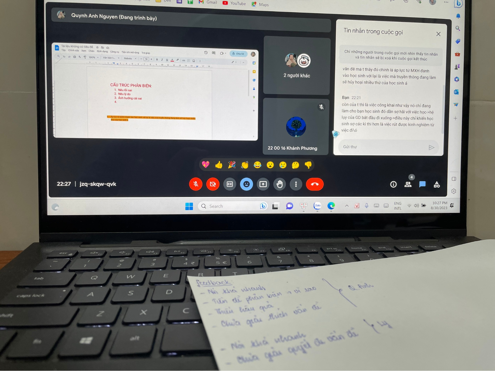

## Kỳ 2: TỚ KHÔNG NGHĨ TỚ TÀI GIỎI NHƯ THẾ...

**_Xin chào, chào mừng cậu lại đến với thế giới có thể biến mọi thứ tiêu cực của cậu thành tích cực!_**

**_Lại là mình - Khánh Phương đâyyyy!_**

_Thế là cũng sắp bước vào năm học mới rồi, không biết các bạn thấy thế nào nhỉ? Còn phần tớ á thì... mọi thứ nó cứ dồn dập đến làm tớ xoay trở cũng chẳng kịp._

**_À, mà trước khi vào năm học mới thì ngồi lại đây và nghe tớ kể cái này nha!!!!_**

_**Cậu có bao giờ cho mình là tài giỏi?** **Rồi... hoặc chưa... hoặc không dám... Mình cũng vậy đó.** Có ai dám tự vỗ ngực xưng tên rằng mình giỏi đâu, mà có thì đấy cũng chẳng phải mình rồi hihi._

_Nhưng mà... 20:50, ngày 29/08/2023, mình nhận được một lời mời:_

> - **_Haisss, dạo này ổn không bà?_**
> - **_Ổn nhe trời, khá là okila_**
> - **_Ê, tui có slot đi đấu debate ở chuyên Lê Bình Định nè, mà chọn qua giờ không thấy ai được hết à. Hay... bà đi nha!_**
> - **_Hả? Tui có biết gì đâu mà đấu, thua thì quê lắm, trời ạ._**
> - **_Quê gì mà quê, đi đi, cả team 50 mấy con người, tui chọn được mỗi bà thôi, đi đi nha. Với cái profile căng đét đó thì bà đi là okay rồi._**
> - **_Nhưng mà... thua thì sao?_**
> - **_Thì thôi, chả sao cả, người giỏi nhất là người dám đối mặt với thất bại nhất. Nên là, đi đi nha._**
> - **_..._**

_Đó là một lời mời đi đấu giải debate SODO 23 ở chuyên Lê Bình Định (**nghe xa nhỉ**). Nhưng điều tớ chú ý trong phải là giải đấu mà là bạn Founder chọn tớ trong 50 mấy con người của team. Lần đầu tiên có người chọn tớ dù chỉ là newbies. **Họ tin tưởng tớ tới thế à? Hay... do tớ giỏi thật sự? Không biết nữa**..._

_Cậu biết không, tớ vui lắm, vì đây là slot free và còn là được chọn nữa. Vui chứ, vui vì người khác tin tưởng mình, tin tưởng vào tài năng của mình. **Thua hả? Kệ nó đi, cứ cố gắng là được rồi**._

_Và tớ cũng được tiếp xúc với 2 bạn chung team của tớ, phải là 2 anh thì đúng hơn. Và tất nhiên rồi, mình chỉ là con kiến nhỏ xíu dưới chân 2 anh thôi. Nhưng cậu biết không, sau phần tranh biện của tớ thì có 1 anh bảo như vầy nè:_

> **_Ồ, sao không ai giới thiệu hai anh về bé để dắt bé đi đấu giải sớm hơn ha. Anh thích cách mà em đưa luận đề, tuy nó không thể phản biện lại hết nhưng nó lại là điều mà anh chưa nghĩ tới luôn đấy..._**

**_Thật sao? Có người công nhận cái mà tớ từng cho là kém cỏi kìa. Tớ giỏi đúng không? Đúng!_**

_Và cậu... cũng hãy như vậy nha. Đừng cho mình là không giỏi, không ai là không giỏi cả, chỉ là do chúng ta chưa tìm được người khai phá cái giỏi đó thôi. Đừng bao giờ tự ti vì bất cứ điều gì hay tổn thương bởi những lời chê bai dở tệ của người khác về cậu. **Họ không là cậu, hà cớ gì bắt họ phải hiểu và công nhận?**_

_Cậu à, cậu rất giỏi, giỏi lắm luôn. Và đừng vì một lời chê bai nào mà bản thân mình lại giật lùi nha!_

**_Chào cậu, tớ là Khánh Phương!_**
