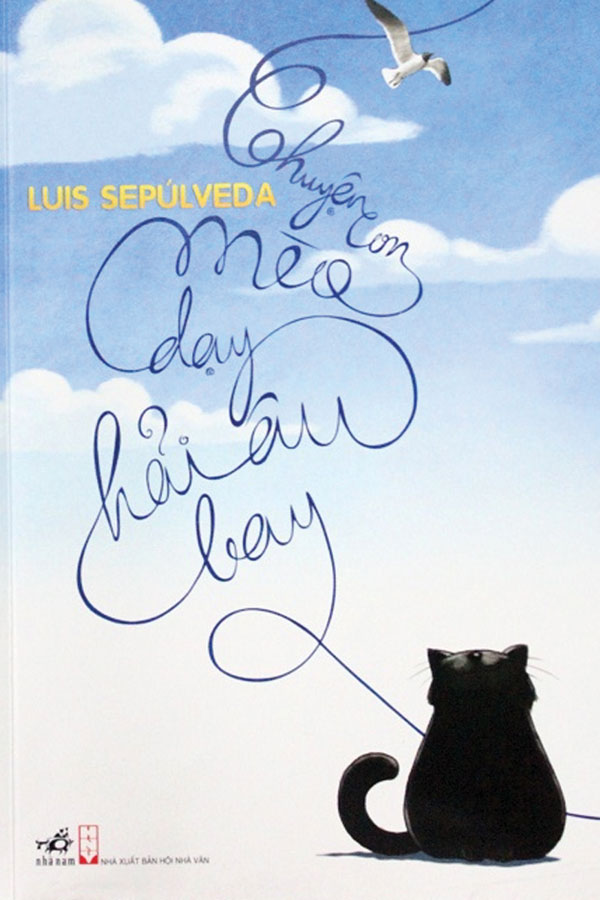

## CHUYỆN CON MÈO DẠY HẢI ÂU BAY - KHI NGƯỜI LỚN CŨNG CẦN ĐƯỢC CHỮA LÀNH TÂM HỒN

_Thế giới sẽ chẳng bao giờ ngừng lại. Điều này đồng nghĩa rằng con người buộc phải dốc hết sức lực, dồn cả tâm trí để hoàn thành đường đua cuộc đời. Tuy nhiên, nếu vòng đời của chúng ta chỉ diễn ra như thế, liệu rằng **chúng ta có thật sự sống?**_

_Dẫu bạn vẫn ổn hay không ổn một tẹo nào, tâm hồn của bạn rất cần được quan tâm và bồi đắp. Đối với tôi, sách văn học luôn là liều thuốc chữa lành tâm hồn hiệu quả nhất bởi kho tàng ý nghĩa vô cùng đắt giá được trao truyền đến độc giả._

**_Hôm nay, bạn hãy cùng tôi khám phá một trong những tác phẩm đã chữa lành biết bao tâm hồn: "Chuyện con mèo dạy hải âu bay” của nhà văn Luis Sepúlveda nhé!_**

_"**Chuyện con mèo dạy hải âu bay**" là câu chuyện về hành trình của cô hải âu **Lucky** từ khi chỉ là quả trứng cho đến khi cô đã học cách bay, dưới sự chăm sóc ân cần của chú mèo **Zorba** cùng những người bạn mèo khác của chú. Mở đầu câu chuyện kể về số phận đen đủi của cô hải âu **Kengah**: **cô không may bị lớp váng dầu bẩn thỉu và nặng trịch che phủ mắt**. Bằng tất cả sức lực cuối cùng của mình, cô đã nỗ lực bay đến đất liền và rơi xuống ban công. Tại nơi ấy, cô đã gặp chú mèo **Zorba**. Ngay giây phút cận kề với cái tử, cô đã đặt ra ba lời hứa với Zorba, mong chú ta có thể chăm sóc đứa con của mình là Lucky. Sau đó, Zorba bắt đầu hành trình làm "mẹ”, thực hiện đủ đầy ba lời hứa và cuối cùng cô hải âu bé nhỏ Lucky có thể cất cánh bay trong đêm mưa._

_"**Chuyện con mèo dạy hải âu bay**” đã tạo được tiếng vang dội trong lòng vô vàn độc giả ở các quốc gia khác nhau, bao gồm cả Việt Nam. Vậy, vì sao tác phẩm lại **tạo được ấn tượng lớn đến như vậy?**_

_Ngay từ tựa sách "**Chuyện con mèo dạy hải âu bay**” đã để lại ấn tượng đặc biệt trong lòng mỗi độc giả. Một con mèo chẳng bao giờ có cơ hội bay lượn trên trời thì làm sao có thể **dạy con hải âu bay được?** Đây quả thật là một chuyện phi lý. Nhưng với ngòi bút tài tình, khéo léo của Luis Sepúlveda sẽ đưa chúng ta đi từ bất ngờ này đến bất ngờ khác. Điểm bất ngờ trong truyện không phải là những yếu tố kì ảo, mà đó chính là yếu tố nhân văn._

_Bài học đầu tiên chúng ta có thể học được qua câu chuyện đó chính là **sống phải biết yêu thương**. Tuy rằng bạn và tôi là những cá thể riêng biệt, nhưng điều này không đồng nghĩa là sống tách biệt khỏi xã hội mà cần biết đặt người khác trong tâm trí của bản thân. Mỗi nhân vật trong tác phẩm đều để lại một bài học về tình yêu thương. Ngay mở đầu tác phẩm, tình mẫu tử thiêng liêng của cô hải âu Kengah đã chạm vào cả những trái tim sắt đá nhất. Điều cuối cùng cô nghĩ đến chính là đứa con chưa chào đời của mình, và cô đã trao con cho Zorba. Có một câu nói của chú mèo Zorba mà tôi rất tâm đắc rằng:_

> **_Thật dễ dàng để yêu thương một kẻ nào đó giống mình, nhưng để yêu thương ai đó khác mình thực sự rất khó khăn, và con đã giúp chúng ta làm được điều đó._**

_**Tình yêu thương không phân biệt bất cứ ai cả. Dẫu là mèo nhưng Zorba vẫn yêu thương Lucky đấy thôi!** Tình yêu thương còn là sự **tôn trọng bản sắc cá nhân của nhau**. Nếu không thật sự yêu thương Lucky, có lẽ Zorba sẽ sẵn sàng biến Lucky thành một con mèo, mãi mãi không bao giờ biết bay như một con hải âu thực thụ. Lucky là một cô hải âu với trái tim ấm áp, vì vậy trước khi cất cánh bay, cô bé hứa rằng sẽ không bao giờ quên công ơn nuôi dưỡng của Zorba và các bác mèo của mình. Cùng với đó, sự tận tâm tận lực ngày đêm của các chú mèo khác cũng đã giúp Lucky rất nhiều trong quá trình học bay. Quả thật, tình yêu thương chính là **sợi dây kết nối** người với người lại gần nhau hơn, là **dây cót lên tinh thần** cho con người tiếp tục chặng đường của bản thân, là **liều thuốc chữa lành tâm hồn** con người sau bao áp lực phải gồng gánh trong cuộc sống._

_Bài học thứ hai chúng ta đón nhận được đó là bài học về **sự nỗ lực**. "**Có công mài sắt, có ngày nên kim**", nếu không có sự nỗ lực từng ngày từng tháng thì thật khó để ánh hào quang soi rọi vào chúng ta. Để có thể thành công bay trên trời đòi hỏi sự cố gắng không ít từ chính bản thân Lucky và các chú mèo. Lucky ban đầu rất sợ hãi, nhưng cuối cùng cô bé vẫn lấy hết dũng khí, dồn hết sức để dang rộng đôi cánh bay lên trời cao, và sự nỗ lực đã được đền đáp xứng đáng._

> **_Chỉ những kẻ thật sự dám thì mới có thể bay._**

_Đây cũng là câu nói của chú mèo Zorba mà tôi rất ấn tượng. **Tôi tin rằng chúng ta sẽ luôn nhận được thành quả xứng đáng với công sức chúng ta đã dành ra!**_

_Với ngòi bút đơn giản nhưng truyền cảm, sâu lắng, Luis Sepúlveda đã thành công chiếm trọn biết bao trái tim của cả đứa trẻ và người lớn. Hình tượng nhân vật trong truyện là những con vật hết sức gần gũi và dễ thương, đã được nhân hóa nhằm đến gần với cuộc sống của quần chúng hơn. Cốt truyện tuy đơn giản nhưng nhìn chung vẫn có sức lôi cuốn bởi ý nghĩa nhân văn sâu sắc._

_Dẫu "**Chuyện con mèo dạy hải âu bay**" có thể được xem là truyện thiếu nhi, nhưng bất kỳ ai, ở bất kỳ lứa tuổi nào đều có thể mua lấy một quyển và chiêm nghiệm qua từng trang sách. Chúng ta đôi lúc nên dừng chân và ngẫm lại từng bài học nhân sinh, bởi lẽ đây chính là bước đệm để bản thân ngày một vững vàng, cứng cáp và hữu ích hơn trong xã hội. **Chỉ khi ấy, chúng ta không dừng lại ở hai chữ tồn tại, mà ta đã thật sự sống!**_
