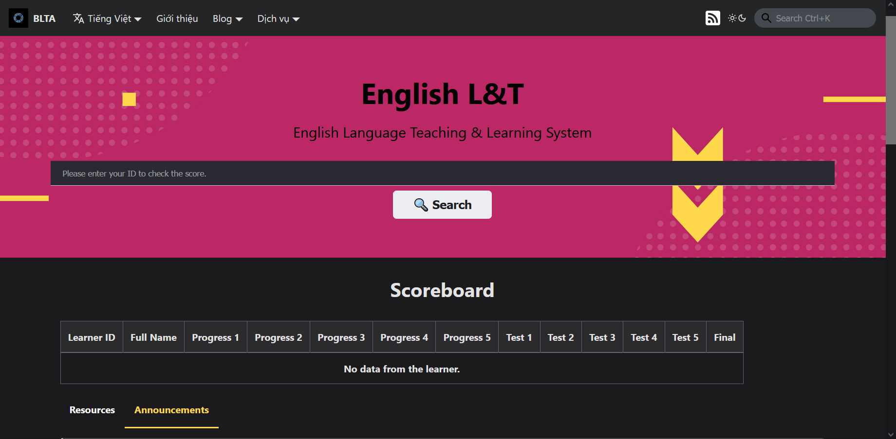

## Introduction

The English L&T service allows users to track their English learning progress through tests and assignments. In addition, users can also review the lessons they have learned, and the assignments they have done.

## Guide to access

To access the Services Portal, please use [**this link**](https://portal.builetuananh.name.vn/en/).

Select the **English L&T** service, then click on **Access**. The website will automatically be redirected to the service page as shown below.

:::note

The image above is using bilingual mode, the actual interface may be different.

:::

## Guide to interact

### Search bar and Scoreboard section

Enter the learner's ID into the search bar, then click on **Search**. The system will automatically search and notify the result to the user. When there is no result, the system will notify the user as shown above.

### Resources/Announcements sections

- The **Resources** section updates the reference materials used for teaching and learning on the system.
- The **Announcements** section updates the latest announcements from the teacher (class registration schedule, holidays, system access links, ...)

### English Courses section

This section updates the English courses that are currently being taught, allowing users to review the lessons that have been recorded previously through the system's official YouTube platform.
