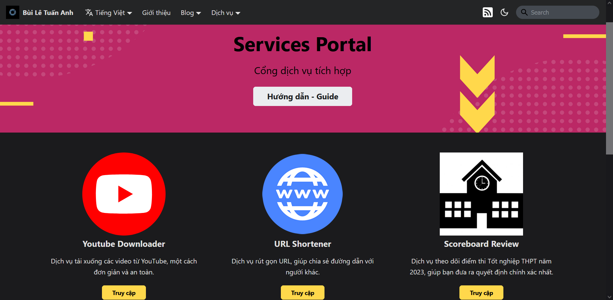

To access the Services Portal, please use [**this link**](https://portal.builetuananh.name.vn/en/services).

The screen will look something like this:

:::note

The image above is just a sample in **Vietnamese**. The actual website will be in **English** and **has the same layout**.

:::

Select a service to use, then click on **Access**. The website will be redirected to the desired service.

From the Services Portal, users can access the guide by clicking on **Hướng dẫn - Guide**.

There are currently six different services as follows:

1. **Youtube Downloader** ([User Guide](./youtube))
2. **URL Shortener** ([User Guide](./shortener))
3. **Scoreboard Review** ([User Guide](./scoreboard))
4. **English L&T** ([User Guide](./english))
5. **Images Gallery** ([User Guide](./gallery))
6. **2048 Game** ([User Guide](./games))
