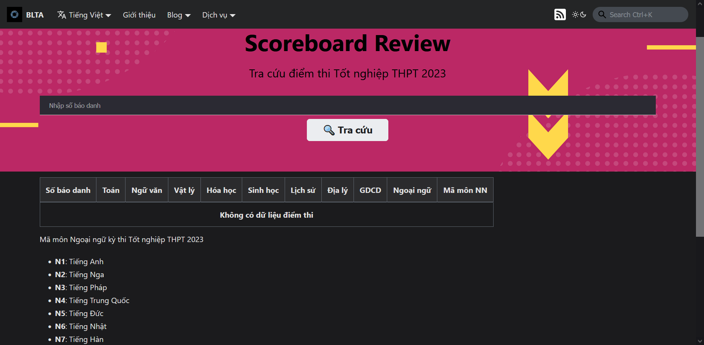

## Introduction

The Scoreboard Review service allows users to update the latest information about the results of the High School Graduation Examination as well as view the analysis of the exam results of provinces and cities nationwide.

## Guide to access

To access the Services Portal, please use [**this link**](https://portal.builetuananh.name.vn/en/services).

Select the **Scoreboard Review** service, then click on **Access**. The website will automatically be redirected to the service page as shown below.

:::note

The image above is just a sample in **Vietnamese**. The actual website will be in **English** and **has the same layout**.

:::

## Guide to interact

:::note

The system is currently in the maintenance phase to prepare for the 2024 High School Graduation Examination, so there will be **no exam results** to look up.

:::

Enter the candidate's ID into the search bar, then click on **Search**. The system will automatically search and notify the result to the user. When there is no result, the system will notify the user as shown above.

In addition, at the end of the page, users can view the statistics of the exam results of provinces and cities nationwide through the **View the scoreboard analysis** button (redirected to the GitHub page).
