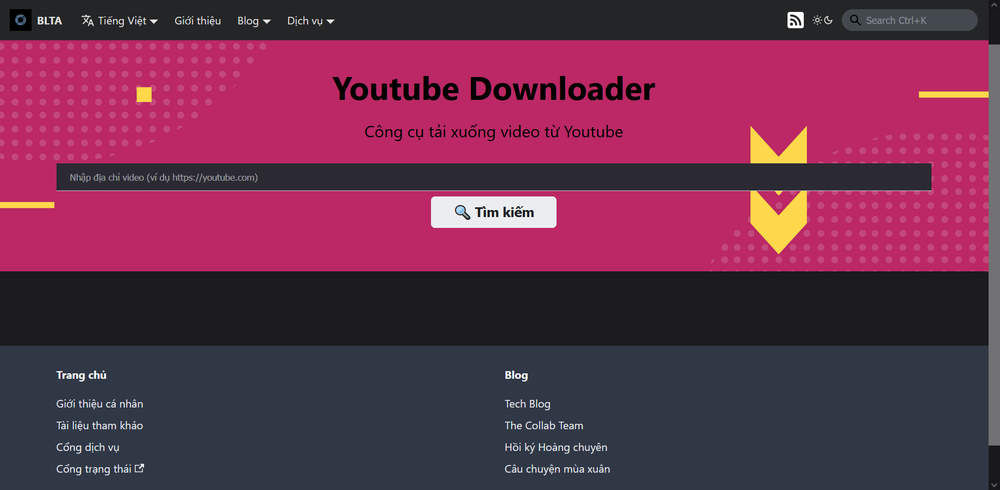

## Introduction

The Youtube Downloader service allows users to watch and download videos on YouTube quickly and easily, while supporting many different video/audio formats.

## Guide to access

To access the Services Portal, please use [**this link**](https://portal.builetuananh.name.vn/en/).

Select the **Youtube Downloader** service, then click on **Access**. The website will automatically be redirected to the service page as shown below.

:::note

The image above is just a sample in **Vietnamese**. The actual website will be in **English** and **has the same layout**.

:::

## Guide to interact

1. Enter the Youtube video address (in the format [https://www.youtube.com/watch?v=abcxyz](https://www.youtube.com/watch?v=abcxyz)) into the search bar in the center, then click **Search**. The system will automatically search and display the results to the user. When no results are found, the system will **display an error**, the user can try again with another address.

2. After selecting the appropriate version, click **Download**. The system will switch to a page with a format similar to the image below.

3. Right-click, select **Save video** or **Save audio**, name and click **Save**. The system will automatically download the video/audio with the corresponding format.

## Some related limitations

The following videos cannot be downloaded:

- **Territorial restrictions**
- **Private** access rights
- **Rentals** video
- **Premium** content
- Livestreams with **non-HLS** format

The download links are only valid for **6 hours** and can only be downloaded with the **same corresponding IP address**. The system will display an error if the video is subject to at least one of the above limitations.
