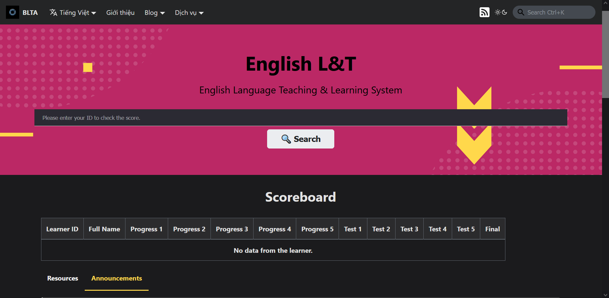

## Giới thiệu

Dịch vụ English L&T cho phép người dùng theo dõi tiến độ học tập tiếng Anh của mình thông qua các bài kiểm tra và bài tập được giao. Ngoài ra, người dùng còn có thể xem lại các bài học đã được học, và các bài tập đã làm.

## Hướng dẫn truy cập

Để sử dụng cổng dịch vụ, xin truy cập vào đường dẫn [**này**](https://portal.builetuananh.name.vn/services)

Chọn dịch vụ **English L&T**, nhấn nút **Truy cập**. Hệ thống sẽ tự chuyển hướng đến trang của dịch vụ như hình dưới.

:::note

Chỉ duy nhất trang này có sử dụng giao diện song ngữ Việt - Anh.

:::

## Hướng dẫn tương tác

### Thanh tìm kiếm và mục Scoreboard

Nhập mã số định danh của học viên vào thanh tìm kiếm trung tâm, sau đó nhấn nút **Search**. Hệ thống tự động tìm và thông báo kết quả bảng điểm đến người dùng. Khi chưa hoặc không có kết quả, hệ thống sẽ thông báo cho người dùng như hình trên.

### Cụm mục Resources/Announcements

- Mục **Resources** cập nhật các nguồn tài liệu tham khảo sử dụng cho quá trình dạy và học trên hệ thống
- Mục **Announcements** cập nhật các thông báo mới nhất từ phía giáo viên (lịch đăng ký lớp, lịch nghỉ, đường dẫn truy cập hệ thống, ...)

### Mục English Courses

Mục này cập nhật các khóa học tiếng Anh hiện đang giảng dạy, cho phép người dùng có thể xem lại các bài học đã được ghi hình trước đó thông qua nền tảng YouTube chính thức của hệ thống.
