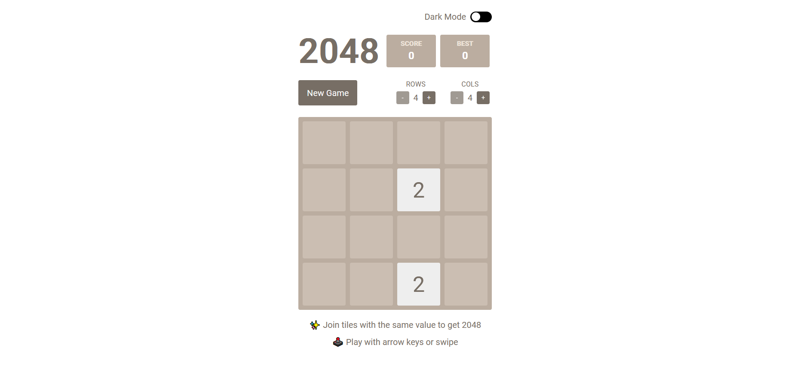

## Giới thiệu

Dịch vụ 2048 Game cho phép người dùng tham gia chơi trò chơi 2048 trực tuyến.

## Hướng dẫn truy cập

Để sử dụng cổng dịch vụ, xin truy cập vào đường dẫn [**này**](https://portal.builetuananh.name.vn/).

Chọn dịch vụ **2048 Game**, nhấn nút **Truy cập**. Hệ thống sẽ tự chuyển hướng đến trang của dịch vụ như hình dưới.

:::note

Giao diện trò chơi sử dụng ngôn ngữ **tiếng Anh**.

:::

## Hướng dẫn chơi

_Trò chơi 2048 là một trò chơi trí tuệ được phát triển bởi Gabriele Cirulli. Trò chơi được chơi trên một bảng 4x4 với các ô vuông có màu khác nhau. Mỗi ô vuông có thể chứa một con số, hoặc không có gì. Mỗi lần di chuyển, người chơi có thể di chuyển tất cả các ô vuông có số sang một hướng (trên, dưới, trái, phải). Khi hai ô vuông có số giống nhau chạm nhau, chúng sẽ kết hợp lại thành một ô vuông có số bằng tổng của hai ô vuông cũ. Mục tiêu của trò chơi là tạo ra một ô vuông có số bằng 2048. Nếu bảng đầy và không thể di chuyển được nữa, trò chơi sẽ kết thúc._
